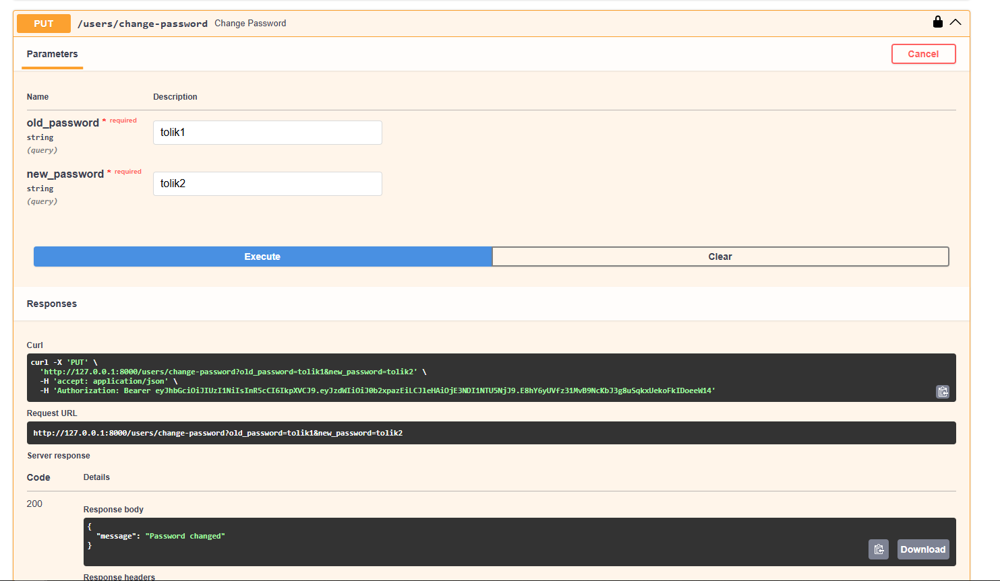
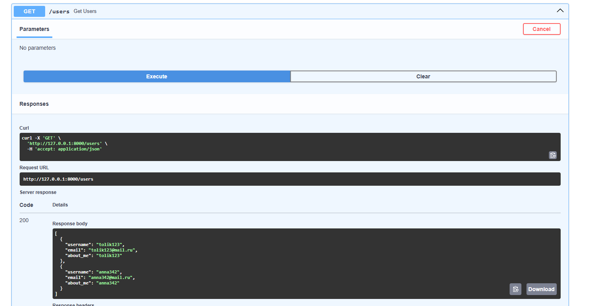
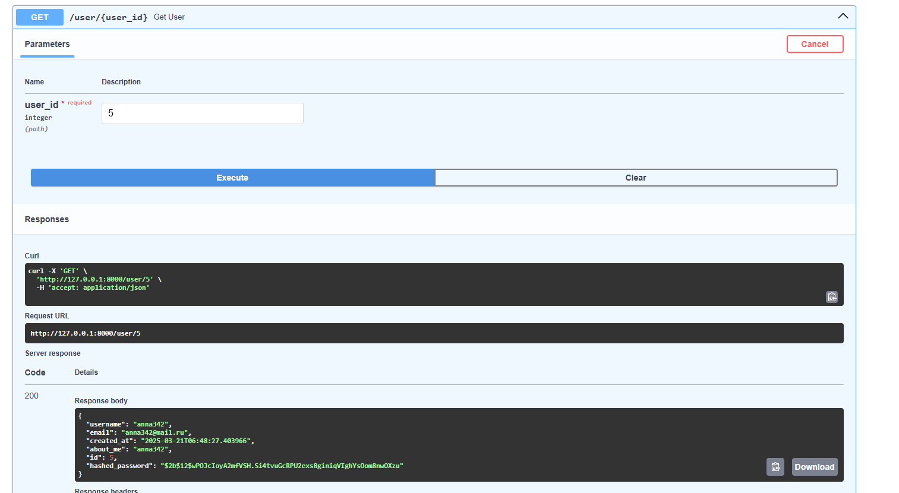
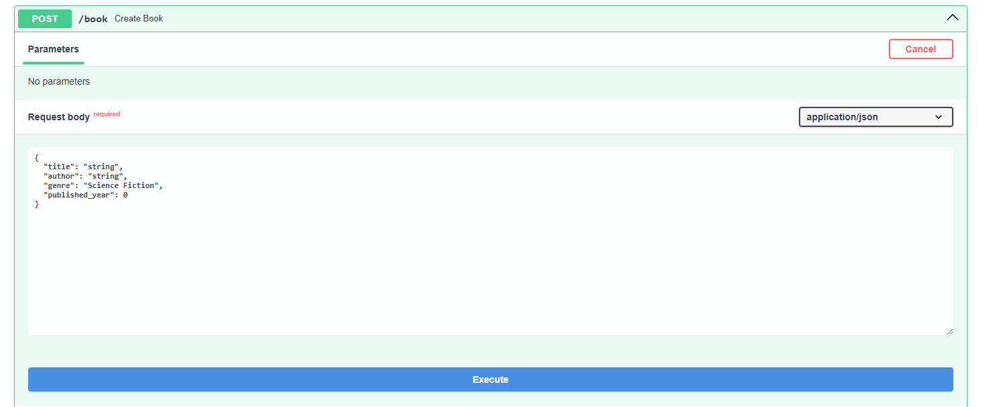
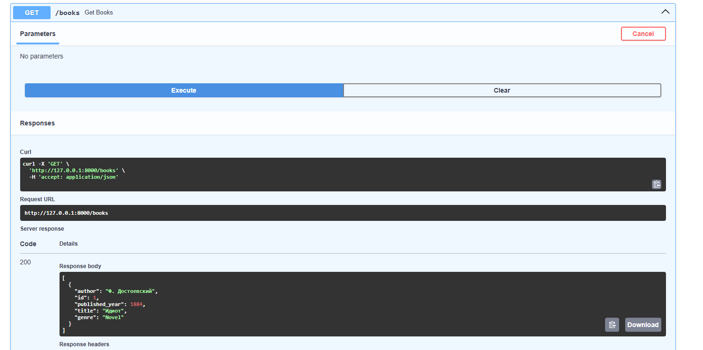
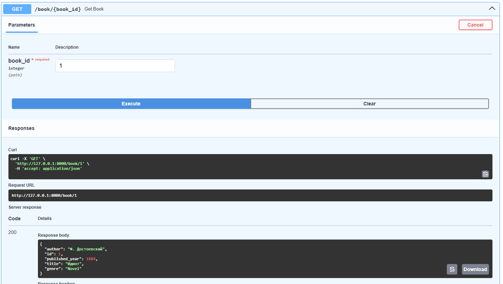
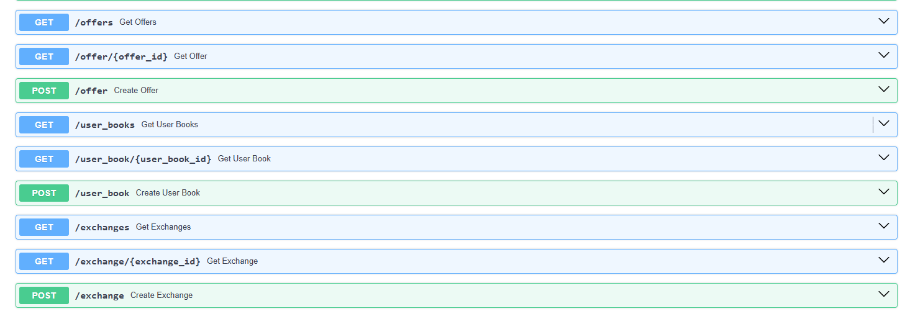

# Реализованные эндпоинты
1) Аутентификация
Сначала нам нужно зарегистрировать пользователя, вызовем данный эндпоинт
http://localhost:8000/register
2) 

Далее можно войти в созданный аккаунт введя пароль и логин
http://localhost:8000/login


Для проверки корректности аутентификации перейдём по данному пути
http://localhost:8000/users/me


Также была реализована возможность изменения пароля для текущего аккаунта
http://localhost:8000/users/change-password


Для пользователей была добавлена возможность вывода всех users из базы данных и получения пользователя по IP
http://localhost:8000/users


http://localhost:8000/users/{users_id}


Соответствущий код для аутентификации
```python

security = HTTPBearer()

def get_current_user(credentials: HTTPAuthorizationCredentials = Depends(security), session=Depends(get_session)):
    token_data = verify_token(credentials.credentials)
    if not token_data:
        raise HTTPException(status_code=401, detail="Invalid token")

    user = session.exec(select(User).where(User.username == token_data["sub"])).first()
    if not user:
        raise HTTPException(status_code=401, detail="User not found")

    return user

ACCESS_TOKEN_EXPIRE_MINUTES = 30

def create_access_token(data: dict, expires_delta: timedelta = None):
    to_encode = data.copy()
    expire = datetime.utcnow() + (expires_delta if expires_delta else timedelta(minutes=ACCESS_TOKEN_EXPIRE_MINUTES))
    to_encode.update({"exp": expire})
    return jwt.encode(to_encode, os.getenv('SECRET_KEY'), algorithm= os.getenv('ALGORITHM'))

def verify_token(token: str):
    try:
        payload = jwt.decode(token, os.getenv('SECRET_KEY'), algorithms=[os.getenv('ALGORITHM')])
        return payload
    except jwt.ExpiredSignatureError:
        return None
    except jwt.InvalidTokenError:
        return None


@app.get("/users", response_model=List[UserDefault])
def get_users(session=Depends(get_session)):
    return session.exec(select(User)).all()

@app.get("/users/me", response_model=UserDefault)
def get_current_user_info(user: User = Depends(get_current_user)):
    return user

@app.put("/users/change-password")
def change_password(old_password: str, new_password: str, user: User = Depends(get_current_user), session=Depends(get_session)):
    if not user.verify_password(old_password):
        raise HTTPException(status_code=400, detail="Incorrect old password")

    user.set_password(new_password)
    session.add(user)
    session.commit()
    return {"message": "Password changed"}

@app.get("/user/{user_id}", response_model=User)
def get_user(user_id: int, session=Depends(get_session)):
    user = session.get(User, user_id)
    if not user:
        raise HTTPException(status_code=404, detail="User not found")
    return user

@app.post("/register")
def register_user(user: UserDefault, password: str, session=Depends(get_session)):
    existing_user = session.exec(select(User).where(User.username == user.username)).first()
    if existing_user:
        raise HTTPException(status_code=400, detail="User already exists")

    new_user = User(**user.dict(), created_at=datetime.utcnow().isoformat())
    new_user.set_password(password)
    session.add(new_user)
    session.commit()
    session.refresh(new_user)
    return {"message": "User registered"}

@app.post("/login")
def login(username: str, password: str, session=Depends(get_session)):
    user = session.exec(select(User).where(User.username == username)).first()
    if not user or not user.verify_password(password):
        raise HTTPException(status_code=401, detail="Invalid credentials")

    token = create_access_token({"sub": user.username})
    return {"access_token": token, "token_type": "bearer"}
```

2) Book
Создание книги 
http://localhost:8000/book


```python
@app.post("/book", response_model=Book)
def create_book(book: BookDefault, session=Depends(get_session)):
    new_book = Book(**book.dict())
    session.add(new_book)
    session.commit()
    session.refresh(new_book)
    return new_book
```
Получение списка книг
http://localhost:8000/books

```python
@app.get("/books", response_model=List[Book])
def get_books(session=Depends(get_session)):
    books = session.exec(select(Book)).all()
    return books
```

http://localhost:8000/book/{book_id}

```python
@app.get("/book/{book_id}", response_model=Book)
def get_book(book_id: int, session=Depends(get_session)):
    book = session.get(Book, book_id)
    if not book:
        raise HTTPException(status_code=404, detail="Book not found")
    return book
```
3) Остальные модели
Для остальных моделей БД crud запросы реализованы аналогично


```python
@app.get("/offers", response_model=List[Offer])
def get_offers(session=Depends(get_session)):
    offers = session.exec(select(Offer)).all()
    return offers

@app.get("/offer/{offer_id}", response_model=Offer)
def get_offer(offer_id: int, session=Depends(get_session)):
    offer = session.get(Offer, offer_id)
    if not offer:
        raise HTTPException(status_code=404, detail="Offer not found")
    return offer

@app.post("/offer", response_model=Offer)
def create_offer(offer: OfferDefault, session=Depends(get_session)):
    new_offer = Offer(**offer.dict(), created_at = datetime.utcnow().isoformat())
    session.add(new_offer)
    session.commit()
    session.refresh(new_offer)
    return new_offer


@app.get("/user_books", response_model=List[UserBook])
def get_user_books(session=Depends(get_session)):
    user_books = session.exec(select(UserBook)).all()
    return user_books

# GET — получение конкретной записи UserBook по id
@app.get("/user_book/{user_book_id}", response_model=UserBook)
def get_user_book(user_book_id: int, session=Depends(get_session)):
    user_book = session.get(UserBook, user_book_id)
    if not user_book:
        raise HTTPException(status_code=404, detail="UserBook not found")
    return user_book

# POST — создание новой связи пользователя с книгой
@app.post("/user_book", response_model=UserBook)
def create_user_book(user_book: UserBookDefault, session=Depends(get_session)):
    new_user_book = UserBook(**user_book.dict())
    session.add(new_user_book)
    session.commit()
    session.refresh(new_user_book)
    return new_user_book


@app.get("/exchanges", response_model=List[Exchange])
def get_exchanges(session=Depends(get_session)):
    exchanges = session.exec(select(Exchange)).all()
    return exchanges

# GET — получение конкретной записи Exchange по id
@app.get("/exchange/{exchange_id}", response_model=Exchange)
def get_exchange(exchange_id: int, session=Depends(get_session)):
    exchange = session.get(Exchange, exchange_id)
    if not exchange:
        raise HTTPException(status_code=404, detail="Exchange not found")
    return exchange

# POST — создание новой записи Exchange
@app.post("/exchange", response_model=Exchange)
def create_exchange(exchange: ExchangeDefault, session=Depends(get_session)):
    new_exchange = Exchange(**exchange.dict())
    new_exchange.exchange_date = str(datetime.utcnow())  # Фиксируем дату обмена
    session.add(new_exchange)
    session.commit()
    session.refresh(new_exchange)
    return new_exchange
```
