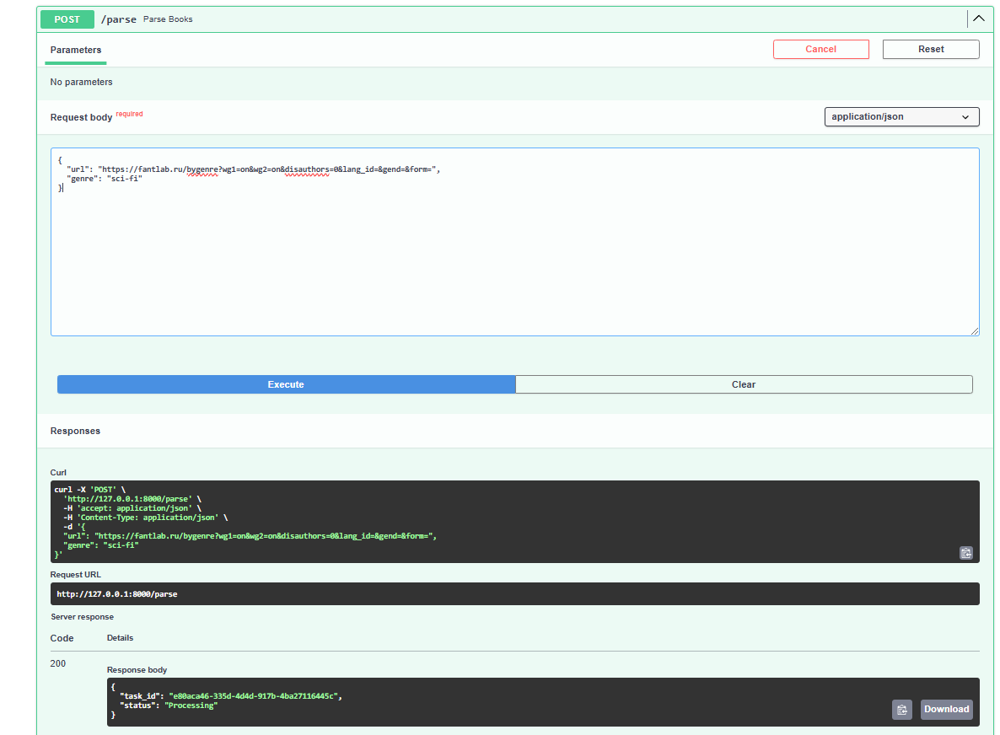
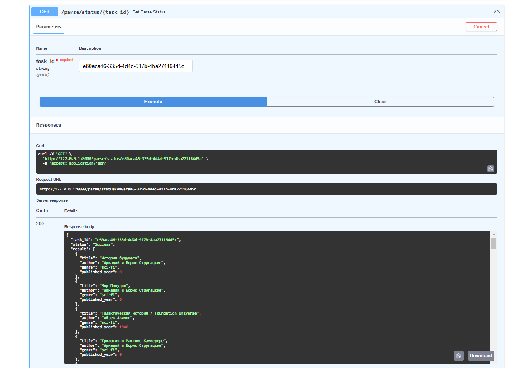

# Offer
Подзадача 1: Упаковка FastAPI приложения, базы данных и парсера данных в Docker
API и парсер из предыдущих лабораторных работ были разделены на 2 проекта, для каждой системы был написан docker файл, который описывает контейнеризацию приложения

Вот пример для API
```python
FROM python:3.11-slim

WORKDIR /app

COPY requirements.txt .
RUN apt-get update && apt-get install -y libpq-dev gcc python3-dev
RUN pip install --no-cache-dir -r requirements.txt

COPY . .

CMD ["uvicorn", "main:app", "--host", "0.0.0.0", "--port", "8000"]

```
Далее был реализован docker-compose.yml, в котором были указаны связи м/у сервисами и установлены параметры базы данных.


```python
version: '3.8'

services:
  parser-service:
    build:
      context: ./parser-service
    ports:
      - "8001:8000"
    networks:
      - app-network

  main-service:
    build:
      context: ./main-service
    ports:
      - "8000:8000"
    depends_on:
      - db
      - parser-service
      - redis
    environment:
      - DATABASE_URL=postgresql://postgres:1234@db:5432/warriors_db
      - PARSER_SERVICE_URL=http://parser-service:8000/parse
      - SECRET_KEY=your_secret_key
      - ALGORITHM=HS256
      - CELERY_BROKER_URL=redis://redis:6379/0
    networks:
      - app-network

  celery-worker:
    build:
      context: ./main-service
    command: celery -A celery_worker.celery_app worker --loglevel=info
    depends_on:
      - redis
      - main-service
      - parser-service
    environment:
      - CELERY_BROKER_URL=redis://redis:6379/0
    networks:
      - app-network

  redis:
    image: redis:7
    ports:
      - "6379:6379"
    networks:
      - app-network

  db:
    image: postgres:15
    environment:
      POSTGRES_USER: postgres
      POSTGRES_PASSWORD: 1234
      POSTGRES_DB: warriors_db
    ports:
      - "5432:5432"
    volumes:
      - pgdata:/var/lib/postgresql/data
    networks:
      - app-network

networks:
  app-network:

volumes:
  pgdata:


```

Подзадача 2: Вызов парсера из FastAPI
** Эндпоинт в FastAPI для вызова парсера**:
Необходимо добавить в FastAPI приложение ендпоинт, который будет принимать запросы с URL для парсинга от клиента, отправлять запрос парсеру (запущенному в отдельном контейнере) и возвращать ответ с результатом клиенту.
Зачем: Это позволит интегрировать функциональность парсера в ваше веб-приложение, предоставляя возможность пользователям запускать парсинг через API.


В сервисе с парсером был реализован роут, который принимает ссылку и жанр и на основе этих данных выводит книги со спаршенной страницы


```python
from fastapi import FastAPI, HTTPException
from pydantic import BaseModel
from typing import List
from parser import parse_books_from_url

app = FastAPI()

class ParseRequest(BaseModel):
    url: str
    genre: str

@app.post("/parse", response_model=List[dict])
async def parse_endpoint(req: ParseRequest):
    try:
        books = parse_books_from_url(req.url, req.genre)
        return books
    except Exception as e:
        raise HTTPException(status_code=500, detail=str(e))


```

Подзадача 3: Вызов парсера из FastAPI через очередь

Для связи с API и парсера был использован брокер сообщений, который позволяет асинхронно их обрабатывать в фоне, тем самым не блокируя всю программу

celery_worker реализует очередь задач, которая реализует парсинг
```python
import os

from celery import Celery
import httpx

celery_app = Celery(
    "worker",
    broker="redis://redis:6379/0",
    backend="redis://redis:6379/0"
)

PARSER_SERVICE_URL = os.getenv("PARSER_SERVICE_URL")

@celery_app.task
def parse_books_task(url: str, genre: str):
    payload = {"url": url, "genre": genre}
    try:
        response = httpx.post(PARSER_SERVICE_URL, json=payload)
        response.raise_for_status()
        return response.json()
    except Exception as e:
        return {"error": str(e)}

```
После инициализации celery внедряется в основной сервис 
```python
@app.post("/parse")
async def parse_books(request: ParseRequest):
    task = parse_books_task.delay(request.url, request.genre)  
    return {"task_id": task.id, "status": "Processing"}


@app.get("/parse/status/{task_id}")
async def get_parse_status(task_id: str = Path(...)):
    task_result = AsyncResult(task_id, app=parse_books_task.app)
    if task_result.state == "PENDING":
        return {"task_id": task_id, "status": "Pending"}
    elif task_result.state == "SUCCESS":
        return {"task_id": task_id, "status": "Success", "result": task_result.result}
    elif task_result.state == "FAILURE":
        return {"task_id": task_id, "status": "Failure", "error": str(task_result.result)}
    else:
        return {"task_id": task_id, "status": task_result.state}
```

Проверим работу в swagger по ссылке http://127.0.0.1:8000/docs
Запросим парсинг сайта по ссылке

По id задачи можно проверить состояния выполнения парсинга и вывод

