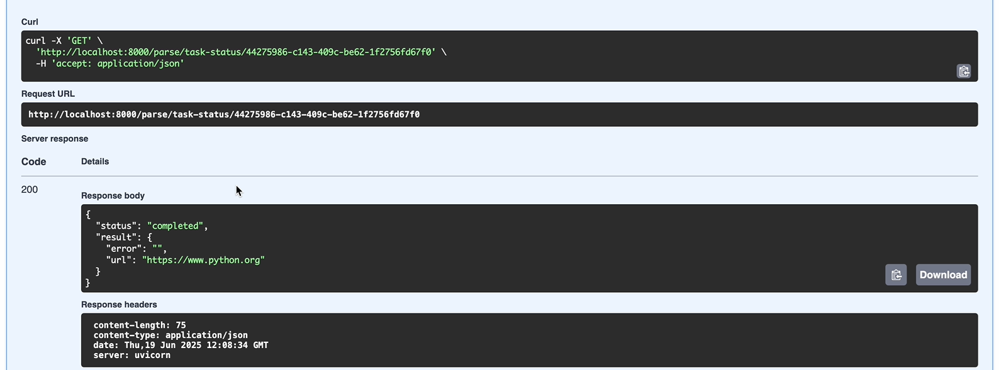

## Цель
Научиться упаковывать FastAPI приложение в Docker, интегрировать парсер данных с базой данных и вызывать парсер через API и очередь.

1. Создание FastAPI приложения: Создано в рамках лабораторной работы номер 1,
2. Создание базы данных: Создано в рамках лабораторной работы номер 1,
3. Создание парсера данных: Создано в рамках лабораторной работы номер 2,
4. Реулизуйте возможность вызова парсера по http Для этого можно сделать отдельное приложение FastAPI для парсера или воспользоваться библиотекой socket или подобными,
5. Разработка Dockerfile,
6. Создание Docker Compose файла,
7. Подзадача 2: Вызов парсера из FastAPI.


docker-compose file:
```python
services:
  db:
    image: postgres:14
    container_name: hackathon_postgres
    restart: always
    environment:
      POSTGRES_USER: postgres
      POSTGRES_PASSWORD: postgres
      POSTGRES_DB: hackathon_db
    ports:
      - "5432:5432"
    volumes:
      - postgres_data:/var/lib/postgresql/data

  redis:
    image: redis:7
    container_name: redis
    restart: always
    ports:
      - "6379:6379"

  hackathon:
    build:
      context: ./hackathon
      dockerfile: Dockerfile
    container_name: hackathon_app
    depends_on:
      - db
      - redis
    env_file:
      - ./hackathon/.env
    ports:
      - "8000:8000"
    volumes:
      - ./hackathon:/app
    command: ["uvicorn", "app:app", "--host", "0.0.0.0", "--port", "8000", "--reload"]

  parser:
    build:
      context: ./parser
      dockerfile: Dockerfile
    container_name: parser_app
    depends_on:
      - db
    env_file:
      - ./parser/task2/.env
    ports:
      - "9000:9000"
    volumes:
      - ./parser:/parser
    command: ["uvicorn", "main:app", "--host", "0.0.0.0", "--port", "9000"]

  celery_worker:
    build:
      context: ./hackathon
      dockerfile: Dockerfile
    container_name: celery_worker
    depends_on:
      - redis
      - hackathon
    command: ["celery", "-A", "celery_worker", "worker", "--loglevel=info"]
    volumes:
      - ./hackathon:/app
    environment:
      - CELERY_BROKER=redis://redis:6379/0
      - CELERY_BACKEND=redis://redis:6379/0

volumes:
  postgres_data:
```

Swagger:





Литкоды:

- https://leetcode.com/submissions/detail/1669365753/
- https://leetcode.com/submissions/detail/1669362463/
- https://leetcode.com/submissions/detail/1669357511/
- https://leetcode.com/submissions/detail/1669356420/
- https://leetcode.com/submissions/detail/1669354193/
- https://leetcode.com/submissions/detail/1669345386/
- https://leetcode.com/submissions/detail/1669337223/