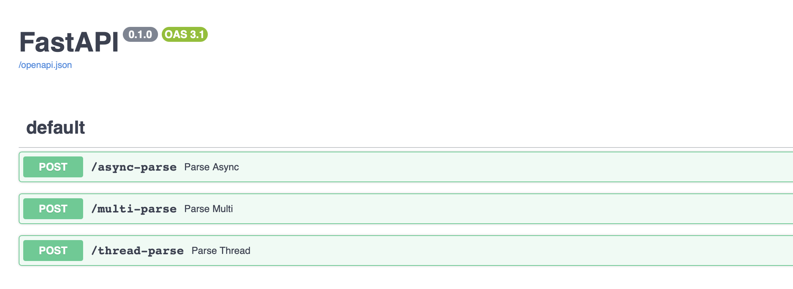

## Цель
Научиться упаковывать FastAPI приложение в Docker, интегрировать парсер данных с базой данных и вызывать парсер через API и очередь.

1. Создание FastAPI приложения: Создано в рамках лабораторной работы номер 1,
2. Создание базы данных: Создано в рамках лабораторной работы номер 1,
3. Создание парсера данных: Создано в рамках лабораторной работы номер 2,
4. Реулизуйте возможность вызова парсера по http Для этого можно сделать отдельное приложение FastAPI для парсера или воспользоваться библиотекой socket или подобными,
5. Разработка Dockerfile,
6. Создание Docker Compose файла,
7. Подзадача 2: Вызов парсера из FastAPI.


docker-compose file:
```python
services:
  web:
    build:
      context: ./app
      dockerfile: Dockerfile
    ports:
      - "8000:8000"
    depends_on:
      - db
    command: uvicorn main:app --host 0.0.0.0 --port 8000
    environment:
      PYTHONPATH: /app

  db:
    image: postgres:17
    environment:
      POSTGRES_USER: postgres
      POSTGRES_PASSWORD: postgres
      POSTGRES_DB: postgres
    ports:
      - "5432:5432"
    volumes:
      - postgres_data:/var/lib/postgresql/data/

  parser:
    build:
      context: ./parser
      dockerfile: Dockerfile.async
    container_name: parser_app
    depends_on:
      - db
    ports:
      - "9000:9000"
    volumes:
      - ./parser:/parser
    command: [ "uvicorn", "main:app", "--host", "0.0.0.0", "--port", "9000" ]

volumes:
  postgres_data:
```

Swagger:
