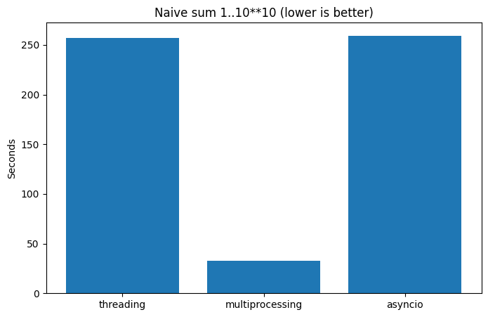

# 📘 Лабораторная работа: сравнение вычислений

Multiprocessing даёт единственный реальный выигрыш, потому что каждый процесс работает на собственном ядре и не делит GIL, поэтому время падает почти в 8 раз. Threading и asyncio запускают лишь потоки внутри одного процесса, оставаясь под тем же GIL, — отсюда почти идентичные и существенно более длинные времена.

| Подход            | Время, с |
|-------------------|---------|
| threading         | **256.99** |
| multiprocessing   | **32.66** |
| asyncio           | **259.37** |

