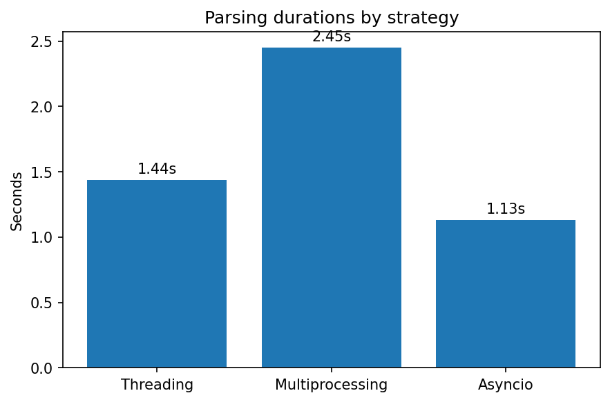

# 📘 Лабораторная работа: парсер

# Документация по парсерам

## Подходы и программы

| Файл            | Подход              | Суть механизма                                                                | Когда применять                          |
| --------------- | ------------------- | ----------------------------------------------------------------------------- | ---------------------------------------- |
| `threads.py`    | **Threading**       | Пул потоков параллелит I/O‑операции в одном процессе (GIL остаётся).          | I/O‑bound задачи без тяжёлых вычислений  |
| `multiproc.py`  | **Multiprocessing** | Отдельные процессы дают истинный параллелизм, но дорого стоят создание и IPC. | CPU‑bound задачи, изоляция, обход GIL    |
| `async_main.py` | **Asyncio**         | Асинхронные корутины переключаются по `await`, минимальный overhead.          | Массовые I/O‑bound операции (сеть, диск) |

## Время выполнения

| Подход          | Время, с |
| --------------- | -------- |
| Threading       | **1.44** |
| Multiprocessing | **2.45** |
| Asyncio         | **1.13** |

## Итоги сравнения

* **Asyncio** быстрее всех благодаря отсутствию затрат на переключение потоков/процессов.
* **Threading** средний вариант: дешевле процессов, но ограничен GIL.
* **Multiprocessing** самый медленный на небольшом объёме работы из‑за затрат на процессы.

### Вывод

Используйте `asyncio` для сетевых парсеров, потоки — для простых I/O‑bound задач, процессы — для CPU‑bound.

## Скриншот графика

