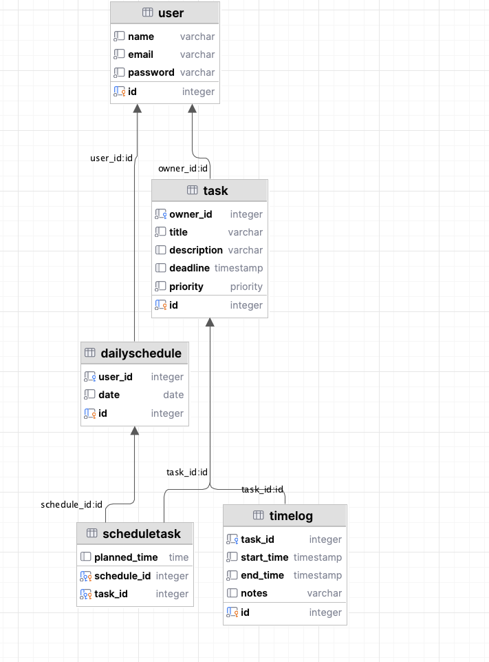
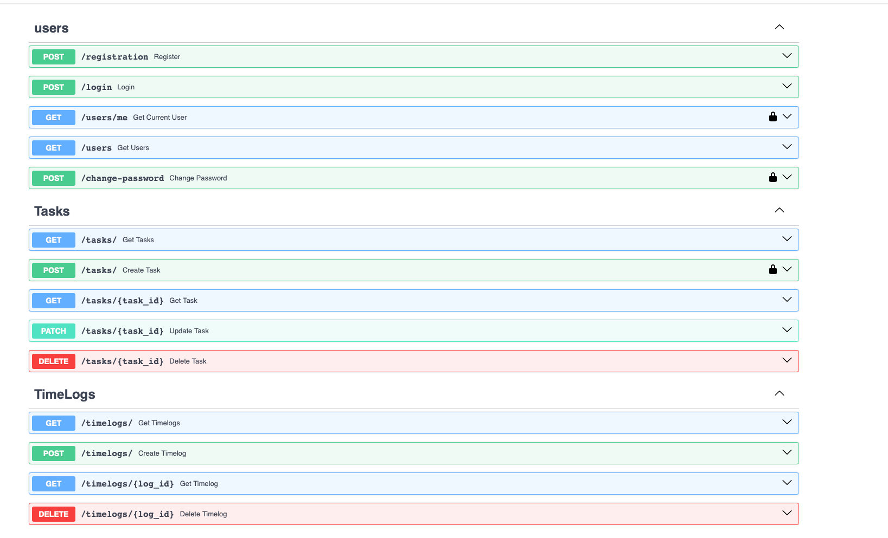
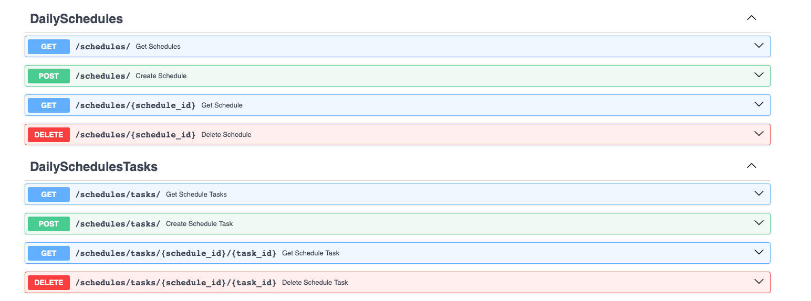

# Лабораторная работа 1. Реализация серверного приложения FastAPI

## Тема:
Разработка веб-приложения для поиска партнеров в путешествие.

# Ход работы:
Схема базы данных:


Файл `models.py`
```python
from datetime import datetime, date, time
from typing import Optional, List
from enum import Enum
from sqlmodel import SQLModel, Field, Relationship


class Priority(str, Enum):
    low = "low"
    medium = "medium"
    high = "high"


class User(SQLModel, table=True):
    id: Optional[int] = Field(default=None, primary_key=True)
    name: str
    email: str
    password: str

    tasks: List["Task"] = Relationship(back_populates="owner")
    schedules: List["DailySchedule"] = Relationship(back_populates="user")


class Task(SQLModel, table=True):
    id: Optional[int] = Field(default=None, primary_key=True)
    owner_id: int = Field(foreign_key="user.id")
    title: str
    description: Optional[str] = None
    deadline: Optional[datetime] = None
    priority: Priority = Priority.medium

    owner: Optional[User] = Relationship(back_populates="tasks")
    time_logs: List["TimeLog"] = Relationship(back_populates="task")
    schedule_items: List["ScheduleTask"] = Relationship(back_populates="task")


class TimeLog(SQLModel, table=True):
    id: Optional[int] = Field(default=None, primary_key=True)
    task_id: int = Field(foreign_key="task.id")
    start_time: datetime
    end_time: datetime
    notes: Optional[str] = None

    task: Optional[Task] = Relationship(back_populates="time_logs")


class DailySchedule(SQLModel, table=True):
    id: Optional[int] = Field(default=None, primary_key=True)
    user_id: int = Field(foreign_key="user.id")
    date: date

    user: Optional[User] = Relationship(back_populates="schedules")
    items: List["ScheduleTask"] = Relationship(back_populates="schedule")


class ScheduleTask(SQLModel, table=True):
    schedule_id: int = Field(foreign_key="dailyschedule.id", primary_key=True)
    task_id: int = Field(foreign_key="task.id", primary_key=True)
    planned_time: Optional[time] = None

    schedule: Optional[DailySchedule] = Relationship(back_populates="items")
    task: Optional[Task] = Relationship(back_populates="schedule_items")

```

Файл `connection.py`

```python
import os

from dotenv import load_dotenv
from sqlmodel import SQLModel, Session, create_engine

load_dotenv()
db_url = os.getenv('DB_URL')
engine = create_engine(db_url, echo=True)


def init_db():
    SQLModel.metadata.create_all(engine)


def get_session():
    with Session(engine) as session:
        yield session

```

Файл `task_endpoints.py`

```python
from typing import List

from fastapi import APIRouter, Depends, HTTPException
from sqlmodel import Session, select

from auth.auth import AuthHandler
from db.connection import get_session
from model.models.models import Task
from model.schemas.task import TaskRead, TaskCreate, TaskUpdate

task_router = APIRouter()
auth_handler = AuthHandler()


@task_router.post("/", response_model=TaskRead)
def create_task(task: TaskCreate, session: Session = Depends(get_session),
                current_user=Depends(auth_handler.get_current_user)):
    db_task = Task(**task.model_dump(), owner_id=current_user.id)
    session.add(db_task)
    session.commit()
    session.refresh(db_task)
    return db_task


@task_router.get("/", response_model=List[TaskRead])
def get_tasks(session: Session = Depends(get_session)):
    return session.exec(select(Task)).all()


@task_router.get("/{task_id}", response_model=TaskRead)
def get_task(task_id: int, session: Session = Depends(get_session)):
    task = session.get(Task, task_id)
    if not task:
        raise HTTPException(status_code=404, detail="Task not found")
    return task


@task_router.patch("/{task_id}", response_model=TaskRead)
def update_task(task_id: int, update: TaskUpdate, session: Session = Depends(get_session)):
    task = session.get(Task, task_id)
    if not task:
        raise HTTPException(status_code=404, detail="Task not found")
    update_data = update.model_dump(exclude_unset=True)
    for key, value in update_data.items():
        setattr(task, key, value)
    session.commit()
    session.refresh(task)
    return task


@task_router.delete("/{task_id}", response_model=dict)
def delete_task(task_id: int, session: Session = Depends(get_session)):
    task = session.get(Task, task_id)
    if not task:
        raise HTTPException(status_code=404, detail="Task not found")
    session.delete(task)
    session.commit()
    return {"ok": True}

```

Файл `schemas.task`

```python
from datetime import datetime
from typing import Optional

from pydantic import BaseModel

from model.models.models import Priority, User


class TaskBase(BaseModel):
    title: str
    description: Optional[str] = None
    deadline: Optional[datetime] = None
    priority: Optional[Priority] = Priority.medium


class TaskCreate(TaskBase):
    pass


class TaskUpdate(BaseModel):
    title: Optional[str] = None
    description: Optional[str] = None
    deadline: Optional[datetime] = None
    priority: Optional[Priority] = None


class TaskRead(TaskBase):
    id: int
    owner: Optional["User"] = None

class TaskReadShort(BaseModel):
    id: int
    title: str
    deadline: Optional[datetime] = None
    priority: Priority
```

Эндпоинты в Swagger

