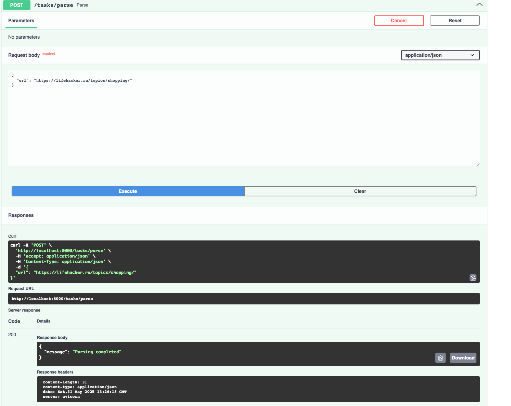
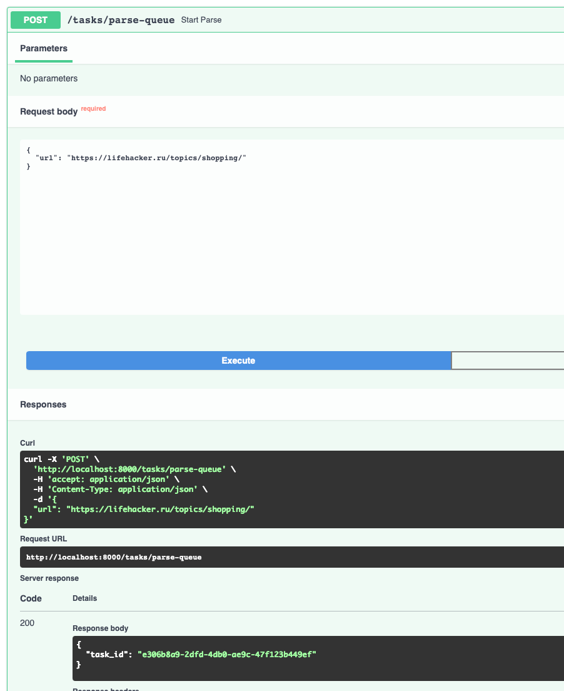
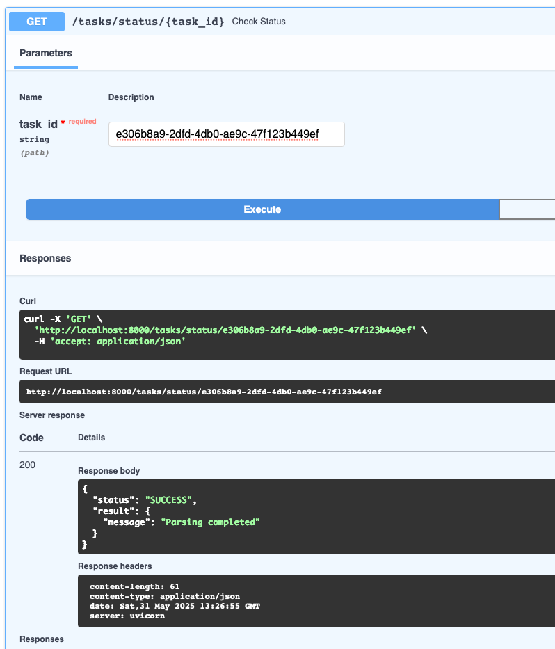
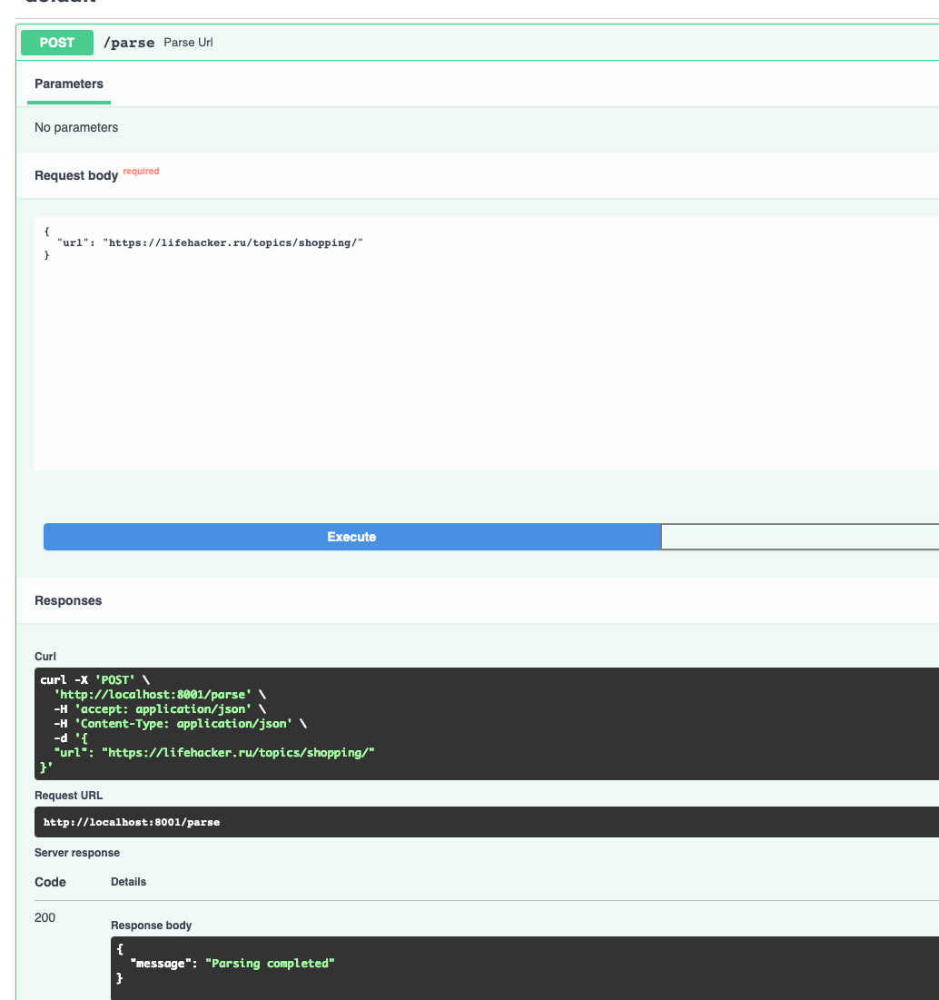

# Лабораторная работа 3. Упаковка FastAPI приложения в Docker, Работа с источниками данных и Очереди

## Тема:
Создание системы для управления временем

# Ход работы:

`Dockerfile` приложения FastApi
```
FROM python:3.11-slim

WORKDIR /app

ENV PYTHONPATH=/app

COPY requirements.txt .

RUN pip install --no-cache-dir -r requirements.txt

COPY . .


CMD ["uvicorn", "main:app", "--host", "0.0.0.0", "--port", "8000"]
```

`Dockerfile` приложения parser
```
FROM python:3.11-slim

WORKDIR /parser

COPY requirements.txt .

RUN pip install --no-cache-dir -r requirements.txt

COPY . .

CMD ["uvicorn", "app.parser_app:app", "--host", "0.0.0.0", "--port", "8001"]

```

`docker-compose.yaml`

```
services:
  postgres:
    image: postgres:15
    container_name: postgres_container_lab
    restart: unless-stopped
    environment:
      POSTGRES_USER: ${DB_USER:-postgres}
      POSTGRES_PASSWORD: ${DB_PASSWORD:-changeme}
      POSTGRES_DB: ${DB_NAME:-app_db}
      PGDATA: /data/postgres
    volumes:
      - postgres:/data/postgres
    ports:
      - "5436:5432"
    networks:
      - backend

  redis:
    image: redis:7
    container_name: rediska
    ports:
      - "6379:6379"
    networks:
      - backend

  fastapi_app:
    build:
      context: ./app
      dockerfile: Dockerfile
    container_name: fastapi_app
    depends_on:
      - postgres
      - redis
    env_file:
      - .env
    ports:
      - "8000:8000"
    networks:
      - backend

  parser_app:
    build:
      context: ./parser
      dockerfile: Dockerfile
    container_name: parser_app
    depends_on:
      - postgres
      - redis
    env_file:
      - .env
    ports:
      - "8001:8001"
    networks:
      - backend

  celery_worker:
    build:
      context: ./app
    command: celery -A app.celery_app worker --loglevel=info
    container_name: celery_worker
    working_dir: /app
    environment:
      - PYTHONPATH=/app
    depends_on:
      - redis
      - postgres
    env_file:
      - .env
    networks:
      - backend

  celery_beat:
    build:
      context: ./app
      dockerfile: Dockerfile
    container_name: celery_beat
    command: celery -A app.celery_app beat --loglevel=info
    depends_on:
      - redis
    env_file:
      - .env
    networks:
      - backend


volumes:
  postgres:

networks:
  backend:

```

`celery_app.py` 
```python
from celery import Celery

celery_app = Celery(
    "fastapi",
    broker="redis://redis:6379/0",
    backend="redis://redis:6379/1"
)

celery_app.conf.beat_schedule = {
    "run-parsing-every-2-minutes": {
        "task": "app.tasks.run_periodic_parsing",
        "schedule": 120.0,
    },
}

celery_app.autodiscover_tasks(["app"])
```

`tasks.py`
```python
import os
import requests

from app.celery_app import celery_app

from urls import urls


@celery_app.task(name="app.tasks.parse_url_task")
def parse_url_task(url: str):
    parser_url = os.getenv("PARSER_URL", "http://parser_app:8001/parse")
    response = requests.post(parser_url, json={"url": url})
    response.raise_for_status()
    return response.json()

@celery_app.task(name="app.tasks.run_periodic_parsing")
def run_periodic_parsing():
    for url in urls:
        parse_url_task.delay(url) 
    return f"Dispatched {len(urls)} parsing tasks"
```

Необходимые эндпоинты в приложении FastApi
```python
@task_router.post("/", response_model=TaskRead)
def create_task(task: TaskCreate, session: Session = Depends(get_session),
                current_user=Depends(auth_handler.get_current_user)):
    db_task = Task(**task.model_dump(), owner_id=current_user.id)
    session.add(db_task)
    session.commit()
    session.refresh(db_task)
    return db_task


@task_router.get("/", response_model=List[TaskRead])
def get_tasks(session: Session = Depends(get_session)):
    return session.exec(select(Task)).all()


@task_router.get("/{task_id}", response_model=TaskRead)
def get_task(task_id: int, session: Session = Depends(get_session)):
    task = session.get(Task, task_id)
    if not task:
        raise HTTPException(status_code=404, detail="Task not found")
    return task
```

Файл `parser_app.py`
```python
from contextlib import asynccontextmanager

from fastapi import FastAPI

from app.parser_service import parse_and_save
from common.connection import init_db
from common.parse import ParseRequest


@asynccontextmanager
async def lifespan(app: FastAPI):
    init_db()
    yield


app = FastAPI(lifespan=lifespan)

@app.post("/parse")
async def parse_url(parse_request: ParseRequest):
    print(parse_request.url)
    print(f"Parsing URL: {parse_request.url}")
    await parse_and_save(parse_request.url)
    return {"message": "Parsing completed"}
```

Эндпоинт для общения с parser



Эндпоинт для общения с parser, настроенный через очередь



Эндпоинт для того, чтобы узнать статус задачи



Эндпоинт приложения парсера

