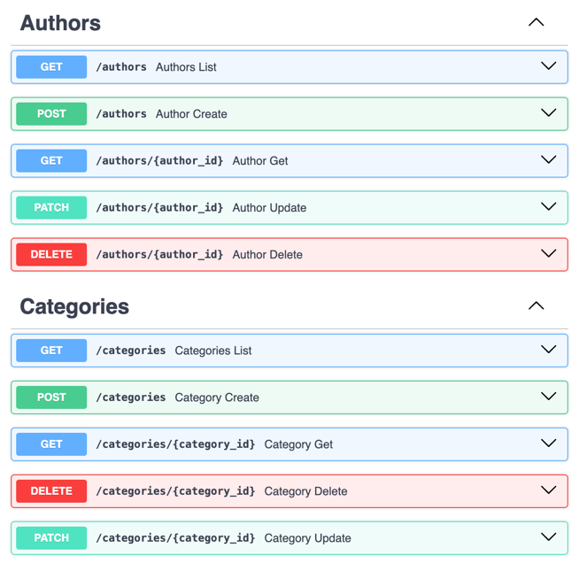

# Вариант
Ваша задача - создать веб-приложение, которое позволит пользователям обмениваться книгами между собой. Это приложение должно облегчать процесс обмена книгами, позволяя пользователям находить книги, которые им интересны, и находить новых пользователей для обмена книгами. Функционал веб-приложения должен включать следующее:

Создание профилей: Возможность пользователям создавать профили, указывать информацию о себе, своих навыках, опыте работы и предпочтениях по проектам.

Добавление книг в библиотеку: Пользователи могут добавлять книги, которыми они готовы поделиться, в свою виртуальную библиотеку на платформе.

Поиск и запросы на обмен: Функционал поиска книг в библиотеке других пользователей. Возможность отправлять запросы на обмен книгами другим пользователям.

Управление запросами и обменами: Возможность просмотра и управления запросами на обмен. Возможность подтверждения или отклонения запросов на обмен.

# Реализованные эндпоинты

# Models
    from sqlmodel import Field, Relationship, SQLModel
    from enum import Enum
    from typing import List, Optional
    import datetime
    
    
    class BookCategory(SQLModel, table=True):
        book_id: int = Field(foreign_key="book.id", primary_key=True)
        category_id: int = Field(foreign_key="category.id", primary_key=True)
    
    
    class Category(SQLModel, table=True):
        id: int = Field(default=None, primary_key=True)
        name: str
        books: Optional[List["Book"]] = Relationship(back_populates="categories", link_model=BookCategory)
    
    
    class Author(SQLModel, table=True):
        id: int = Field(default=None, primary_key=True)
        name: str
        books: Optional[List["Book"]] = Relationship(back_populates="author")
    
    
    class BookCopy(SQLModel, table=True):
        id: int = Field(default=None, primary_key=True)
        book_id: Optional[int] = Field(default=None, foreign_key="book.id")
        user_id: Optional[int] = Field(default=None, foreign_key="user.id")
    
    
    class Book(SQLModel, table=True):
        id: int = Field(default=None, primary_key=True)
        name: str
        author_id: Optional[int] = Field(default=None, foreign_key="author.id")
        author: Optional[Author] = Relationship(back_populates="books")
        categories: Optional[List[Category]] = Relationship(back_populates="books", link_model=BookCategory)
        owners: Optional[List["User"]] = Relationship(back_populates="own_books", link_model=BookCopy)
    
    
    class User(SQLModel, table=True):
        id: int = Field(default=None, primary_key=True)
        username: str
        email: str
        password: str
        own_books: Optional[List[Book]] = Relationship(back_populates="owners", link_model=BookCopy)
        shared_books: Optional[List["Sharing"]] = Relationship(
            back_populates="owner",
            sa_relationship_kwargs=dict(foreign_keys="[Sharing.owner_id]")
        )
        borrowed_books: Optional[List["Sharing"]] = Relationship(
            back_populates="taking",
            sa_relationship_kwargs=dict(foreign_keys="[Sharing.taking_id]")
        )
    
    
    class SharingStatus(Enum):
        requested = "requested"
        active = "active"
        archived = "archived"
    
    
    class Sharing(SQLModel, table=True):
        owner_id: int = Field(foreign_key="user.id")
        taking_id: int = Field(foreign_key="user.id")
        book_copy_id: int = Field(foreign_key="bookcopy.id")
        id: int = Field(default=None, primary_key=True)
        owner: Optional["User"] = Relationship(back_populates="shared_books",
                                               sa_relationship_kwargs=dict(foreign_keys="[Sharing.owner_id]")
                                               )
        taking: Optional["User"] = Relationship(back_populates="borrowed_books",
                                                sa_relationship_kwargs=dict(foreign_keys="[Sharing.taking_id]")
                                                )
    
        status: SharingStatus = Field(default=SharingStatus.requested)
    
    
    class CategoryIn(SQLModel):
        name: str
    
    
    class CategoryOut(CategoryIn):
        id: int
        books: Optional[List["Book"]] = None
    
    
    class AuthorIn(SQLModel):
        name: str
    
    
    class AuthorOut(AuthorIn):
        id: int
        books: Optional[List["Book"]] = None
    
    
    class BookIn(SQLModel):
        name: str
        author_id: Optional[int] = Field(default=None, foreign_key="author.id")
    
    
    class BookOut(BookIn):
        id: int
        author: Optional[Author] = None
        categories: Optional[List[Category]] = None
        owners: Optional[List[User]] = None
    
    
    class UserIn(SQLModel):
        username: str
        email: str
        password: str
    
    
    class UserLogin(SQLModel):
        username: str
        password: str
    
    
    class UserPassword(SQLModel):
        password: str
    
    
    class UserOut(UserIn):
        id: int
        own_books: Optional[List[Book]] = None
        shared_books: Optional[List["Sharing"]] = None
        borrowed_books: Optional[List["Sharing"]] = None

# Auth
    class AuthService:
        auth_scheme = HTTPBearer()
        pwd_context = CryptContext(schemes=['bcrypt'])
        SECRET_KEY =  os.getenv("SECRET_KEY")

    def hash_password(self, password: str) -> str:
        return self.pwd_context.hash(password)

    def verify_password(self, plain_password: str, hashed_password: str) -> bool:
        return self.pwd_context.verify(plain_password, hashed_password)

    def create_token(self, username: str) -> str:
        payload = {
            'exp': datetime.datetime.utcnow() + datetime.timedelta(hours=8),
            'iat': datetime.datetime.utcnow(),
            'sub': username
        }
        return jwt.encode(payload, self.SECRET_KEY, algorithm='HS256')

    def decode_token(self, token: str) -> str:
        try:
            payload = jwt.decode(token, self.SECRET_KEY, algorithms=['HS256'])
            return payload['sub']
        except jwt.ExpiredSignatureError:
            raise HTTPException(status_code=401, detail='Expired token')
        except jwt.InvalidTokenError:
            raise HTTPException(status_code=401, detail='Invalid token')

    def authenticate(self, auth: HTTPAuthorizationCredentials = Security(auth_scheme)) -> str:
        return self.decode_token(auth.credentials)

    def get_active_user(self, auth: HTTPAuthorizationCredentials = Security(auth_scheme),
                        session=Depends(get_session)) -> dict:
        credentials_exception = HTTPException(
            status_code=status.HTTP_401_UNAUTHORIZED,
            detail='Invalid credentials'
        )
        username = self.decode_token(auth.credentials)
        if not username:
            raise credentials_exception

        user = session.exec(select(User).where(User.username == username)).first()
        if not user:
            raise credentials_exception

        return user.dict()
