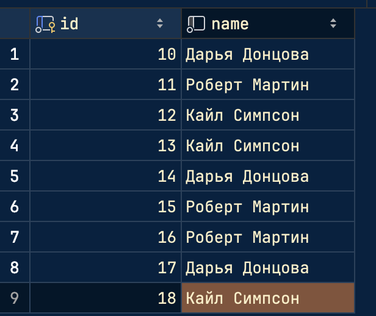
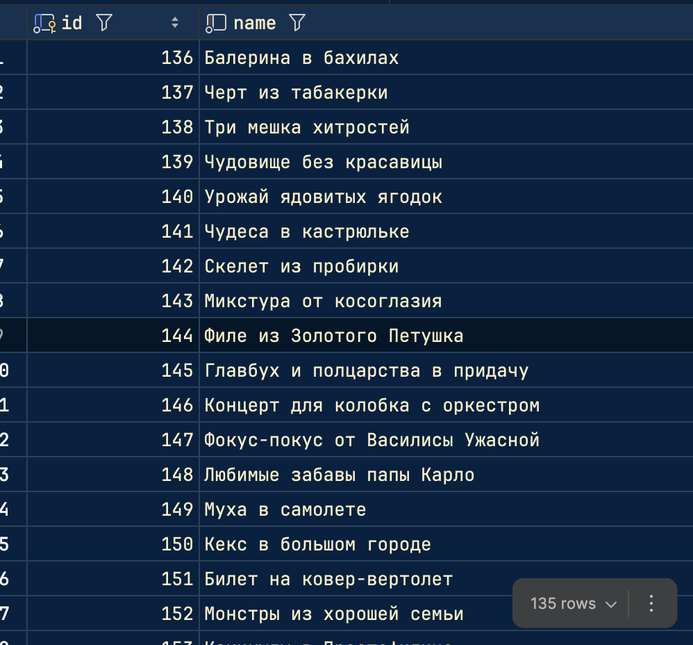

# Задача 1. Различия между threading, multiprocessing и async в Python

Задача: Напишите три различных программы на Python, использующие каждый из подходов: threading, multiprocessing и async. Каждая программа должна решать считать сумму всех чисел от 1 до 1000000000. Разделите вычисления на несколько параллельных задач для ускорения выполнения.

## asyncio
    import asyncio
    import time
    
    from students.K3341.Sakhno_Yaroslav.lr2.plt_builder import paint
    
    x = []
    y = []

    async def calculate_sum_of_range(start, end):
        partial_sum = sum(range(start, end))
        return partial_sum

    async def calculate_sum(border, task_cnt):
        start_time = time.time()
    
        cnt = border // task_cnt
    
        tasks = []
        for i in range(task_cnt):
            start = i * cnt + 1
            end = (i + 1) * cnt + 1 if i < task_cnt - 1 else border + 1
            task = asyncio.create_task(calculate_sum_of_range(start, end))
            tasks.append(task)
    
        sums = await asyncio.gather(*tasks)
        result = sum(sums)
    
        end_time = time.time()
    
        x.append(task_cnt)
        y.append(end_time - start_time)
    
        print("Выполнено с использованием asyncio")
    
        print("Сумма: ", result)
        print("Время:", end_time - start_time, "с")

    if __name__ == "__main__":
        border = 1000000000
        for i in range(2, 3):
        # for i in range(25, 26):
            asyncio.run(calculate_sum(border, i))
        print(x, y)
        paint(x, y, "Сумма " + str(border) + " asyncio")
Хорошо работает с задачами, зависящими от ввода/вывода (I/O-bound), в этом случае неэффективен из-за CPU-bound задачи
## multiprocessing
    import multiprocessing
    import time
    
    from students.K3341.Sakhno_Yaroslav.lr2.plt_builder import paint
    
    x = []
    y = []
    
    def calculate_sum_of_range(start, end, result):
        partial_sum = sum(range(start, end))
        result.put(partial_sum)
    
    
    def calculate_sum(border, processes_cnt):
        start_time = time.time()
    
        results = multiprocessing.Queue()
    
        processes = []
        cnt = border // processes_cnt
        for i in range(processes_cnt):
            start = i * cnt + 1
            end = (i + 1) * cnt + 1 if i < processes_cnt - 1 else border + 1
            process = multiprocessing.Process(target=calculate_sum_of_range, args=(start, end, results))
            processes.append(process)
            process.start()
    
        for process in processes:
            process.join()
    
        result = 0
        while not results.empty():
            result += results.get()
    
        end_time = time.time()
    
        x.append(processes_cnt)
        y.append(end_time - start_time)
    
        print("Выполнено с использованием multiprocessing")
    
        print("Сумма: ", result)
        print("Время:", end_time - start_time, "с")
    
    
    if __name__ == "__main__":
        border = 1000000000
        for i in range(2, 3):
        # for i in range(2, 30):
            calculate_sum(border, i)
        print(x, y)
        paint(x, y, "Сумма " + str(border) + " multiprocessing")
Подходит для CPU-bound задачи, так как каждый процесс исполняется в отдельном пространстве и обходит ограничения GIL, а также эффективно использует многоядерные процессоры.
## threading
    import threading
    import time
    
    from students.K3341.Sakhno_Yaroslav.lr2.plt_builder import paint
    
    x = []
    y = []
    
    def calculate_sum_of_range(start, end, result):
        partial_sum = sum(range(start, end))
        result.append(partial_sum)
    
    
    def calculate_sum(border, threads_cnt):
        start_time = time.time()
    
        results = []
        threads = []
    
        cnt = border // threads_cnt
        for i in range(threads_cnt):
            start = i * cnt + 1
            end = (i + 1) * cnt + 1 if i < threads_cnt - 1 else border + 1
            thread = threading.Thread(target=calculate_sum_of_range, args=(start, end, results))
            threads.append(thread)
            thread.start()
    
        for thread in threads:
            thread.join()
    
        result = sum(results)
    
        end_time = time.time()
    
        x.append(threads_cnt*1.0)
        y.append(end_time - start_time)
    
        print("Выполнено с использованием threading")
    
        print("Сумма: ", result)
        print("Кол-во потоков: ", threads_cnt)
        print("Время:", end_time - start_time, "с")
    
    
    if __name__ == "__main__":
        border = 1000000000
        for i in range(2, 3):
        # for i in range(5, 6):
            calculate_sum(border, i)
        print(x, y)
        paint(x, y, "Сумма " + str(border) + " threading")
Работает в пределах одного процесса, деля ресурсы и память, так как это фундаментальное ограничение питона в виже GIL.

| Метод          | Время (сек)          |
|----------------|----------------------|
| `asyncio`      | 7.201862096786499     |
| `multiprocessing` | 4.245497226715088 |
| `threading`    | 7.609512805938721     |

## Вывод

Для интенсивных вычислений (CPU-bound) стоит использовать multiprocessing, так как он обходит GIL и позволяет задействовать все доступные ядра процессора.

Если бы задача была связана с работой с файлами, сетью или базами данных (I/O-bound) — asyncio или threading могли бы показать гораздо лучшие результаты.

# Задача 2. Параллельный парсинг веб-страниц с сохранением в базу данных

Задача: Напишите программу на Python для параллельного парсинга нескольких веб-страниц с сохранением данных в базу данных с использованием подходов threading, multiprocessing и async. Каждая программа должна парсить информацию с нескольких веб-сайтов, сохранять их в базу данных.

## models

    from sqlmodel import Field, Relationship, SQLModel
    from enum import Enum
    from typing import List, Optional
    
    
    class BookCategory(SQLModel, table=True):
        book_id: int = Field(foreign_key="book.id", primary_key=True)
        category_id: int = Field(foreign_key="category.id", primary_key=True)
    
    
    class Category(SQLModel, table=True):
        id: int = Field(default=None, primary_key=True)
        name: str
        books: Optional[List["Book"]] = Relationship(back_populates="categories", link_model=BookCategory)
    
    
    class Author(SQLModel, table=True):
        id: int = Field(default=None, primary_key=True)
        name: str
        books: Optional[List["Book"]] = Relationship(back_populates="author")
    
    
    class BookCopy(SQLModel, table=True):
        id: int = Field(default=None, primary_key=True)
        book_id: Optional[int] = Field(default=None, foreign_key="book.id")
        user_id: Optional[int] = Field(default=None, foreign_key="user.id")
    
    
    class Book(SQLModel, table=True):
        id: int = Field(default=None, primary_key=True)
        name: str
        author_id: Optional[int] = Field(default=None, foreign_key="author.id")
        author: Optional[Author] = Relationship(back_populates="books")
        categories: Optional[List[Category]] = Relationship(back_populates="books", link_model=BookCategory)
        owners: Optional[List["User"]] = Relationship(back_populates="own_books", link_model=BookCopy)
    
    
    class User(SQLModel, table=True):
        id: int = Field(default=None, primary_key=True)
        username: str
        email: str
        password: str
        own_books: Optional[List[Book]] = Relationship(back_populates="owners", link_model=BookCopy)
        shared_books: Optional[List["Sharing"]] = Relationship(
            back_populates="owner",
            sa_relationship_kwargs=dict(foreign_keys="[Sharing.owner_id]")
        )
        borrowed_books: Optional[List["Sharing"]] = Relationship(
            back_populates="taking",
            sa_relationship_kwargs=dict(foreign_keys="[Sharing.taking_id]")
        )
    
    
    class SharingStatus(Enum):
        requested = "requested"
        active = "active"
        archived = "archived"
    
    
    class Sharing(SQLModel, table=True):
        owner_id: int = Field(foreign_key="user.id")
        taking_id: int = Field(foreign_key="user.id")
        book_copy_id: int = Field(foreign_key="bookcopy.id")
        id: int = Field(default=None, primary_key=True)
        owner: Optional["User"] = Relationship(back_populates="shared_books",
                                               sa_relationship_kwargs=dict(foreign_keys="[Sharing.owner_id]")
                                               )
        taking: Optional["User"] = Relationship(back_populates="borrowed_books",
                                                sa_relationship_kwargs=dict(foreign_keys="[Sharing.taking_id]")
                                                )
    
        status: SharingStatus = Field(default=SharingStatus.requested)
    
    
    class CategoryIn(SQLModel):
        name: str
    
    
    class CategoryOut(CategoryIn):
        id: int
        books: Optional[List["Book"]] = None
    
    
    class AuthorIn(SQLModel):
        name: str
    
    
    class AuthorOut(AuthorIn):
        id: int
        books: Optional[List["Book"]] = None
    
    
    class BookIn(SQLModel):
        name: str
        author_id: Optional[int] = Field(default=None, foreign_key="author.id")
    
    
    class BookOut(BookIn):
        id: int
        author: Optional[Author] = None
        categories: Optional[List[Category]] = None
        owners: Optional[List[User]] = None
    
    
    class UserIn(SQLModel):
        username: str
        email: str
        password: str
    
    
    class UserLogin(SQLModel):
        username: str
        password: str
    
    
    class UserPassword(SQLModel):
        password: str
    
    
    class UserOut(UserIn):
        id: int
        own_books: Optional[List[Book]] = None
        shared_books: Optional[List["Sharing"]] = None
        borrowed_books: Optional[List["Sharing"]] = None
## async
    import asyncio
    from save_data_async import save_to_db
    from parser_async import parse_data
    import time
    
    urls = [
        "https://www.litres.ru/author/kayl-simpson/",
        "https://www.litres.ru/author/robert-s-martin/",
        "https://www.litres.ru/author/darya-doncova/"
    ]
    
    
    async def parse_and_save(url):
        author_info = await parse_data(url)
        await save_to_db(author_info)
    
    
    async def start():
        start_time = time.time()
    
        tasks = []
        for url in urls:
            task = asyncio.create_task(parse_and_save(url))
            tasks.append(task)
    
        await asyncio.gather(*tasks)
    
        end_time = time.time()
    
        print("asynio")
        print(f"Время: {end_time - start_time} c")
    
    if __name__ == '__main__':
        asyncio.run(start())
## multiprocessing
    import multiprocessing
    from parser import parse_data
    from save_data import save_to_db
    import time
    
    urls = [
        "https://www.litres.ru/author/kayl-simpson/",
        "https://www.litres.ru/author/robert-s-martin/",
        "https://www.litres.ru/author/darya-doncova/"
    ]
    
    def parse_and_save(chunk):
        for url in chunk:
            author_info = parse_data(url)
            save_to_db(author_info)
    
    
    def start():
        start_time = time.time()
    
        processes_cnt = len(urls)
        size = len(urls) // processes_cnt
        batches = [urls[i:i + size] for i in range(0, len(urls), size)]
    
        processes = []
        for batch in batches:
            process = multiprocessing.Process(target=parse_and_save, args=(batch,))
            processes.append(process)
            process.start()
    
        for process in processes:
            process.join()
    
        end_time = time.time()
        execution_time = end_time - start_time
    
        print("multiprocessing")
        print(f"Время: {execution_time} с")
    
    
    if __name__ == '__main__':
        start()
## threading
    import threading
    from parser import parse_data
    from save_data import save_to_db
    import time
    
    urls = [
        "https://www.litres.ru/author/kayl-simpson/",
        "https://www.litres.ru/author/robert-s-martin/",
        "https://www.litres.ru/author/darya-doncova/"
    ]
    
    def parse_and_save(urls):
        for url in urls:
            author_info = parse_data(url)
            save_to_db(author_info)
    
    
    def start():
        start_time = time.time()
    
        threads_cnt = 3
        size = len(urls) // threads_cnt
        batches = [urls[i:i + size] for i in range(0, len(urls), size)]
    
        threads = []
        for batch in batches:
            thread = threading.Thread(target=parse_and_save, args=(batch,))
            thread.start()
            threads.append(thread)
    
        for thread in threads:
            thread.join()
    
        end_time = time.time()
        execution_time = end_time - start_time
    
        print("threading")
        print(f"Время: {execution_time} с")
    
    
    if __name__ == '__main__':
        start()
Программы парсят с сайта литрес трех авторов и их книги и загружают результат в базу данных.

| Метод          | Время (сек)          |
|----------------|----------------------|
| `asyncio`      | 0.49976301193237305      |
| `multiprocessing` | 2.9438908100128174 |
| `threading`    | 1.1627459526062012      |

# Вывод
В задаче лучше всего показал asyncio, так как здесь легкие I/O-задачи (веб-запросы, запись в базу, файловые операции). Multiprocessing здесь дольше из-за накладных расходов в виде создания процессов.