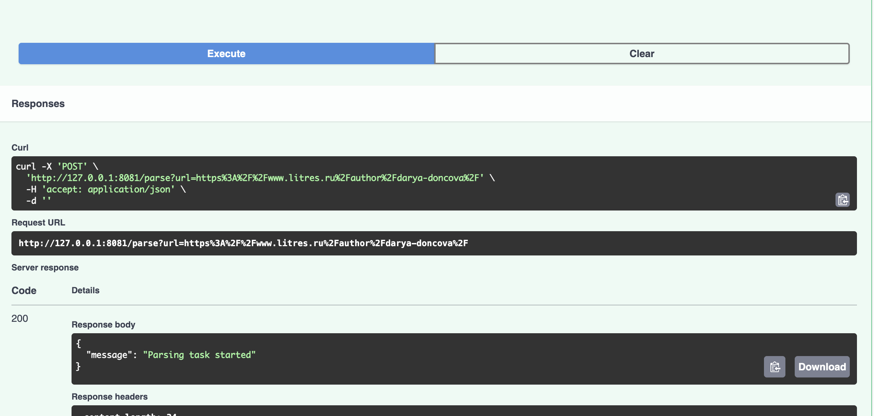
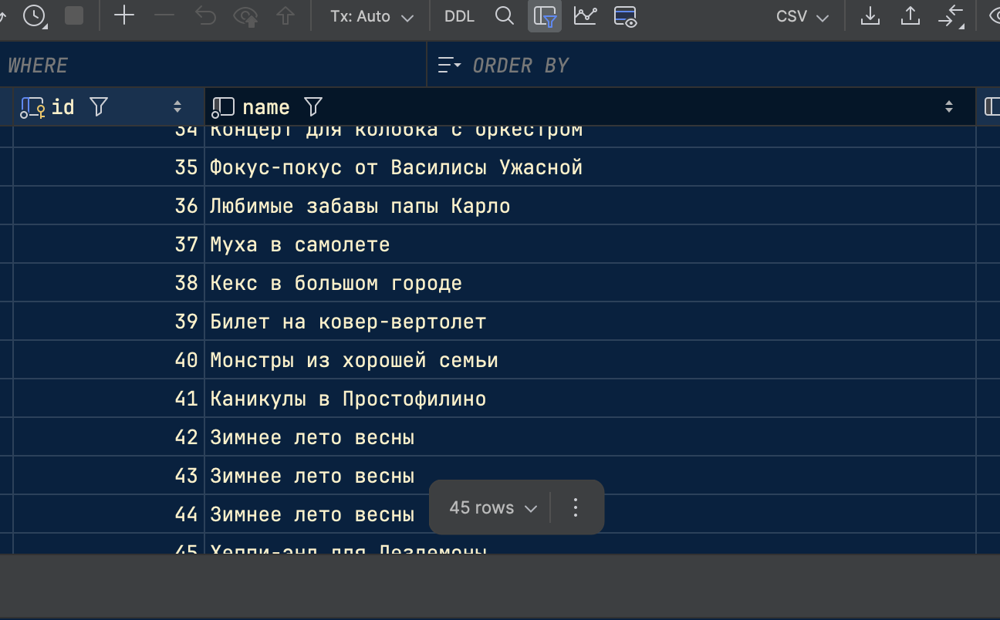

# celery_config.py
    from celery import Celery
    
    celery_app = Celery("parser", broker='redis://redis:6379', backend='redis://redis:6379')
    
    celery_app.conf.update(
        task_serializer='json',
        accept_content=['json'],
        result_serializer='json'
    )
    
    celery_app.autodiscover_tasks(['main'])
# main.py
    import requests
    from fastapi import FastAPI, HTTPException
    from celery_config import celery_app
    from parser import parse_data
    from save_data import save_to_db
    from celery import shared_task
    
    app = FastAPI()
    
    # urls = [
    #     "https://www.litres.ru/author/kayl-simpson/",
    #     "https://www.litres.ru/author/robert-s-martin/",
    #     "https://www.litres.ru/author/darya-doncova/"
    # ]
    @app.get("/")
    async def root():
        return {"message": "Ярослав Сахно"}
    
    
    @app.post("/parse")
    async def parse(url: str):
        try:
            parse_task.delay(url)
            return {"message": "Parsing task started"}
        except requests.RequestException as e:
            raise HTTPException(status_code=500, detail=str(e))
    
    
    @shared_task
    def parse_task(url: str):
        try:
            response = requests.get(url)
            response.raise_for_status()
            author_info = parse_data(url)
            save_to_db(author_info)
        except requests.RequestException as e:
            raise HTTPException(status_code=500, detail=str(e))
# models.py
    from sqlmodel import Field, Relationship, SQLModel
    from enum import Enum
    from typing import List, Optional
    import datetime
    
    
    class BookCategory(SQLModel, table=True):
        book_id: int = Field(foreign_key="book.id", primary_key=True)
        category_id: int = Field(foreign_key="category.id", primary_key=True)
    
    
    class Category(SQLModel, table=True):
        id: int = Field(default=None, primary_key=True)
        name: str
        books: Optional[List["Book"]] = Relationship(back_populates="categories", link_model=BookCategory)
    
    
    class Author(SQLModel, table=True):
        id: int = Field(default=None, primary_key=True)
        name: str
        books: Optional[List["Book"]] = Relationship(back_populates="author")
    
    
    class BookCopy(SQLModel, table=True):
        id: int = Field(default=None, primary_key=True)
        book_id: Optional[int] = Field(default=None, foreign_key="book.id")
        user_id: Optional[int] = Field(default=None, foreign_key="user.id")
    
    
    class Book(SQLModel, table=True):
        id: int = Field(default=None, primary_key=True)
        name: str
        author_id: Optional[int] = Field(default=None, foreign_key="author.id")
        author: Optional[Author] = Relationship(back_populates="books")
        categories: Optional[List[Category]] = Relationship(back_populates="books", link_model=BookCategory)
        owners: Optional[List["User"]] = Relationship(back_populates="own_books", link_model=BookCopy)
    
    
    class User(SQLModel, table=True):
        id: int = Field(default=None, primary_key=True)
        username: str
        email: str
        password: str
        own_books: Optional[List[Book]] = Relationship(back_populates="owners", link_model=BookCopy)
        shared_books: Optional[List["Sharing"]] = Relationship(
            back_populates="owner",
            sa_relationship_kwargs=dict(foreign_keys="[Sharing.owner_id]")
        )
        borrowed_books: Optional[List["Sharing"]] = Relationship(
            back_populates="taking",
            sa_relationship_kwargs=dict(foreign_keys="[Sharing.taking_id]")
        )
    
    
    class SharingStatus(Enum):
        requested = "requested"
        active = "active"
        archived = "archived"
    
    
    class Sharing(SQLModel, table=True):
        owner_id: int = Field(foreign_key="user.id")
        taking_id: int = Field(foreign_key="user.id")
        book_copy_id: int = Field(foreign_key="bookcopy.id")
        id: int = Field(default=None, primary_key=True)
        owner: Optional["User"] = Relationship(back_populates="shared_books",
                                               sa_relationship_kwargs=dict(foreign_keys="[Sharing.owner_id]")
                                               )
        taking: Optional["User"] = Relationship(back_populates="borrowed_books",
                                                sa_relationship_kwargs=dict(foreign_keys="[Sharing.taking_id]")
                                                )
    
        status: SharingStatus = Field(default=SharingStatus.requested)
    
    
    class CategoryIn(SQLModel):
        name: str
    
    
    class CategoryOut(CategoryIn):
        id: int
        books: Optional[List["Book"]] = None
    
    
    class AuthorIn(SQLModel):
        name: str
    
    
    class AuthorOut(AuthorIn):
        id: int
        books: Optional[List["Book"]] = None
    
    
    class BookIn(SQLModel):
        name: str
        author_id: Optional[int] = Field(default=None, foreign_key="author.id")
    
    
    class BookOut(BookIn):
        id: int
        author: Optional[Author] = None
        categories: Optional[List[Category]] = None
        owners: Optional[List[User]] = None
    
    
    class UserIn(SQLModel):
        username: str
        email: str
        password: str
    
    
    class UserLogin(SQLModel):
        username: str
        password: str
    
    
    class UserPassword(SQLModel):
        password: str
    
    
    class UserOut(UserIn):
        id: int
        own_books: Optional[List[Book]] = None
        shared_books: Optional[List["Sharing"]] = None
        borrowed_books: Optional[List["Sharing"]] = None
# parser.py
    import requests
    from bs4 import BeautifulSoup
    import json
    
    
    def parse_data(url):
        response = requests.get(url)
    
        soup = BeautifulSoup(response.text, 'html.parser')
    
        author_name = soup.find('h1', class_='Author_authorName__i4Wxb').text.strip()
    
        books_elements = soup.find_all('a', class_='ListItem_listContextItem__title__V1ZbU')
        books = [book.text.strip() for book in books_elements]
    
        author_data = {
            'author_name': author_name,
            'books': books
        }
    
        json_data = json.dumps(author_data, ensure_ascii=False)
    
        return json_data
# save_data.py
    import json
    from sqlalchemy import create_engine
    from sqlalchemy.orm import sessionmaker
    from models import Author, Book
    import os
    from dotenv import load_dotenv
    
    load_dotenv()
    engine = create_engine(os.getenv("DB_ADMIN"), echo=True)
    SessionLocal = sessionmaker(autocommit=False, autoflush=False, bind=engine)
    
    
    def save_to_db(data: str):
        data_dict = json.loads(data)
    
        print(data)
    
        session = SessionLocal()
    
        try:
            author_name = data_dict.get('author_name')
    
            if not author_name:
                raise ValueError("Некорректные данные")
    
            author = Author(name=author_name)
    
            book_names = data_dict.get('books')
    
            if not book_names:
                raise ValueError("Некорректные данные")
    
            books = [Book(name=title, author=author) for title in book_names]
    
            session.add(author)
            session.add_all(books)
    
            session.commit()
            session.refresh(author)
    
            return author, books
    
        finally:
            session.close()
# Пример

# Результат
