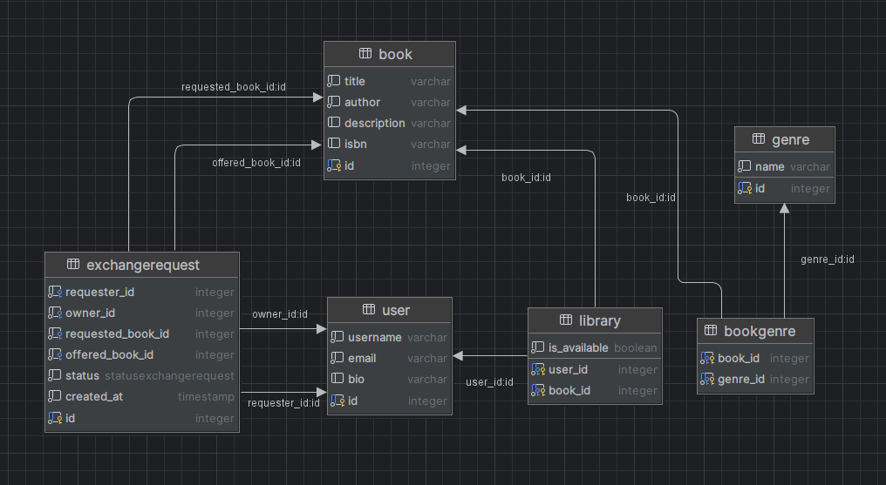

## Диаграмма

## Пояснение
**User** — таблица пользователей. Содержит информацию о username, email, bio и хэшированном пароле. Связана с таблицами Library (библиотека книг пользователя) и ExchangeRequest (запросы на обмен).

**Genre** — таблица жанров книг. Содержит название жанра. Связана с книгами через связующую таблицу BookGenre.

**Book** — таблица книг. Содержит информацию о названии, авторе, описании и ISBN. Связана с жанрами (через BookGenre) и пользователями (через Library).

**BookGenre** — связующая таблица для отношений многие-ко-многим между книгами и жанрами.

**Library** — таблица для хранения книг пользователей. Содержит флаг is_available, указывающий доступность книги для обмена. Связывает пользователей и книги.

**ExchangeRequest** — таблица запросов на обмен книгами. Содержит информацию о запрашивающей стороне (requester), владельце книги (owner), запрашиваемой и предлагаемой книгах, статусе запроса и дате создания.