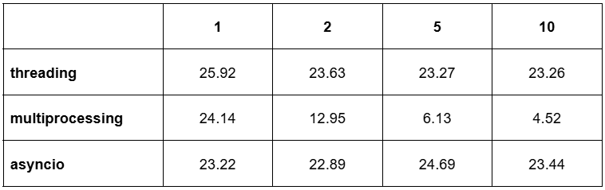
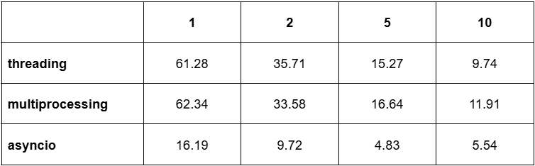

# Задание 1

## threading
```python
import threading
import time


def calculate_sum(a, b):
    s = 0
    for i in range(a, b + 1):
        s += i
    results.append(s)


def main(n, count_of_threads):
    start_time = time.time()
    size = n // count_of_threads
    threads = []
    for i in range(count_of_threads):
        a = i * size + 1
        b = (i + 1) * size if (i + 1) * size < n else n
        thread = threading.Thread(target=calculate_sum, args=(a, b))
        thread.start()
        threads.append(thread)
    for thread in threads:
        thread.join()
    total = sum(results)
    print('Result:', total)
    end_time = time.time()
    print('Total time:', end_time - start_time)


if __name__ == '__main__':
    results = []
    main(10 ** 9, 5)
```

## multiprocessing
```python
import multiprocessing
import time


def calculate_sum(a, b, results):
    s = 0
    for i in range(a, b + 1):
        s += i
    results.append(s)


def main(n, count_of_processes):
    start_time = time.time()
    size = n // count_of_processes
    manager = multiprocessing.Manager()
    results = manager.list()
    processes = []
    for i in range(count_of_processes):
        a = i * size + 1
        b = (i + 1) * size if (i + 1) * size < n else n
        process = multiprocessing.Process(target=calculate_sum, args=(a, b, results))
        processes.append(process)
        process.start()
    for process in processes:
        process.join()
    total = sum(results)
    print('Result:', total)
    end_time = time.time()
    print('Total time:', end_time - start_time)


if __name__ == '__main__':
    main(10 ** 9, 1)
```

## asyncio
```python
import asyncio
import time


async def calculate_sum(a, b):
    s = 0
    for i in range(a, b + 1):
        s += i
    return s


async def main(n, count_of_tasks):
    start_time = time.time()
    size = n // count_of_tasks
    tasks = []
    for i in range(count_of_tasks):
        a = i * size + 1
        b = (i + 1) * size if (i + 1) * size < n else n
        task = asyncio.create_task(calculate_sum(a, b))
        tasks.append(task)
    results = await asyncio.gather(*tasks)
    total = sum(results)
    print("Result:", total)
    end_time = time.time()
    print("Total time:", end_time - start_time)


if __name__ == '__main__':
    asyncio.run(main(10 ** 9, 10))
```

### Результаты


Как мы можем заметить, только multiprocessing дал нам положительный результат. Это можно объяснить существованием GIL, 
то есть при разделении процесса на потоки, интерпретатор не начинает обрабатывать их одновременно, а начинает
последовательно переключаться между ними. Multiprocessing же создает копии интерпретаторов, что позволяет параллельно 
обрабатывать процессы.


# Задание 2

## threading
```python
import threading
import time
from urllib.parse import urljoin

import requests
from bs4 import BeautifulSoup


def get_all_books():
    book_urls = []
    current_url = URL

    while True:
        response = requests.get(current_url)
        soup = BeautifulSoup(response.text, 'html.parser')

        book_links = soup.select('h3 a')
        for link in book_links:
            book_url = urljoin(current_url, link['href'])
            book_urls.append(book_url)

        next_button = soup.select_one('li.next a')
        if not next_button:
            break
        current_url = urljoin(current_url, next_button['href'])

    return book_urls


def parse_and_save(book_url):
    try:
        response = requests.get(book_url)
        soup = BeautifulSoup(response.text, 'html.parser')
        title = soup.find("div", class_="product_main").h1.string
        description = soup.find("div", id="product_description").find_next_sibling("p").string
        api_response = requests.post(
            "http://127.0.0.1:8000/books/",
            json={
                "title": title,
                "description": description
            },
            headers={"Content-Type": "application/json"}
        )
        if api_response.status_code == 201:
            return True, title
        return False, title

    except Exception as e:
        print(f"Error processing {book_url}: {e}")
        return False, None


def worker(book_urls, results, thread_id):
    for url in book_urls:
        success, title = parse_and_save(url)
        if success:
            results.append(title)
            print(f"Thread {thread_id}: Saved {title}")
        else:
            print(f"Thread {thread_id}: Failed to save {url}")


def main(count_of_threads):
    start_time = time.time()
    book_urls = get_all_books()
    size = len(book_urls) // count_of_threads
    results = []
    threads = []
    for i in range(count_of_threads):
        start_idx = i * size
        end_idx = start_idx + size if i < count_of_threads - 1 else len(book_urls)
        thread_urls = book_urls[start_idx:end_idx]
        thread = threading.Thread(
            target=worker,
            args=(thread_urls, results, i + 1)
        )
        thread.start()
        threads.append(thread)
    for thread in threads:
        thread.join()
    print(f"\nSaved {len(results)}/{len(book_urls)} books")
    end_time = time.time()
    print(f"Time: {end_time - start_time:.2f} seconds")


if __name__ == '__main__':
    URL = 'https://books.toscrape.com/catalogue/category/books/nonfiction_13/index.html'
    main(10)
```

## multiprocessing
```python
import time
from urllib.parse import urljoin
from multiprocessing import Process, Manager
import requests
from bs4 import BeautifulSoup


def get_all_books():
    book_urls = []
    current_url = URL

    while True:
        response = requests.get(current_url)
        soup = BeautifulSoup(response.text, 'html.parser')

        book_links = soup.select('h3 a')
        for link in book_links:
            book_url = urljoin(current_url, link['href'])
            book_urls.append(book_url)

        next_button = soup.select_one('li.next a')
        if not next_button:
            break
        current_url = urljoin(current_url, next_button['href'])

    return book_urls


def parse_and_save(book_url):
    try:
        response = requests.get(book_url)
        soup = BeautifulSoup(response.text, 'html.parser')
        title = soup.find("div", class_="product_main").h1.string
        description = soup.find("div", id="product_description").find_next_sibling("p").string
        api_response = requests.post(
            "http://127.0.0.1:8000/books/",
            json={
                "title": title,
                "description": description
            },
            headers={"Content-Type": "application/json"}
        )
        if api_response.status_code == 201:
            return True, title
        return False, title

    except Exception as e:
        print(f"Error processing {book_url}: {e}")
        return False, None


def worker(book_urls, results, process_id):
    for url in book_urls:
        success, title = parse_and_save(url)
        if success:
            results.append(title)
            print(f"Process {process_id}: Saved {title}")
        else:
            print(f"Process {process_id}: Failed to save {url}")


def main(count_of_processes):
    start_time = time.time()
    book_urls = get_all_books()
    size = len(book_urls) // count_of_processes
    with Manager() as manager:
        results = manager.list()
        processes = []
        for i in range(count_of_processes):
            start_idx = i * size
            end_idx = start_idx + size if i < count_of_processes - 1 else len(book_urls)
            process_urls = book_urls[start_idx:end_idx]

            process = Process(
                target=worker,
                args=(process_urls, results, i + 1)
            )
            process.start()
            processes.append(process)
        for process in processes:
            process.join()
        print(f"\nSaved {len(results)}/{len(book_urls)} books")
        end_time = time.time()
        print(f"Time: {end_time - start_time:.2f} seconds")


if __name__ == '__main__':
    URL = 'https://books.toscrape.com/catalogue/category/books/nonfiction_13/index.html'
    main(10)
```

## asyncio
```python
import asyncio
import time
from urllib.parse import urljoin
import aiohttp
from bs4 import BeautifulSoup


async def get_all_books(session):
    book_urls = []
    current_url = URL

    while True:
        async with session.get(current_url) as response:
            text = await response.text()
            soup = BeautifulSoup(text, 'html.parser')

            book_links = soup.select('h3 a')
            for link in book_links:
                book_url = urljoin(current_url, link['href'])
                book_urls.append(book_url)

            next_button = soup.select_one('li.next a')
            if not next_button:
                break
            current_url = urljoin(current_url, next_button['href'])

    return book_urls


async def parse_and_save(session, book_url):
    try:
        async with session.get(book_url) as response:
            text = await response.text()
            soup = BeautifulSoup(text, 'html.parser')
            title = soup.find("div", class_="product_main").h1.string
            description_tag = soup.find("div", id="product_description")
            description = description_tag.find_next_sibling("p").string if description_tag else None

            async with session.post(
                    "http://127.0.0.1:8000/books/",
                    json={
                        "title": title,
                        "description": description
                    },
                    headers={"Content-Type": "application/json"}
            ) as api_response:
                if api_response.status == 201:
                    return True, title
                return False, title

    except Exception as e:
        print(f"Error processing {book_url}: {e}")
        return False, None


async def worker(session, book_urls, results, worker_id):
    for url in book_urls:
        success, title = await parse_and_save(session, url)
        if success:
            results.append(title)
            print(f"Worker {worker_id}: Saved {title}")
        else:
            print(f"Worker {worker_id}: Failed to save {url}")


async def main(count_of_workers):
    start_time = time.time()
    connector = aiohttp.TCPConnector(limit_per_host=10)
    async with aiohttp.ClientSession(connector=connector) as session:
        book_urls = await get_all_books(session)
        size = len(book_urls) // count_of_workers
        results = []
        tasks = []
        for i in range(count_of_workers):
            start_idx = i * size
            end_idx = start_idx + size if i < count_of_workers - 1 else len(book_urls)
            worker_urls = book_urls[start_idx:end_idx]

            task = asyncio.create_task(worker(session, worker_urls, results, i + 1))
            tasks.append(task)
        await asyncio.gather(*tasks)
        print(f"\nSaved {len(results)}/{len(book_urls)} books")
        end_time = time.time()
        print(f"Time: {end_time - start_time:.2f} seconds")


if __name__ == '__main__':
    URL = 'https://books.toscrape.com/catalogue/category/books/nonfiction_13/index.html'
    asyncio.run(main(10))
```
### Результаты


Заметим, что тут уже каждый из подходов принес результаты, так как тут нам нужно было ждать ответ от api. Threading и 
multiprocessing показали примерно одинаковый результат, однако asyncio оказался самым эффективным. Это можно объяснить 
тем, что в этом подходе мы отправляем новый запрос в api, не дожидаясь ответа, что, конечно же, существенно ускоряет работу.