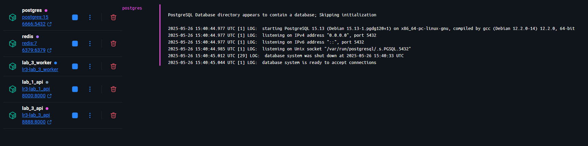

# Создание эндпоинта для вызова парсера из api

```python
@router.post("/parse")
def parse(url: str):
    try:
        response = requests.get(url)
        response.raise_for_status()
        parser = BookParser(url=url)
        asyncio.run(parser.run())
        return {"message": "Parsing completed"}
    except requests.RequestException as e:
        raise HTTPException(status_code=500, detail=str(e))
```

# Создание Dockerfile

Dockerfile для api из лабораторной 1.

```dockerfile
FROM python:3.13

WORKDIR /code

COPY requirements .

RUN pip install --no-cache-dir --upgrade -r /code/requirements

COPY ./Lr1 /code/Lr1

CMD ["uvicorn", "Lr1.main:app", "--host", "0.0.0.0", "--port", "8000"]
```

Dockerfile для парсера.

```dockerfile
FROM python:3.13

WORKDIR /code

COPY requirements .

RUN pip install --no-cache-dir --upgrade -r /code/requirements

COPY . .

#CMD ["uvicorn", "Lr3.main:app", "--host", "0.0.0.0", "--port", "8000"]
```

# Создание docker-compose.yml

```yml
services:
  lab_1_api:
    build:
      context: ../Lr1
      dockerfile: Dockerfile
    restart: always
    container_name: lab_1_api
    ports:
      - "8000:8000"
    depends_on:
      - postgres
    env_file:
      - ../../.env

  lab_3_api:
    build:
      context: ../Lr3
      dockerfile: Dockerfile
    restart: always
    container_name: lab_3_api
    command: uvicorn Lr3.main:app --host 0.0.0.0 --port 8000
    ports:
      - "8888:8000"
    env_file:
      - ../../.env
    depends_on:
      - postgres
      - redis

  postgres:
    image: postgres:15
    container_name: postgres
    restart: always
    environment:
      POSTGRES_USER: ${DB_USER}
      POSTGRES_PASSWORD: ${DB_PASSWORD}
      POSTGRES_DB: ${DB_NAME}
    ports:
      - "6666:5432"
    volumes:
      - ./postgres_data:/var/lib/postgresql/data

  lab_3_worker:
    build:
      context: ../Lr3
      dockerfile: Dockerfile
    restart: always
    container_name: lab_3_worker
    command: celery -A Lr3.tasks worker --loglevel=info
    env_file:
      - ../../.env
    depends_on:
      - postgres
      - redis

  redis:
    image: redis:7
    container_name: redis
    restart: always
    ports:
      - "6379:6379"
```

# Создание очереди с помощью Celery и Redis

Создание задачи.

```python
celery_app = Celery('tasks', broker='redis://redis:6379/0', backend='redis://redis:6379/0')


@celery_app.task
def parse_task(url: str):
    parser = BookParser(url=url)
    return asyncio.run(parser.run(count_of_workers=10))
```

Эндпоинт для добавления задачи в очередь.

```python
@router.post("/parse/task")
async def parse_task_create(url: str):
    task = parse_task.delay(url)
    return {"task": task.id}
```

Эндпоинт для получения задачи по id.

```python
@router.get("/parse/task/{task_id}")
async def get_task(task_id: str):
    task = parse_task.AsyncResult(task_id)
    return {"task": task.id, "status": task.status}
```

# Результат

