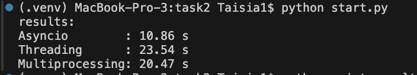

## Задача 2: Параллельный парсинг веб-страниц с сохранением в базу данных

### Цель:
Исследовать эффективность параллельного парсинга веб-страниц с использованием трёх подходов: `threading`, `multiprocessing` и `asyncio`, с последующим сохранением заголовков страниц в базу данных.

### Описание задачи:
- Создан список URL-адресов (`urls.py`)
- Для каждого URL выполняется запрос, извлекается заголовок страницы и сохраняется в SQLite-базу (`parsed.db`)
- Реализовано три версии парсера:
  - с использованием потоков (`threading_parser.py`)
  - с использованием процессов (`multiprocessing_parser.py`)
  - с использованием асинхронного ввода-вывода (`async_parser.py`)
- Для извлечения заголовков используется `BeautifulSoup`.
- Вся логика вынесена в общие модули: `db.py`, `common.py`, `models.py`.


### База данных:
Используется SQLite. Таблица:

```sql
ParsedPage(
    id INTEGER PRIMARY KEY,
    url TEXT,
    title TEXT
)
```

Создаётся автоматически при вызове init_db() из db.py.

## Описание реализации:

### Асинхронный парсинг (async_parser.py)

Используется aiohttp и asyncio.gather()
Все запросы отправляются одновременно
Самый быстрый подход для IO-bound задач

### Потоки (threading_parser.py)

Каждый URL обрабатывается в отдельном потоке
Используется requests для загрузки страниц
GIL в Python ограничивает масштабируемость

###  Процессы (multiprocessing_parser.py)

Каждый процесс независимо обрабатывает URL
Отдельная память, обходит GIL
Эффективен, но требует большего времени на создание процессов

```bash

ID  | URL                                 | Title
------------------------------------------------------------------------------------------
1   | https://www.allrecipes.com          | Allrecipes | Recipes, How-Tos, Videos and More
2   | https://www.imdb.com                | IMDb: Ratings, Reviews, and Where to Watch the Best Movies &
3   | https://www.webmd.com               | WebMD - Better information. Better health.
4   | https://www.wikipedia.org           | Wikipedia
5   | https://www.wikipedia.org           | Wikipedia
6   | https://www.webmd.com               | WebMD - Better information. Better health.
7   | https://www.allrecipes.com          | Allrecipes | Recipes, How-Tos, Videos and More
8   | https://www.imdb.com                | IMDb: Ratings, Reviews, and Where to Watch the Best Movies &
9   | https://www.wikipedia.org           | Wikipedia
10  | https://www.webmd.com               | WebMD - Better information. Better health.
11  | https://www.allrecipes.com          | Allrecipes | Recipes, How-Tos, Videos and More
12  | https://www.imdb.com                | IMDb: Ratings, Reviews, and Where to Watch the Best Movies &
```

## Результаты:

