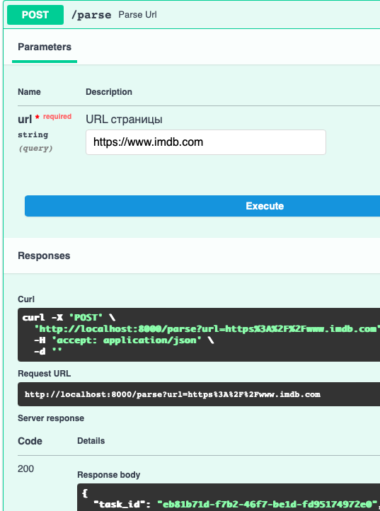
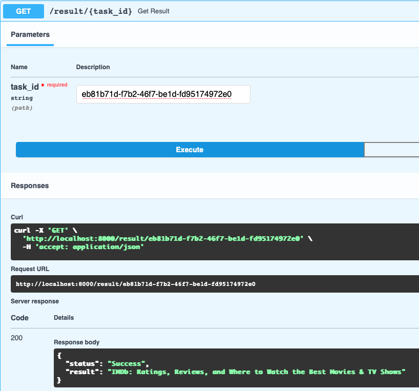
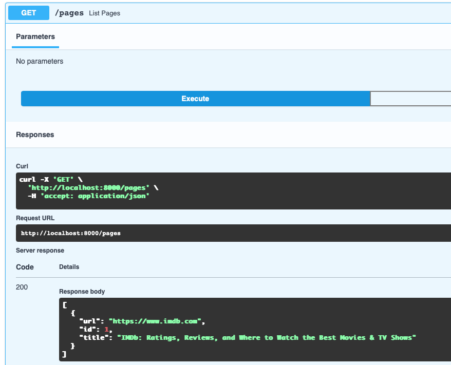

# Лабораторная работа №3

**Тема:** Упаковка FastAPI-приложения в Docker, работа с источниками данных и очереди  
**Цель:** Научиться упаковывать FastAPI-приложение в Docker, вызывать парсер через HTTP и Celery, подключать базу данных и очередь сообщений Redis.

##  Используемые технологии

- **FastAPI** — фреймворк для построения REST API
- **Docker / Docker Compose** — контейнеризация и оркестрация
- **Celery** — асинхронная очередь задач
- **Redis** — брокер сообщений для Celery
- **PostgreSQL** — СУБД
- **Python**
- **BeautifulSoup / Requests**


## Подзадача 1: Упаковка в Docker

Созданы два основных сервиса:
- `web` — FastAPI-приложение
- `worker` — Celery-воркер

Дополнительно:
- `redis` — брокер задач
- `db` — база данных PostgreSQL

### Dockerfile.web

```dockerfile
FROM python:3.10

WORKDIR /app

COPY requirements.txt .
RUN pip install --no-cache-dir -r requirements.txt

COPY app/ .

CMD ["uvicorn", "main:app", "--host", "0.0.0.0", "--port", "8000"]
```

### Dockerfile.worker

```dockerfile
FROM python:3.10

WORKDIR /app

COPY requirements.txt .
RUN pip install --no-cache-dir -r requirements.txt

COPY app/ .

CMD ["celery", "-A", "tasks", "worker", "--loglevel=info"]
```

### docker-compose.yml

```yml
vversion: "3.9"

services:
  db:
    image: postgres:15
    environment:
      POSTGRES_USER: postgres
      POSTGRES_PASSWORD: postgres
      POSTGRES_DB: finance
    ports:
      - "5432:5432"

  redis:
    image: redis:alpine
    ports:
      - "6379:6379"

  web:
    build: .
    depends_on:
      - db
      - redis
    ports:
      - "8000:8000"
    environment:
      - DATABASE_URL=postgresql://postgres:postgres@db/finance
    volumes:
      - ./app:/app

  worker:
    build: .
    command: celery -A tasks worker --loglevel=info
    depends_on:
      - redis
      - db
```

## Подзадача 2: Вызов парсера через HTTP

Добавлен эндпоинт /parse в main.py:

```python
@app.post("/parse")
def parse_url(request: ParseRequest):
    title = parse_and_save(request.url)
    return {"message": "Parsed", "title": title}
```
Парсер загружает содержимое страницы по URL и извлекает title. Данные сохраняются в БД.

## Подзадача 3: Вызов парсера через очередь (Celery + Redis)

Определена асинхронная задача:

```python
@app.task
def async_parse(url):
    return parse_and_save(url)
```
FastAPI-эндпоинт ставит задачу в очередь:

```python
@app.post("/parse_async")
def parse_async(request: ParseRequest):
    task = async_parse.delay(request.url)
    return {"task_id": task.id}
```

### Описание функциональности

FastAPI API

- POST /parse?url=...

Кидает задачу парсинга в очередь Celery

- GET /result/{task_id}

Проверка статуса задачи и возврат результата

- GET /pages

Получение всех ранее распарсенных страниц из БД

Celery обрабатывает задачи парсинга страниц.
Redis используется как брокер и хранилище результатов.
Повторные попытки реализованы через retry в Celery.


## Запуск

- Установлен Docker

- Выполнить `docker-compose up --build`

- Приложение будет доступно по адресу: [http://localhost:8000/docs](http://localhost:8000/docs)


Пример запроса

Отправка URL на парсинг:



POST /parse?url=https://www.imdb.com

Проверка результата:




Записи в бд:



## Результаты

- Успешно упаковано FastAPI-приложение в Docker
- Реализован HTTP-вызов парсера
- Реализован асинхронный вызов парсера через Celery
- Использована PostgreSQL как хранилище
- Протестирована связка всех компонентов с помощью Docker Compose

