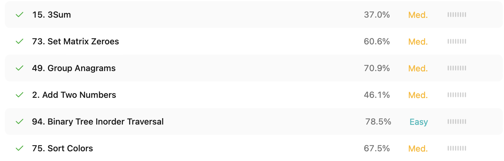

## 3Sum
Решение находит все уникальные тройки чисел в массиве, сумма которых равна нулю (a + b + c = 0).
Сначала массив сортируется, чтобы можно было эффективно использовать двухуказательный подход.
Для каждого элемента nums[i] устанавливаются два указателя — left (справа от i) и right (в конце массива).
Сумма тройки nums[i] + nums[left] + nums[right] сравнивается с нулем:

- если сумма равна 0, найдено решение, и указатели сдвигаются, пропуская дубликаты;

- если сумма меньше 0, сдвигается left;

- если больше 0 — right.
Пропуск дубликатов помогает избежать повторяющихся троек.

Сложность: O(n^2) по времени, O(k) по памяти для хранения результата (где k — количество уникальных троек).

## Set Matrix zeroes
Если хотя бы один элемент в матрице равен нулю, то вся строка и столбец, в котором он находится, должны быть обнулены.
Решение делает два прохода по матрице:

- В первом проходе запоминаются индексы всех строк и столбцов, где найден 0.

- Во втором проходе по этим индексам зануляются соответствующие строки и столбцы.

Сложность: O(mn) по времени, O(m + n) по памяти, где m и n — размеры матрицы.

## Group Anagrams
Необходимо сгруппировать слова, которые являются анаграммами друг друга.
Анаграммы имеют одинаковый набор букв, поэтому каждое слово сортируется и используется как ключ в словаре.
Например, "eat", "tea", "ate" после сортировки становятся "aet" — это ключ для их группы.
Словарь defaultdict(list) собирает списки анаграмм по этим ключам.

Сложность: O(n * k log k) по времени, где n — число слов, k — средняя длина слова. Используется память для словаря и хранения групп.

## Add Two Numbers
Сложение двух неотрицательных чисел, представленных в виде перевёрнутых односвязных списков (l1, l2).
Цифры хранятся поразрядно, начиная с младших.
Проходим по обоим спискам одновременно, складывая соответствующие цифры и учитывая перенос (carry).
Создаётся новый список, представляющий сумму в том же формате (младшие разряды — первыми).

Сложность: O(max(m, n)), где m и n — длины списков. Память — O(max(m, n)) на новый список.

## Binary Tree Incoder Traversal
Нужно обойти бинарное дерево в порядке in-order: сначала левое поддерево, затем корень, потом правое.
Реализованы два подхода:

- Рекурсивный: простой и компактный, вызывает функцию обхода для left, затем добавляет val, затем для right.

- Итеративный: без рекурсии, использует стек для имитации глубины обхода. Сначала спускаемся влево до конца, затем обрабатываем узлы и переходим вправо.

Сложность: O(n) по времени и O(n) по памяти в худшем случае (глубина дерева или стек).

## Sort Colors

Задача заключается в том, чтобы отсортировать массив, содержащий только элементы 0, 1 и 2, представляющие цвета: красный (0), белый (1), синий (2).
Решение использует алгоритм Dutch National Flag, который работает за один проход и использует три указателя:

- low — указывает на границу для 0;

- mid — текущий элемент;

- high — граница для 2.

При проходе по массиву:

- Если nums[mid] == 0: меняем с nums[low], двигаем low и mid;

- Если nums[mid] == 1: просто двигаем mid;

- Если nums[mid] == 2: меняем с nums[high], уменьшаем high.

Сложность: O(n) по времени — каждый элемент обрабатывается максимум один раз. O(1) по памяти — сортировка выполняется на месте без дополнительной памяти.
