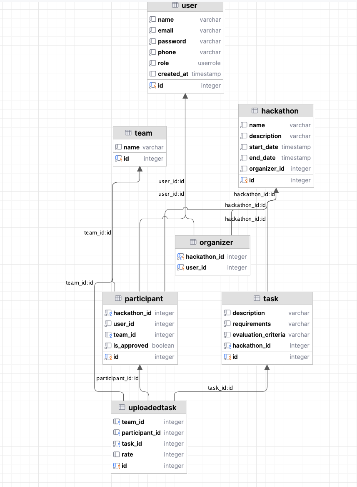
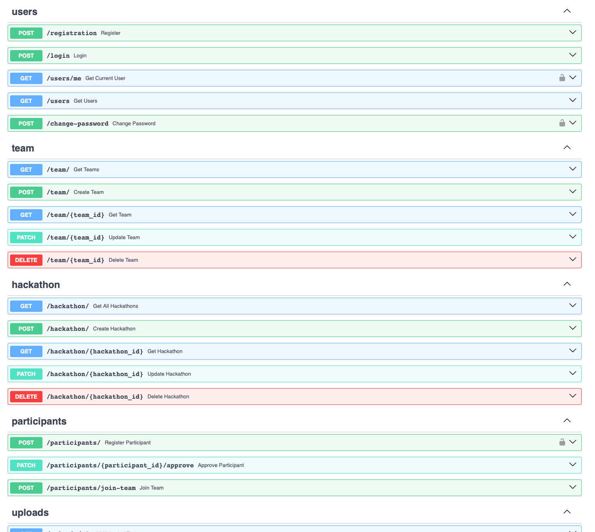
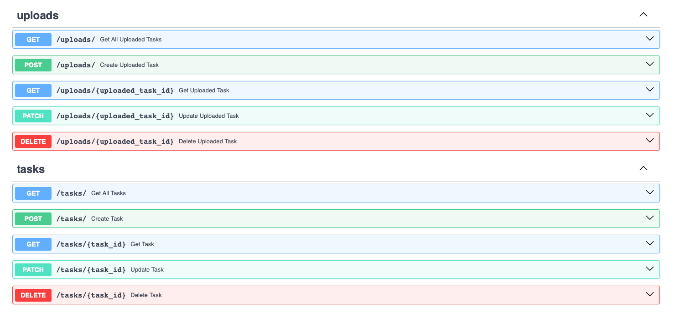

# Лабораторная работа 1. Реализация серверного приложения FastAPI

## Тема:
Создание системы для проведения хакатонов

# Ход работы:
Схема базы данных:


Файл `models.py`
```python
from datetime import datetime
from enum import Enum
from typing import Optional, List

from pydantic import EmailStr
from sqlmodel import SQLModel, Field, Relationship


class UserRole(Enum):
    user = "user"
    admin = "admin"
class TeamRole(Enum):
    designer = "designer"
    marketing = "marketing"
    programmer = "programmer"


class User(SQLModel, table=True):
    id: int = Field(default=None, primary_key=True)
    name: str
    email: EmailStr
    password: str
    phone: str
    role: UserRole = UserRole.user
    created_at: Optional[datetime] = datetime.now()

    participants: List["Participant"] = Relationship(back_populates="user")
    organized_hackathons: List["Hackathon"] = Relationship(back_populates="main_organizer")
    coordinators: List["Organizer"] = Relationship(back_populates="user")


class Hackathon(SQLModel, table=True):
    id: int = Field(default=None, primary_key=True)
    name: str
    description: str
    start_date: datetime
    end_date: datetime
    organizer_id: int = Field(default=None, foreign_key="user.id")

    main_organizer: Optional[User] = Relationship(back_populates="organized_hackathons")
    tasks: List["Task"] = Relationship(back_populates="hackathon")
    participants: List["Participant"] = Relationship(back_populates="hackathon")
    organizers: List["Organizer"] = Relationship(back_populates="hackathon")


class Organizer(SQLModel, table=True):
    hackathon_id: int = Field(default=None, foreign_key="hackathon.id", primary_key=True)
    user_id: int = Field(default=None, foreign_key="user.id", primary_key=True)

    hackathon: Optional["Hackathon"] = Relationship(back_populates="organizers")
    user: Optional["User"] = Relationship(back_populates="coordinators")


class Participant(SQLModel, table=True):
    id: int = Field(default=None, primary_key=True)
    hackathon_id: int = Field(default=None, foreign_key="hackathon.id")
    user_id: int = Field(default=None, foreign_key="user.id")
    team_id: Optional[int] = Field(default=None, foreign_key="team.id")
    is_approved: bool = False

    hackathon: Optional[Hackathon] = Relationship(back_populates="participants")
    team: Optional["Team"] = Relationship(back_populates="members")
    user: Optional["User"] = Relationship(back_populates="participants")
    uploaded_tasks: List["UploadedTask"] = Relationship(back_populates="participant")


class Team(SQLModel, table=True):
    id: int = Field(default=None, primary_key=True)
    name: str

    members: List[Participant] = Relationship(back_populates="team")
    uploaded_tasks: List["UploadedTask"] = Relationship(back_populates="team")


class Task(SQLModel, table=True):
    id: int = Field(default=None, primary_key=True)
    description: str
    requirements: str
    evaluation_criteria: str
    hackathon_id: int = Field(default=None, foreign_key="hackathon.id")

    hackathon: Optional[Hackathon] = Relationship(back_populates="tasks")
    uploaded_tasks: List["UploadedTask"] = Relationship(back_populates="task")


class UploadedTask(SQLModel, table=True):
    id: int = Field(default=None, primary_key=True)
    team_id: Optional[int] = Field(default=None, foreign_key="team.id")
    participant_id: Optional[int] = Field(default=None, foreign_key="participant.id")
    task_id: int = Field(default=None, foreign_key="task.id")
    rate: Optional[int]

    team: Optional[Team] = Relationship(back_populates="uploaded_tasks")
    participant: Optional[Participant] = Relationship(back_populates="uploaded_tasks")
    task: Optional[Task] = Relationship(back_populates="uploaded_tasks")
```

Файл `connection.py`

```python
import os

from dotenv import load_dotenv
from sqlmodel import SQLModel, Session, create_engine

load_dotenv()
db_url = os.getenv('DB_URL')
engine = create_engine(db_url, echo=True)


def init_db():
    SQLModel.metadata.create_all(engine)


def get_session():
    with Session(engine) as session:
        yield session

```

Файл `hackathon_endpoints.py`

```python
from fastapi import APIRouter, Depends, HTTPException
from sqlmodel import Session, select
from typing_extensions import List

from db.connection import get_session
from model.models.models import Hackathon
from model.schemas.hackathon import HackathonRead, HackathonCreate, HackathonUpdate, HackathonReadDetailed

hackathon_router = APIRouter()


@hackathon_router.get("/", response_model=List[HackathonReadDetailed])
def get_all_hackathons(session: Session = Depends(get_session)):
    return session.exec(select(Hackathon)).all()


@hackathon_router.get("/{hackathon_id}", response_model=HackathonReadDetailed)
def get_hackathon(hackathon_id: int, session: Session = Depends(get_session)):
    hackathon = session.get(Hackathon, hackathon_id)
    if not hackathon:
        raise HTTPException(status_code=404, detail="Hackathon not found")
    return hackathon


@hackathon_router.post("/", response_model=HackathonRead, status_code=201)
def create_hackathon(hackathon: HackathonCreate, session: Session = Depends(get_session)):
    new_hackathon = Hackathon.model_validate(hackathon)
    session.add(new_hackathon)
    session.commit()
    session.refresh(new_hackathon)
    return new_hackathon


@hackathon_router.patch("/{hackathon_id}", response_model=HackathonRead)
def update_hackathon(hackathon_id: int, update: HackathonUpdate, session: Session = Depends(get_session)):
    db_hackathon = session.get(Hackathon, hackathon_id)
    if not db_hackathon:
        raise HTTPException(status_code=404, detail="Hackathon not found")
    update_data = update.model_dump(exclude_unset=True)
    for key, value in update_data.items():
        setattr(db_hackathon, key, value)
    session.commit()
    session.refresh(db_hackathon)
    return db_hackathon


@hackathon_router.delete("/{hackathon_id}", status_code=204)
def delete_hackathon(hackathon_id: int, session: Session = Depends(get_session)):
    db_hackathon = session.get(Hackathon, hackathon_id)
    if not db_hackathon:
        raise HTTPException(status_code=404, detail="Hackathon not found")
    session.delete(db_hackathon)
    session.commit()
    return {"message": "Hackathon deleted"}

```

Файл `schemas.hackathon.py`

```python
from datetime import datetime
from typing import List, Optional

from sqlmodel import SQLModel

from model.schemas.organizer import OrganizerRead
from model.schemas.participant import ParticipantRead
from model.schemas.task import TaskRead
from model.schemas.user import UserReadShort


class HackathonBase(SQLModel):
    name: str
    description: str
    start_date: datetime
    end_date: datetime


class HackathonCreate(HackathonBase):
    organizer_id: int


class HackathonRead(HackathonBase):
    id: int
    organizer_id: int


class HackathonUpdate(SQLModel):
    name: Optional[str] = None
    description: Optional[str] = None
    start_date: Optional[datetime] = None
    end_date: Optional[datetime] = None


class HackathonReadDetailed(HackathonRead):
    main_organizer: Optional[UserReadShort]
    tasks: List[TaskRead] = []
    participants: List[ParticipantRead] = []
    organizers: List[OrganizerRead] = []
```

Эндпоинты в Swagger

