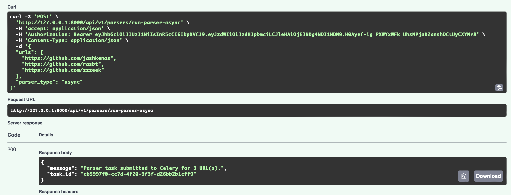
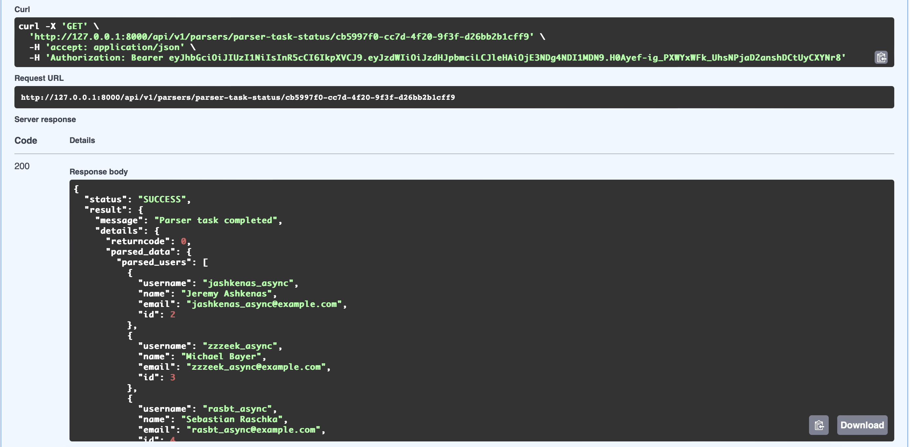

# Лабораторная работа №3: Упаковка FastAPI приложения, Работа с источниками данных и Очереди
---

## Подзадача 1: Упаковка FastAPI приложения, базы данных и парсера данных в Docker

### 1.1. Реализация общей папки `common`

Для обеспечения переиспользуемости кода и консистентности моделей данных между различными сервисами (`finance_app` и `parser_service`), была создана общая папка `common`. Она содержит директории `models` для определения ORM-моделей SQLAlchemy, которые используются обоими приложениями для взаимодействия с базой данных. Такой подход позволяет избежать дублирования кода и упрощает управление схемой данных.

### 1.2. Разработка `Dockerfile` для `finance_app` и `parser_service`

Для каждого основного сервиса (`finance_app` и `parser_service`) был разработан свой `Dockerfile`.

* **`Dockerfile` для `finance_app`:**

```dockerfile
FROM python:3.10-slim-buster

# Устанавливаем рабочую директорию
WORKDIR /app

COPY finance_app/requirements.txt .
RUN pip install --no-cache-dir -r requirements.txt

COPY finance_app/. .

# Копируем common из Lr3/common в /app/common
COPY common /app/common

# Устанавливаем переменные окружения
ENV PYTHONPATH=/app:/app/common
ENV APP_ENV=production

EXPOSE 8000

# Запускаем миграции Alembic перед запуском приложения
CMD ["/bin/bash", "-c", \
    "cd /app && alembic upgrade head && uvicorn app.main:app --host 0.0.0.0 --port 8000 --workers 4"]
```

* **Зависимости:** Сначала копируется `requirements.txt` и устанавливаются зависимости командой `pip install --no-cache-dir -r requirements.txt`. Это позволяет Docker кэшировать слой с зависимостями и пересобирать его только при изменении файла.
* **Копирование кода:** Далее копируется код самого приложения (`finance_app/.`) и общей папки (`common/`).
* **Переменные окружения:** Устанавливается `PYTHONPATH=/app:/app/common`, что позволяет Python-интерпретатору находить модули из `common` и корневой директории `app`.
* **`CMD` и Alembic:** Команда запуска приложения включает в себя предварительное выполнение миграций базы данных с помощью Alembic (`alembic upgrade head`). Это гарантирует, что схема базы данных всегда актуальна перед стартом приложения. Использование `/bin/bash -c` позволяет выполнять несколько команд в одной строке.

* **`Dockerfile` для `parser_service`:**

```dockerfile
FROM python:3.10-slim-buster

WORKDIR /app

# Устанавливаем curl и другие необходимые зависимости
RUN apt-get update && apt-get install -y \
    curl \
    netcat-traditional \
    gcc \
    postgresql-client \
    && rm -rf /var/lib/apt/lists/*

COPY parser/requirements.txt .
RUN pip install --no-cache-dir -r requirements.txt

COPY parser/. .

COPY common /app/common

ENV PYTHONPATH=/app:/app/common
ENV APP_ENV=parsers

EXPOSE 8001

CMD ["uvicorn", "app:app", "--host", "0.0.0.0", "--port", "8001"]
```
* **Установка `curl` и `netcat-traditional`:** Эти утилиты были добавлены (`RUN apt-get install -y curl netcat-traditional`) для использования в проверках работоспособности (`healthcheck`) в `docker-compose.yml`, так как они позволяют проверять доступность HTTP-эндпоинтов и портов.

### 1.3. Создание `docker-compose.yml`

Файл `docker-compose.yml` был создан для оркестрации всех сервисов, составляющих приложение.

```yaml
services:
  db:
    image: postgres:13
    container_name: finance_db
    environment:
      POSTGRES_USER: ${POSTGRES_USER:-postgres}
      POSTGRES_PASSWORD: ${POSTGRES_PASSWORD:-0000}
      POSTGRES_DB: ${POSTGRES_DB:-lab3web}
    volumes:
      - postgres_data:/var/lib/postgresql/data
    ports:
      - "5433:5432"
    healthcheck:
      test: ["CMD-SHELL", "pg_isready -U postgres"]
      interval: 10s
      timeout: 5s
      retries: 5

  redis:
    image: redis:7-alpine
    container_name: redis_broker
    ports:
      - "6379:6379" # Порт для доступа к Redis извне
    volumes:
      - redis_data:/data # Сохраняем данные Redis
    healthcheck: # Проверка работоспособности Redis
      test: ["CMD", "redis-cli", "ping"]
      interval: 5s
      timeout: 3s
      retries: 5

  finance_app:
    build:
      context: .
      dockerfile: ./finance_app/Dockerfile
    container_name: finance_app
    ports:
      - "8000:8000"
    environment:
      DATABASE_URL: postgresql://${POSTGRES_USER:-postgres}:${POSTGRES_PASSWORD:-0000}@db:5432/${POSTGRES_DB:-lab3web}
      SECRET_KEY: ${SECRET_KEY}
      ALGORITHM: ${ALGORITHM}
      ACCESS_TOKEN_EXPIRE_MINUTES: ${ACCESS_TOKEN_EXPIRE_MINUTES}
      PARSER_HOST: parser
      PARSER_PORT: 8001
      DOCKER_ENV: "true"
      REDIS_HOST: redis # Добавляем хост Redis для Celery
      REDIS_PORT: 6379
      REDIS_DB: 0
    depends_on:
      db:
        condition: service_healthy
      redis: # finance_app зависит от Redis для постановки задач
        condition: service_healthy

  parser:
    build:
      context: .
      dockerfile: ./parser/Dockerfile
    container_name: parser_service
    ports:
      - "8001:8001"
    environment:
      SYNC_DB_URL: postgresql://${POSTGRES_USER:-postgres}:${POSTGRES_PASSWORD:-0000}@db:5432/${POSTGRES_DB:-lab3web}
      ASYNC_DB_URL: postgresql+asyncpg://${POSTGRES_USER:-postgres}:${POSTGRES_PASSWORD:-0000}@db:5432/${POSTGRES_DB:-lab3web}
      APP_ENV: parsers
      REDIS_HOST: redis
      REDIS_PORT: 6379
      REDIS_DB: 0
    depends_on:
      db:
        condition: service_healthy
    healthcheck:
      test: [ "CMD", "curl", "-f", "http://localhost:8001/health" ]
      interval: 10s
      timeout: 5s
      retries: 5
      start_period: 20s

  celery_worker:
    build:
      context: .
      dockerfile: ./parser/Dockerfile # Worker будет использовать образ parser
    container_name: celery_parser_worker
    environment:
      SYNC_DB_URL: postgresql://${POSTGRES_USER:-postgres}:${POSTGRES_PASSWORD:-0000}@db:5432/${POSTGRES_DB:-lab3web}
      ASYNC_DB_URL: postgresql+asyncpg://${POSTGRES_USER:-postgres}:${POSTGRES_PASSWORD:-0000}@db:5432/${POSTGRES_DB:-lab3web}
      APP_ENV: parsers # Worker должен быть в режиме parsers для доступа к db
      REDIS_HOST: redis # Worker также зависит от Redis
      REDIS_PORT: 6379
      REDIS_DB: 0
      PARSER_HOST: parser # Worker-у нужен доступ к сервису parser
      PARSER_PORT: 8001
      PYTHONPATH: /app:/app/common
    depends_on:
      redis:
        condition: service_healthy
      db: # Celery worker также должен ждать базу данных
        condition: service_healthy
      parser: # Celery worker будет вызывать сервис parser
        condition: service_healthy
    command: ["celery", "-A", "common.celery_app", "worker", "-l", "info", "--concurrency=1"]

volumes:
  postgres_data:
  redis_data:
```

* **Сервисы:** Определены сервисы `db` (PostgreSQL), `redis`, `finance_app`, `parser`, и `celery_worker`.
* **Конфигурация:** Для каждого сервиса указаны образ Docker (или контекст для сборки `build:`), имена контейнеров, порты для маппинга на хост-систему, переменные окружения, тома для персистентности данных (`postgres_data`, `redis_data`).
* **Зависимости (`depends_on`):** Определены строгие зависимости между сервисами, используя `condition: service_healthy`. Например, `finance_app` будет запущен только после того, как `db` и `redis` станут здоровыми. Это обеспечивает правильный порядок инициализации и функционирования всей системы.
* **Проверки работоспособности (`healthcheck`):** Для `db` и `parser` добавлены проверки работоспособности, которые позволяют `depends_on` ждать не просто запущенного контейнера, а полностью готового к работе сервиса. Для `parser` используется `curl -f http://localhost:8001/health` для проверки доступности его API.

### 1.4. Файл `.env`

Был создан файл `.env` для централизованного управления конфиденциальными данными и параметрами конфигурации (например, учетные данные базы данных, секретные ключи, порты). Этот подход предотвращает жесткое кодирование чувствительной информации в коде и `docker-compose.yml`, упрощая управление различными окружениями (разработка, тестирование, продакшн). Docker Compose автоматически подхватывает переменные из этого файла.

```dotenv
POSTGRES_USER=postgres
POSTGRES_PASSWORD=0000
POSTGRES_DB=lab3web
SECRET_KEY=supersecretkey
ALGORITHM=HS256
ACCESS_TOKEN_EXPIRE_MINUTES=30
```
---

## Подзадача 2: Вызов парсера из FastAPI

### 2.1. Эндпоинт в `finance_app` для вызова парсера (синхронный)

В файле `app/api/parser.py` был реализован эндпоинт `POST /api/v1/parsers/run-parser`.

* **Как реализовано:** Этот эндпоинт принимает список URL и тип парсера. Он использует `BackgroundTasks` FastAPI для вызова вспомогательной асинхронной функции `trigger_parser_service`. Эта функция, в свою очередь, отправляет HTTP-запрос к `parser_service` (`http://parser:8001/parse`).
* **Ответ клиенту:** После постановки задачи в фоновую очередь FastAPI, эндпоинт немедленно возвращает клиенту сообщение о том, что парсер был запущен в фоновом режиме, но **без идентификатора задачи и без прямого результата**.

```python
@router.post("/run-parser")
async def run_parser(request: ParserRequest, background_tasks: BackgroundTasks):
    valid_parsers = ["async", "threading", "multiprocessing"]
    if request.parser_type not in valid_parsers:
        raise HTTPException(
            status_code=400,
            detail=f"Invalid parser type. Choose from {valid_parsers}"
        )
    urls_as_strings = [str(url) for url in request.urls]
    background_tasks.add_task(trigger_parser_service, urls_as_strings, request.parser_type)
    return {"message": f"Parser {request.parser_type} started in background for {len(request.urls)} URL(s)."}

async def trigger_parser_service(urls: List[str], parser_type: str):
    async with httpx.AsyncClient() as client:
        try:
            response = await client.post(
                f"{PARSER_SERVICE_URL}/parse",
                json={"urls": urls, "parser_type": parser_type}
            )
            response.raise_for_status()
        except httpx.HTTPError as e:
            print(f"Error triggering parser service: {str(e)}")
        except Exception as e:
            print(f"An unexpected error occurred: {str(e)}")
```
---

## Подзадача 3: Вызов парсера из FastAPI через очередь

### 3.1. Установка Celery и Redis

**Как реализовано:**
Зависимости для Celery (`celery`, `redis`, `httpx` для HTTP-запросов) были добавлены в `requirements.txt` как для `finance_app`, так и для `parser_service` (поскольку `celery_worker` использует образ `parser`). Redis-сервис был добавлен в `docker-compose.yml` с соответствующими портами и томом для данных.

### 3.2. Настройка Celery (`common/celery_app.py` и `common/tasks.py`)

* **Конфигурация Celery (`common/celery_app.py`):**
    * Был создан файл `common/celery_app.py` для инициализации экземпляра Celery.
```python
from celery import Celery
import os

# Настройки Celery
REDIS_HOST = os.getenv("REDIS_HOST", "redis") # Имя сервиса Redis в Docker Compose
REDIS_PORT = os.getenv("REDIS_PORT", "6379")
REDIS_DB = os.getenv("REDIS_DB", "0") # Номер базы данных Redis

CELERY_BROKER_URL = f"redis://{REDIS_HOST}:{REDIS_PORT}/{REDIS_DB}"
CELERY_RESULT_BACKEND = f"redis://{REDIS_HOST}:{REDIS_PORT}/{REDIS_DB}"


# Создаем экземпляр Celery приложения
app = Celery(
    'parser_tasks',
    broker=CELERY_BROKER_URL,
    backend=CELERY_RESULT_BACKEND,
    include=['common.tasks']
)

app.conf.update(
    enable_utc=True,
    timezone='Europe/Moscow',
    result_expires=3600, # Результаты задач будут храниться 1 час
    task_track_started=True # Позволяет отслеживать задачи в статусе "STARTED"
)
```

* **Определение задачи парсинга (`common/tasks.py`):**
    * В файле `common/tasks.py` была определена Celery-задача `parse_urls_task` с помощью декоратора `@app.task`.
    * **Как реализовано:** Эта задача отвечает за выполнение HTTP-запроса к `parser_service` (`http://parser:8001/parse`). Внутри задачи используется `httpx.AsyncClient` и `asyncio.run` для асинхронного выполнения HTTP-запроса, что позволяет Celery-воркеру эффективно управлять сетевыми операциями.
    * **Ключевое решение - ожидание результата:** `parse_urls_task` ждет полного ответа от `parser_service`, который включает `stdout` и `stderr` от скрипта парсера. Это позволяет Celery-таске сохранить **полный результат выполнения парсинга**, а не просто факт его запуска.
    * **Обработка ошибок:** Внедрена логика повторных попыток (`self.retry()`) при возникновении `httpx.HTTPStatusError` или `httpx.RequestError`, что повышает отказоустойчивость системы при временных проблемах с сервисом парсера или сетью.

```python
from common.celery_app import app
import httpx
import os
import asyncio

# Получаем адрес парсера из переменных окружения
PARSER_SERVICE_URL = f"http://{os.getenv('PARSER_HOST', 'parser')}:{os.getenv('PARSER_PORT', '8001')}"


@app.task(bind=True, name='parser.parse_urls')
def parse_urls_task(self, urls: list[str], parser_type: str):
    """
    Задача Celery для асинхронного запуска парсинга.
    Вызывает HTTP-эндпоинт парсера.
    """
    try:
        # Для вызова асинхронной HTTP-функции используем asyncio.run
        async def _call_parser():
            async with httpx.AsyncClient() as client:
                print(f"[{self.request.id}] Sending parse request to {PARSER_SERVICE_URL}/parse for {len(urls)} URLs (type: {parser_type})...")
                response = await client.post(
                    f"{PARSER_SERVICE_URL}/parse",
                    json={"urls": urls, "parser_type": parser_type},
                    timeout=600
                )
                response.raise_for_status()
                print(f"[{self.request.id}] Parser service responded with: {response.json()}")
                return response.json()

        # Выполняем асинхронную функцию в синхронном контексте Celery
        result = asyncio.run(_call_parser())
        return result

    except httpx.HTTPStatusError as e:
        error_msg = f"HTTP Error triggering parser service (task {self.request.id}): {e.response.status_code} - {e.response.text}"
        print(error_msg)
        raise self.retry(exc=e, countdown=5, max_retries=3) # Повторяем задачу при HTTP ошибке
    except httpx.RequestError as e:
        error_msg = f"Network Error triggering parser service (task {self.request.id}): {str(e)}"
        print(error_msg)
        raise self.retry(exc=e, countdown=10, max_retries=5) # Повторяем задачу при сетевой ошибке
    except Exception as e:
        error_msg = f"Unexpected Error in parse_urls_task (task {self.request.id}): {str(e)}"
        print(error_msg)
        self.update_state(state='FAILURE', meta={'exc_type': type(e).__name__, 'exc_message': str(e)})
        raise
```

### 3.3. Обновление Docker Compose файла для Celery и Redis

**Как реализовано:**
В `docker-compose.yml` были добавлены и сконфигурированы сервисы `redis` и `celery_worker`.

* **Сервис `redis`:** Определен с образом `redis:7-alpine`, маппингом портов и томом для данных.
* **Сервис `celery_worker`:**
    * **Образ:** Использует тот же `Dockerfile` из папки `parser`, что и `parser_service`, так как он содержит все необходимые зависимости для выполнения парсеров и взаимодействия с базой данных.
    * **Переменные окружения:** Определены переменные для подключения к Redis, базе данных и сервису парсера. `PYTHONPATH` также установлен для корректного импорта модулей.
    * **Зависимости:** Указаны зависимости от `redis`, `db` и `parser` с `condition: service_healthy`, гарантируя, что воркер начнет работу только после того, как все необходимые сервисы будут доступны.
    * **Команда запуска:** `command: ["celery", "-A", "common.celery_app", "worker", "-l", "info", "--concurrency=1"]` запускает Celery-воркер, указывая на Celery-приложение и устанавливая уровень логирования. `--concurrency=1` в данном примере демонстрирует, что один воркер обрабатывает задачи последовательно. Для повышения параллелизма это значение можно увеличить или запустить несколько экземпляров `celery_worker`.

### 3.4. Эндпоинт для асинхронного вызова парсера и получения результатов

**Как реализовано:**
В `app/api/parser.py` был создан эндпоинт `POST /api/v1/parsers/run-parser-async`.

* **Инициирование задачи:** Этот маршрут принимает запрос с URL и типом парсера, затем использует `parse_urls_task.delay()` для немедленной постановки задачи в очередь Celery. Клиенту сразу же возвращается `task_id`.

```python
@router.post("/run-parser-async")
async def run_parser_via_celery(request: ParserRequest):
    valid_parsers = ["async", "threading", "multiprocessing"]
    if request.parser_type not in valid_parsers:
        raise HTTPException(
            status_code=400,
            detail=f"Invalid parser type. Choose from {valid_parsers}"
        )

    urls_as_strings = [str(url) for url in request.urls]

    # Ставим задачу в очередь Celery
    task = parse_urls_task.delay(urls_as_strings, request.parser_type)

    return {
        "message": f"Parser task submitted to Celery for {len(urls_as_strings)} URL(s).",
        "task_id": task.id # Возвращаем ID задачи Celery для отслеживания
    }
```



* **Получение результатов (`GET /api/v1/parsers/parser-task-status/{task_id}`):** 

```python
@router.get("/parser-task-status/{task_id}")
async def get_parser_task_status(task_id: str):
    task = parse_urls_task.AsyncResult(task_id) # Получаем объект результата задачи по ID

    if task.state == 'PENDING': # Задача еще не началась
        response = {
            'status': task.state,
            'message': 'Task is pending or unknown.'
        }
    elif task.state == 'STARTED': # Задача началась
        response = {
            'status': task.state,
            'message': 'Task has started.'
        }
    elif task.state == 'SUCCESS': # Задача успешно завершена
        response = {
            'status': task.state,
            'result': task.result # Результат, возвращенный задачей
        }
    elif task.state == 'FAILURE': # Задача завершилась с ошибкой
        response = {
            'status': task.state,
            'message': 'Task failed.',
            'exc': str(task.info.get('exc_type')), # Тип исключения
            'exc_message': str(task.info.get('exc_message')), # Сообщение об исключении
        }
    else:
        response = {
            'status': task.state,
            'message': 'Task is in an unexpected state.',
            'info': task.info # Дополнительная информация о задаче
        }
    return response
```


Для отслеживания статуса и получения результатов задачи был добавлен отдельный эндпоинт `GET /api/v1/parsers/parser-task-status/{task_id}`. Он использует `parse_urls_task.AsyncResult(task_id)` для запроса статуса задачи у Celery и возвращает его клиенту. В случае успешного завершения задачи, этот эндпоинт предоставляет полный результат парсинга, который был сохранен Celery-воркером.

**Почему `subprocess.run` предпочтительнее `subprocess.Popen` для Celery-задачи:**
Изначально в `parser_service` могло быть использовано `subprocess.Popen`, которое запускает дочерний процесс и немедленно возвращает управление, не дожидаясь его завершения. В таком сценарии `parser_service` быстро ответил бы Celery-воркеру, что парсер "запущен", и Celery-задача завершилась бы успешно, но без реального результата парсинга. Это сделало бы невозможным получение `stdout`, `stderr` и кода завершения парсера через Celery.

Переход к `subprocess.run` (обернутому в `asyncio.to_thread` в `parser_service`) позволил `parser_service` дождаться полного выполнения дочернего процесса парсера. Это решение гарантирует, что Celery-воркер получит *полный итоговый результат* парсинга (включая все логи и структурированные данные), прежде чем пометить свою задачу как завершенную. Таким образом, `subprocess.run` (с `asyncio.to_thread`) обеспечивает надежный сбор всех выходных данных от парсера, что критически важно для корректного отслеживания и предоставления результатов клиенту.
