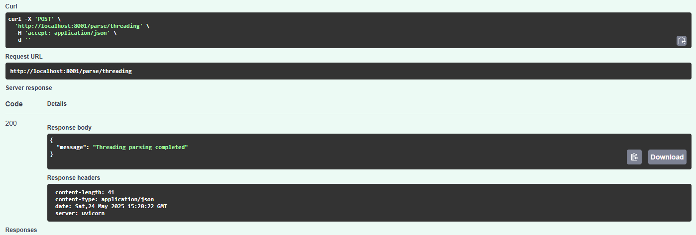
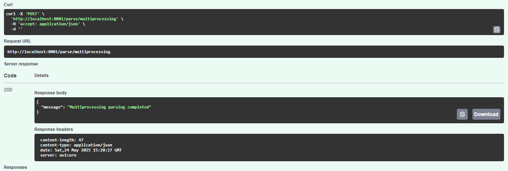
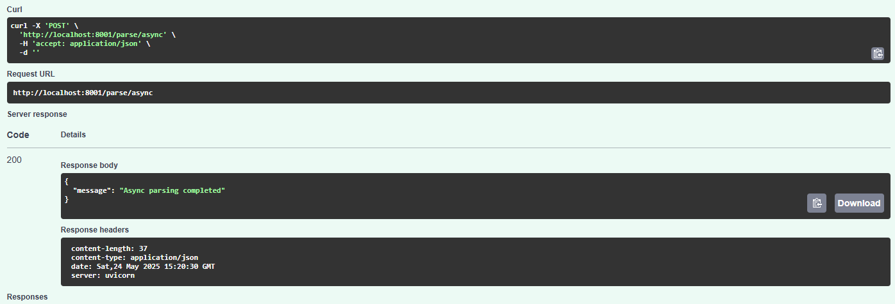
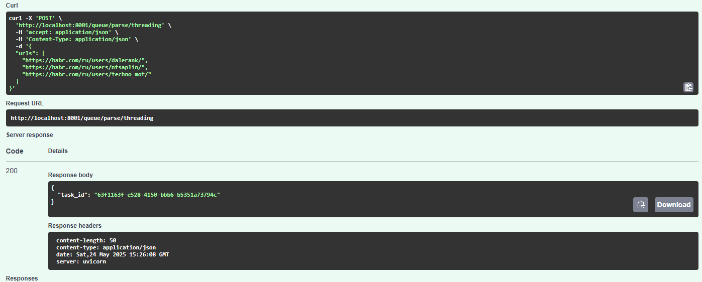
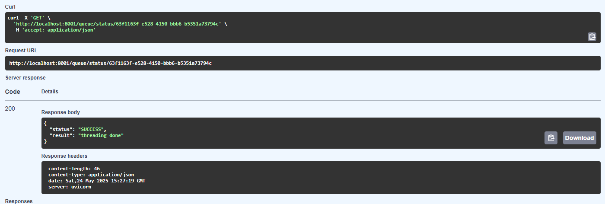

# Лабораторная работа 3: Упаковка FastAPI приложения в Docker, Работа с источниками данных и Очереди

## Цель
Научиться упаковывать FastAPI приложение в Docker, интегрировать парсер данных с базой данных и вызывать парсер через API и очередь.

## Подзадача 1: Упаковка FastAPI приложения, базы данных и парсера данных в Docker

### Dockerfile для `app`

```dockerfile
FROM python:3.13-slim  
  
WORKDIR /usr/src/app  
  
COPY requirements.txt ./  
RUN pip install --no-cache-dir -r requirements.txt  
  
COPY . .  
  
EXPOSE 8000  
  
CMD ["uvicorn", "main:app", "--host", "0.0.0.0", "--port", "8000"]
```

### Dockerfile для `parser`

```dockerfile
FROM python:3.13-slim  
  
WORKDIR /parser  
  
COPY requirements.txt ./  
RUN pip install --no-cache-dir -r requirements.txt  
  
COPY . .  
  
EXPOSE 8001  
  
CMD ["uvicorn", "main:app", "--host", "0.0.0.0", "--port", "8001"]
```

### `docker-compose.yml`

```yml
services:  
  db:  
    image: postgres:15  
    restart: always  
    environment:  
      POSTGRES_USER: postgres  
      POSTGRES_PASSWORD: 123123  
      POSTGRES_DB: finance_db  
    ports:  
      - '5432:5432'  
    volumes:  
      - postgres_data:/var/lib/postgresql/data  
  
  app:  
    build:  
      context: ./app  
      dockerfile: Dockerfile  
    container_name: fastapi_app  
    ports:  
      - '8000:8000'  
    depends_on:  
      - db  
      - redis  
    env_file:  
      - ./app/.env  
  
  parser:  
    build:  
      context: ./parser  
      dockerfile: Dockerfile  
    container_name: parser_service  
    ports:  
      - '8001:8001'  
    depends_on:  
      - db  
      - redis  
    env_file:  
      - ./parser/.env  
  
  redis:  
    image: redis:7  
    container_name: redis  
    ports:  
      - "6379:6379"  
  
  celery_worker:  
    build:  
      context: ./parser  
    container_name: celery_worker  
    command: celery -A celery_app.celery_app worker --loglevel=info  
    depends_on:  
      - redis  
      - db  
    env_file:  
      - ./parser/.env  
  
volumes:  
  postgres_data:
```

## Подзадача 2: Вызов парсера из FastAPI

### Эндпоинт в `parser/main.py`

```python
from fastapi import FastAPI, HTTPException  
from pydantic import BaseModel  
  
from async_parse import main as async_parse  
from connection import init_db  
from multiprocessing_parse import main as multiprocessing_parse  
from celery_app import celery_app  
from tasks import parse_async_task, parse_mp_task, parse_threading_task  
from threading_parse import main as threading_parse  
  
app = FastAPI()  
  
URLS = [  
    "https://habr.com/ru/users/dalerank/",  
    "https://habr.com/ru/users/ntsaplin/",  
    "https://habr.com/ru/users/techno_mot/"  
]  
  
  
@app.on_event("startup")  
def startup_event():  
    init_db()  
  
  
@app.post("/parse/threading")  
def parse_threading():  
    try:  
        threading_parse(URLS)  
        return {"message": "Threading parsing completed"}  
    except Exception as e:  
        raise HTTPException(status_code = 500, detail = str(e))  
  
  
@app.post("/parse/multiprocessing")  
def parse_multiprocessing():  
    try:  
        multiprocessing_parse(URLS)  
        return {"message": "Multiprocessing parsing completed"}  
    except Exception as e:  
        raise HTTPException(status_code = 500, detail = str(e))  
  
  
@app.post("/parse/async")  
async def parse_async():  
    try:  
        await async_parse(URLS)  
        return {"message": "Async parsing completed"}  
    except Exception as e:  
        raise HTTPException(status_code = 500, detail = str(e))
```







## Подзадача 3: Вызов парсера из FastAPI через очередь

### Конфигурация Celery (`parser/celery_app.py`)

```python
import os  
  
from celery import Celery  
from dotenv import load_dotenv  
  
load_dotenv(dotenv_path = "parser/.env")  
  
CELERY_BROKER_URL = os.getenv("CELERY_BROKER_URL")  
CELERY_RESULT_BACKEND = os.getenv("CELERY_RESULT_BACKEND")  
  
celery_app = Celery(  
    "parser_tasks",  
    broker = CELERY_BROKER_URL,  
    backend = CELERY_RESULT_BACKEND,  
    include=["tasks"]  
)
```

### Задачи (`parser/tasks.py`)

```python
from async_parse import main as async_main  
from celery_app import celery_app  
from multiprocessing_parse import main as mp_main  
from threading_parse import main as threading_main  
  
  
@celery_app.task(name = "parser.threading")  
def parse_threading_task(urls):  
    threading_main(urls)  
    return "threading done"  
  
  
@celery_app.task(name = "parser.multiprocessing")  
def parse_mp_task(urls):  
    mp_main(urls)  
    return "multiprocessing done"  
  
  
@celery_app.task(name = "parser.async")  
def parse_async_task(urls):  
    import asyncio  
    return asyncio.run(async_main(urls))
```

### Эндпоинты очереди (`parser/main.py`)

```python
from fastapi import FastAPI, HTTPException  
from pydantic import BaseModel  
  
from async_parse import main as async_parse  
from connection import init_db  
from multiprocessing_parse import main as multiprocessing_parse  
from celery_app import celery_app  
from tasks import parse_async_task, parse_mp_task, parse_threading_task  
from threading_parse import main as threading_parse  
  
app = FastAPI()
  
  
class ParseRequest(BaseModel):
    urls: list[str]
  
  
@app.post("/queue/parse/threading")  
def queue_threading(request: ParseRequest):  
    task = parse_threading_task.delay(request.urls)  
    return {"task_id": task.id}  
  
  
@app.post("/queue/parse/multiprocessing")  
def queue_mp(request: ParseRequest):  
    task = parse_mp_task.delay(request.urls)  
    return {"task_id": task.id}  
  
  
@app.post("/queue/parse/async")  
def queue_async(request: ParseRequest):  
    task = parse_async_task.delay(request.urls)  
    return {"task_id": task.id}  
  
  
@app.get("/queue/status/{task_id}")  
def get_status(task_id: str):  
    res = celery_app.AsyncResult(task_id)  
    return {"status": res.status, "result": res.result}
```



