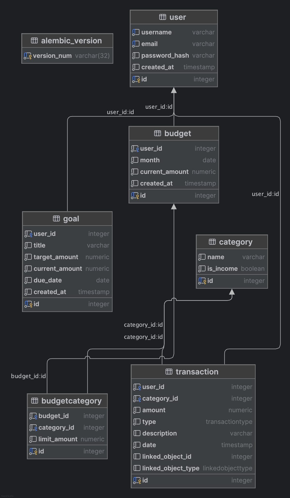
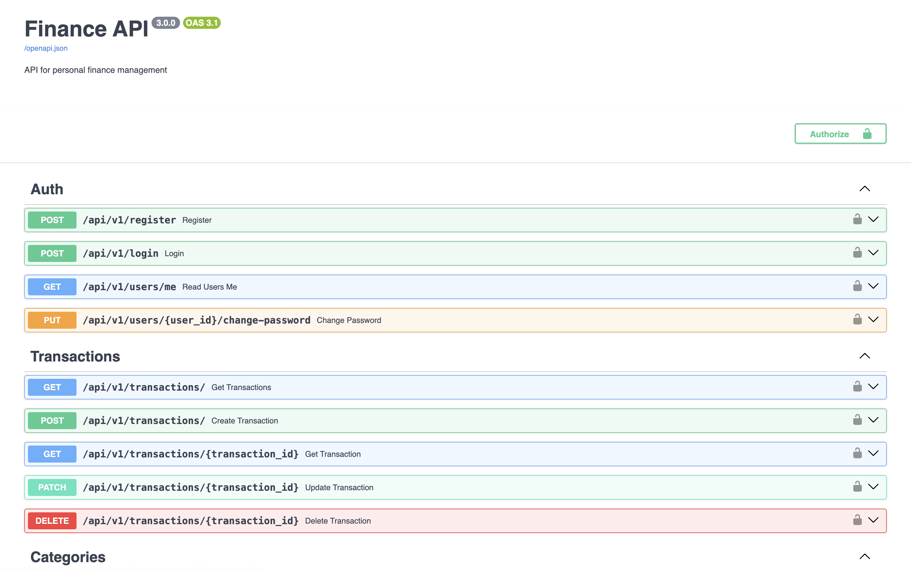

# Документация к Лабораторной работе №2  
[Ссылка на задание](https://rendex85.github.io/WebDevelopmentLabsDocs/lr2/lr2/)

## Модели данных



Проект реализует систему управления личными финансами: бюджеты, цели, транзакции и категории. Ниже описаны основные SQLModel-модели:

---

### User

```python
class User(SQLModel, table=True):
```

- `id`: ID пользователя  
- `username`: уникальное имя  
- `email`: уникальный email  
- `password_hash`: зашифрованный пароль  
- `created_at`: дата регистрации  

Отношения:
- `transactions`: список транзакций  
- `budgets`: список бюджетов  
- `goals`: список целей  

---

### Transaction

```python
class Transaction(SQLModel, table=True):
```

- `id`: ID транзакции  
- `user_id`: внешний ключ на пользователя  
- `category_id`: категория (расход/доход)  
- `amount`: сумма  
- `type`: `income | expense`  
- `linked_object_id`: связь с бюджетом или целью  
- `linked_object_type`: `goal | budget`  
- `description`, `date`

Отношения:
- `user`, `category`

---

### Budget

```python
class Budget(SQLModel, table=True):
```

- `id`, `user_id`, `month`  
- `current_amount`: текущая сумма бюджета  
- `created_at`: дата создания

Отношения:
- `user`, `categories` (через `BudgetCategory`)

---

### BudgetCategory

```python
class BudgetCategory(SQLModel, table=True):
```

- `id`, `budget_id`, `category_id`  
- `limit_amount`: лимит трат по категории

Отношения:
- `budget`, `category`

---

### Category

```python
class Category(SQLModel, table=True):
```

- `id`, `name`  
- `is_income`: флаг "доход" или "расход"

Отношения:
- `transactions`, `budget_categories`

---

### Goal

```python
class Goal(SQLModel, table=True):
```

- `id`, `user_id`, `title`  
- `target_amount`: цель накоплений  
- `current_amount`: уже накоплено  
- `due_date`: крайняя дата  
- `created_at`: дата создания

Отношения:
- `user`

---

## Схемы (Schemas)

Схемы используются для сериализации / валидации данных через **Pydantic** (встроено в SQLModel).

---

### User

- `UserBase` — базовая: `username`, `email`  
- `UserCreate` — регистрация + `password`  
- `UserRead` — `id`, `created_at`  
- `UserUpdate` — изменение пользователя  
- `UserLogin` — для логина

---

### Transaction

- `TransactionBase` — все поля транзакции  
- `TransactionCreate` — создание  
- `TransactionRead` — чтение  
- `TransactionUpdate` — частичное обновление

---

### Budget

- `BudgetBase` — месяц  
- `BudgetCreate` — создание с категориями  
- `BudgetRead` — подробный вывод с транзакциями и лимитами  
- `BudgetUpdate` — изменение бюджета  
- `BudgetCategoryRead` — категория + лимит + потрачено  
- `BudgetCategoryUpdate` — изменение лимита

---

### Category

- `CategoryBase` — `name`, `is_income`  
- `CategoryCreate`, `CategoryRead`, `CategoryUpdate`

---

### Goal

- `GoalBase` — базовая цель  
- `GoalCreate`, `GoalRead`, `GoalUpdate`  
- `TransactionRead` — используется для связи транзакций с целями

---

## API



### **Модуль аутентификации (`api/auth.py`)**

#### `POST /register`
Регистрация нового пользователя.

- **Request body**: `UserCreate` (username, email, password)
- **Response**: `UserRead`
- **Ошибки**:
  - 400: Email/Username уже зарегистрирован

---

#### `POST /login`
Аутентификация пользователя и выдача токена доступа.

- **Request body**: `UserLogin` (username, password)
- **Response**:
  ```json
  {
    "access_token": "<JWT>",
    "token_type": "bearer"
  }
  ```
- **Ошибки**:
  - 401: Неверные учетные данные

---

#### `GET /users/me`
Получение текущего авторизованного пользователя.

- **Response**: `UserRead`
- **Аутентификация**: Bearer Token

---

#### `PUT /users/{user_id}/change-password`
Изменение пароля пользователя.

- **Query param**: `new_password`
- **Response**:
  ```json
  { "msg": "Password updated successfully" }
  ```
- **Ошибки**:
  - 404: Пользователь не найден

---

### **Категории бюджета (`api/budget_category.py`)**

#### `GET /budget-categories/`
Получение списка всех бюджетных категорий.

- **Response**: `List[BudgetCategoryRead]`

---

#### `GET /budget-categories/{id}`
Получение одной категории по ID.

- **Response**: `BudgetCategoryRead`
- **Ошибки**: 404, если не найдено

---

#### `DELETE /budget-categories/{id}`
Удаление категории бюджета.

- **Response**:
  ```json
  { "ok": true }
  ```

---

### **Бюджеты (`api/budgets.py`)**

#### `POST /budgets/`
Создание бюджета на месяц с выбранными категориями.

- **Request body**: `BudgetCreate` (month, categories)
- **Response**: `BudgetRead`
- **Аутентификация**: Bearer Token

---

#### `GET /budgets/{budget_id}`
Получение информации о конкретном бюджете.

- **Response**: `BudgetRead` с категориями и потраченными суммами

---

#### `GET /budgets/`
Получение всех бюджетов со статистикой по категориям.

- **Response**: `List[BudgetRead]`

---

#### `PUT /budgets/{budget_id}`
Обновление бюджета: месяц и категории.

- **Request body**: `BudgetUpdate`
- **Response**: `BudgetRead`
- **Ошибки**:
  - 404: Бюджет не найден или доступ запрещён

---

#### `DELETE /budgets/{budget_id}`
Удаление бюджета.

- **Response**:
  ```json
  { "ok": true }
  ```

---

#### `GET /budgets/{budget_id}/details`
Подробности по бюджету: категории и транзакции.

- **Response**: `BudgetRead` + список транзакций

---

### **Категории (`api/categories.py`)**

#### `POST /categories/`
Создание новой категории.

- **Request body**: `CategoryCreate`
- **Response**: `CategoryRead`

---

#### `GET /categories/`
Получение всех категорий.

- **Response**: `List[CategoryRead]`

---

#### `GET /categories/{category_id}`
Получение одной категории.

- **Response**: `CategoryRead`
- **Ошибки**: 404, если не найдено

---

#### `PUT /categories/{category_id}`
Обновление категории.

- **Request body**: `CategoryUpdate`
- **Response**: `CategoryRead`

---

#### `DELETE /categories/{category_id}`
Удаление категории.

- **Response**:
  ```json
  { "ok": true }
  ```

---

### **Цели (`api/goals.py`)**

#### `POST /goals/`
Создание финансовой цели.

- **Request body**: `GoalCreate`
- **Response**: `GoalRead`
- **Аутентификация**: Bearer Token

---

#### `GET /goals/`
Получение всех целей.

- **Response**: `List[GoalRead]`

---

#### `GET /goals/{goal_id}`
Получение цели по ID.

- **Response**: `GoalRead`
- **Ошибки**: 404, если не найдено

---

#### `PUT /goals/{goal_id}`
Обновление цели.

- **Request body**: `GoalUpdate`
- **Response**: `GoalRead`
- **Ошибки**:
  - 404: Не найдено
  - 403: Нет доступа к изменению

---

#### `DELETE /goals/{goal_id}`
Удаление цели.

- **Response**:
  ```json
  { "ok": true }
  ```

---

#### `GET /goals/{goal_id}/details`
Детальная информация о цели (включая транзакции).

- **Response**:
  ```json
  {
    "id": ...,
    "user_id": ...,
    "title": "...",
    "target_amount": ...,
    "created_at": "...",
    "due_date": "...",
    "transactions": [...]
  }
  ```

---

Вот описание документации для компонентов **аутентификации и авторизации** в твоём проекте, оформленное в стиле FastAPI документации:

---

## Авторизация и Аутентификация

Модуль аутентификации и авторизации реализует регистрацию пользователей, вход, проверку токенов и защиту эндпоинтов с помощью JWT.

---

### `config.py`

#### `Settings`

Класс конфигурации для авторизации. Настройки могут быть переопределены через переменные окружения.

- `SECRET_KEY`: Секретный ключ для подписи токенов (по умолчанию `"richardrichardrichard"`).
- `ALGORITHM`: Алгоритм для JWT (по умолчанию `"HS256"`).
- `ACCESS_TOKEN_EXPIRE_MINUTES`: Время жизни токена доступа в минутах (по умолчанию `30`).

---

### `hash_service.py`

#### `hash_password(password: str) -> str`
Хэширует переданный пароль с использованием bcrypt.

#### `verify_password(plain_password: str, hashed_password: str) -> bool`
Проверяет, соответствует ли простой пароль хэшу.

---

### `jwt_generator.py`

#### `create_access_token(data: dict, expires_delta: Optional[timedelta] = None) -> str`
Создаёт JWT-токен на основе переданных данных и срока действия.

- `data`: Словарь с полезной нагрузкой токена (должен включать как минимум `sub` и `user_id`).
- `expires_delta`: Необязательный параметр — продолжительность действия токена. Если не задан, используется значение по умолчанию из `config.py`.

Возвращает строку JWT.

#### `verify_access_token(token: str, credentials_exception)`
Проверяет валидность JWT-токена. При неуспехе выбрасывает `credentials_exception`.

---

### Использование в эндпоинтах (`auth.py`)

- **Регистрация (`POST /register`)**  
  Создаёт нового пользователя. Проверяет уникальность `email` и `username`. Хэширует пароль.

- **Логин (`POST /login`)**  
  Проверяет учетные данные и возвращает `access_token` и `token_type`.

- **Получение текущего пользователя (`GET /users/me`)**  
  Использует токен в заголовке `Authorization: Bearer <token>` для извлечения информации о пользователе.

- **Смена пароля (`PUT /users/{user_id}/change-password`)**  
  Позволяет изменить пароль пользователя, указав новый.

---

### Защита эндпоинтов

Используется зависимость:

```python
oauth2_scheme = OAuth2PasswordBearer(tokenUrl="login")
```

И функция:

```python
def get_current_user(...)
```

которая:
- декодирует токен,
- проверяет наличие `username` и `user_id`,
- возвращает пользователя из базы данных.

Пример использования:

```python
@router.get("/users/me", response_model=UserRead)
async def read_users_me(current_user: User = Depends(get_current_user)):
    return current_user
```

---