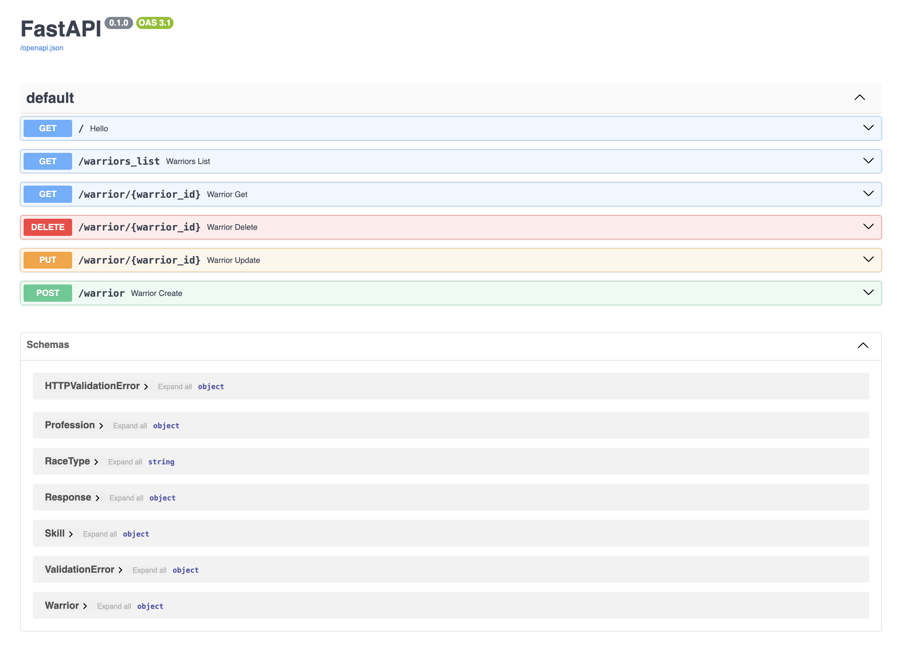

# Документация по практической работе №1  
[Ссылка на задание](https://rendex85.github.io/WebDevelopmentLabsDocs/lr2/pr1/)

## Описание  
Данный проект представляет собой REST API, разработанный с использованием фреймворка **FastAPI**. Он предоставляет функционал для управления сущностями "Воин" (`Warrior`), включая просмотр, добавление, обновление и удаление.

## Структура проекта  
```
.
├── main.py        # Основной файл приложения FastAPI
└── models.py      # Описание моделей данных
```

---

## Модели данных (`models.py`)

### Enum: `RaceType`
```python
class RaceType(str, Enum):
    director = "director"
    worker = "worker"
    junior = "junior"
```
Тип расы воина. Возможные значения:
- `director`
- `worker`
- `junior`

### Модель: `Profession`
```python
class Profession(BaseModel):
    id: int
    title: str
    description: str
```
Профессия воина:
- `id`: идентификатор
- `title`: название профессии
- `description`: описание

### Модель: `Skill`
```python
class Skill(BaseModel):
    id: int
    name: str
    description: str
```
Навыки воина (опционально):
- `id`, `name`, `description`

### Модель: `Warrior`
```python
class Warrior(BaseModel):
    id: int
    race: RaceType
    name: str
    level: int
    profession: Profession
    skills: Optional[List[Skill]] = []
```
Основная модель, представляющая воина.

---

## API Эндпоинты (`main.py`)



### `GET /`
Простой тестовый эндпоинт.  
**Ответ:** `"Hello, User!"`

---

### `GET /warriors_list`
Получить список всех воинов.  
**Ответ:** список объектов `Warrior`.

---

### `GET /warrior/{warrior_id}`
Получить воина по ID.  
**Параметры:**  
- `warrior_id` — ID воина (int)

**Ответ:** объект `Warrior` или `None`, если не найден.

---

### `POST /warrior`
Добавить нового воина.  
**Тело запроса:** объект `Warrior`  
**Ответ:**
```json
{
  "status": 200,
  "data": { /* объект Warrior */ }
}
```

---

### `DELETE /warrior/{warrior_id}`
Удалить воина по ID.  
**Параметры:**  
- `warrior_id` — ID удаляемого воина

**Ответ:**
```json
{ "message": "Warrior with id X deleted" }
```

---

### `PUT /warrior/{warrior_id}`
Обновить данные воина по ID.  
**Тело запроса:** новый объект `Warrior`  
**Ответ:** список всех воинов с обновлённым объектом.

---

## Временная база данных
Используется список `temp_db`, содержащий словари с информацией о воинах. Все изменения вносятся только в оперативную память и не сохраняются после перезапуска сервера.

---

## Зависимости
- Python 3.10+
- FastAPI
- Pydantic
- Uvicorn (для запуска)

---

## Запуск приложения
```bash
uvicorn main:app --reload
```

После запуска приложение будет доступно по адресу:  
`http://127.0.0.1:8000`

Swagger-документация:  
`http://127.0.0.1:8000/docs`