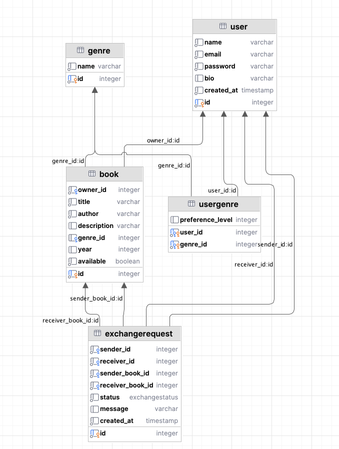
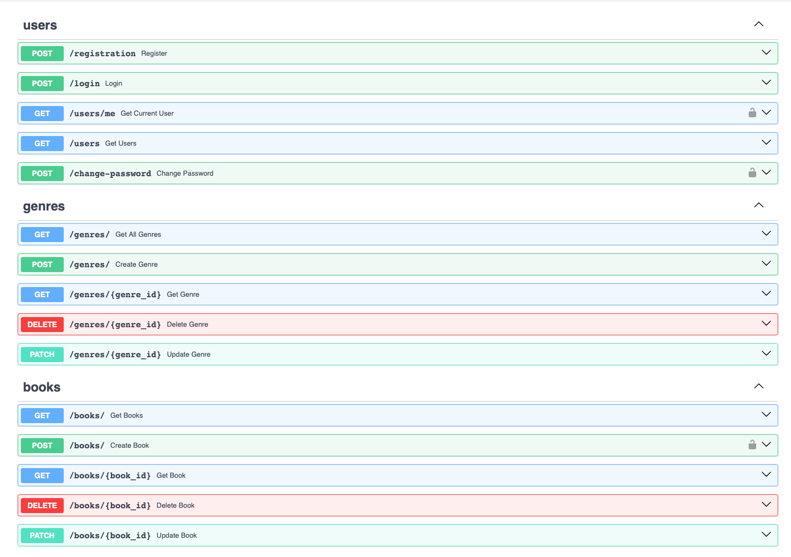
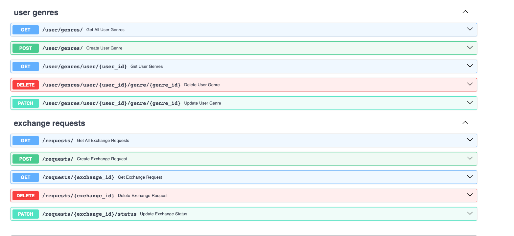

# Лабораторная работа 1. Реализация серверного приложения FastAPI

## Тема:
Разработка веб-приложения для буккросинга

# Ход работы:
Схема базы данных:


Файл `models.py`
```python
from datetime import datetime
from typing import Optional, List
from enum import Enum
from sqlmodel import SQLModel, Field, Relationship


class User(SQLModel, table=True):
    id: Optional[int] = Field(default=None, primary_key=True)
    name: str
    email: str
    password: str
    bio: Optional[str] = None
    created_at: datetime = datetime.now()

    books: List["Book"] = Relationship(back_populates="owner")
    sent_requests: List["ExchangeRequest"] = Relationship(back_populates="sender", sa_relationship_kwargs={"foreign_keys": "ExchangeRequest.sender_id"})
    received_requests: List["ExchangeRequest"] = Relationship(back_populates="receiver", sa_relationship_kwargs={"foreign_keys": "ExchangeRequest.receiver_id"})
    user_genres: List["UserGenre"] = Relationship(back_populates="user")


class Book(SQLModel, table=True):
    id: Optional[int] = Field(default=None, primary_key=True)
    owner_id: int = Field(foreign_key="user.id")
    title: str
    author: str
    description: Optional[str] = None
    genre_id: Optional[int] = Field(default=None, foreign_key="genre.id")
    year: Optional[int] = None
    available: bool = True

    owner: Optional[User] = Relationship(back_populates="books")
    genre: Optional["Genre"] = Relationship(back_populates="books")


class Genre(SQLModel, table=True):
    id: Optional[int] = Field(default=None, primary_key=True)
    name: str

    books: List[Book] = Relationship(back_populates="genre")
    users: List["UserGenre"] = Relationship(back_populates="genre")


class UserGenre(SQLModel, table=True):
    user_id: int = Field(foreign_key="user.id", primary_key=True)
    genre_id: int = Field(foreign_key="genre.id", primary_key=True)
    preference_level: Optional[int] = None

    user: Optional[User] = Relationship(back_populates="user_genres")
    genre: Optional[Genre] = Relationship(back_populates="users")


class ExchangeStatus(str, Enum):
    pending = "pending"
    accepted = "accepted"
    rejected = "rejected"


class ExchangeRequest(SQLModel, table=True):
    id: Optional[int] = Field(default=None, primary_key=True)
    sender_id: int = Field(foreign_key="user.id")
    receiver_id: int = Field(foreign_key="user.id")
    sender_book_id: int = Field(foreign_key="book.id")
    receiver_book_id: int = Field(foreign_key="book.id")
    status: ExchangeStatus = ExchangeStatus.pending
    message: Optional[str] = None
    created_at: datetime = datetime.now()

    sender: Optional[User] = Relationship(back_populates="sent_requests", sa_relationship_kwargs={"foreign_keys": "[ExchangeRequest.sender_id]"})
    receiver: Optional[User] = Relationship(back_populates="received_requests", sa_relationship_kwargs={"foreign_keys": "[ExchangeRequest.receiver_id]"})
    sender_book: Optional[Book] = Relationship(sa_relationship_kwargs={"foreign_keys": "[ExchangeRequest.sender_book_id]"})
    receiver_book: Optional[Book] = Relationship(sa_relationship_kwargs={"foreign_keys": "[ExchangeRequest.receiver_book_id]"})
```

Файл `connection.py`

```python
import os

from dotenv import load_dotenv
from sqlmodel import SQLModel, Session, create_engine

load_dotenv()
db_url = os.getenv('DB_URL')
engine = create_engine(db_url, echo=True)


def init_db():
    SQLModel.metadata.create_all(engine)


def get_session():
    with Session(engine) as session:
        yield session

```

Файл `exchange_endpoints.py`

```python
from fastapi import APIRouter, Depends, HTTPException
from sqlmodel import Session, select
from typing import List

from db.connection import get_session
from model.models.models import ExchangeRequest
from model.schemas.exchange_request import ExchangeRequestCreate, ExchangeRequestRead

exchange_router = APIRouter()


@exchange_router.post("/", response_model=ExchangeRequestRead)
def create_exchange_request(data: ExchangeRequestCreate, session: Session = Depends(get_session)):
    exchange = ExchangeRequest(**data.model_dump())
    session.add(exchange)
    session.commit()
    session.refresh(exchange)
    return exchange


@exchange_router.get("/", response_model=List[ExchangeRequestRead])
def get_all_exchange_requests(session: Session = Depends(get_session)):
    return session.exec(select(ExchangeRequest)).all()


@exchange_router.get("/{exchange_id}", response_model=ExchangeRequestRead)
def get_exchange_request(exchange_id: int, session: Session = Depends(get_session)):
    exchange = session.get(ExchangeRequest, exchange_id)
    if not exchange:
        raise HTTPException(status_code=404, detail="Exchange request not found")
    return exchange


@exchange_router.delete("/{exchange_id}", response_model=dict)
def delete_exchange_request(exchange_id: int, session: Session = Depends(get_session)):
    exchange = session.get(ExchangeRequest, exchange_id)
    if not exchange:
        raise HTTPException(status_code=404, detail="Exchange request not found")
    session.delete(exchange)
    session.commit()
    return {"ok": True}


@exchange_router.patch("/{exchange_id}/status", response_model=ExchangeRequestRead)
def update_exchange_status(exchange_id: int, status: str, session: Session = Depends(get_session)):
    exchange = session.get(ExchangeRequest, exchange_id)
    if not exchange:
        raise HTTPException(status_code=404, detail="Exchange request not found")
    exchange.status = status
    session.commit()
    session.refresh(exchange)
    return exchange

```

Файл `schemas.exchange_request.py`

```python
from datetime import datetime
from typing import Optional

from pydantic import BaseModel

from model.models.models import ExchangeStatus
from model.schemas.book import BookRead
from model.schemas.user import UserRead


class ExchangeRequestCreate(BaseModel):
    sender_id: int
    receiver_id: int
    sender_book_id: int
    receiver_book_id: int
    message: Optional[str] = None


class ExchangeRequestRead(BaseModel):
    id: int
    sender: UserRead
    receiver: UserRead
    sender_book: BookRead
    receiver_book: BookRead
    status: ExchangeStatus
    message: Optional[str] = None
    created_at: datetime

```

Эндпоинты в Swagger


