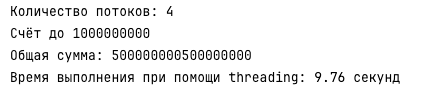
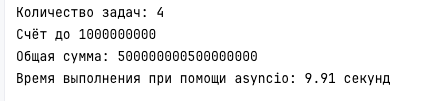

# Лабораторная работа 2. Потоки. Процессы. Асинхронность.
## Ход работы

### Задание 1

#### threading
Файл `threading_solution.py`
```python
import threading
import time


def calculate_sum(start, end, result, index):
    result[index] = sum(range(start, end))

target = 1000000000
num_threads = 8
chunk_size = target // num_threads
threads = []
results = [0] * num_threads
start_time = time.time()

for i in range(num_threads):
    start = i * chunk_size + 1
    end = (i + 1) * chunk_size + 1
    thread = threading.Thread(target=calculate_sum, args=(start, end, results, i))
    threads.append(thread)
    thread.start()

for thread in threads:
    thread.join()

total_sum = sum(results)

print(f"Количество потоков: {num_threads}")
print(f"Счёт до {target}")
print(f"Общая сумма: {total_sum}")
print(f"Время выполнения при помощи threading: {time.time() - start_time:.2f} секунд")
```
Результаты выполнения:



#### multiprocessing
Файл `multiprocess_solution.py`
```python
import multiprocessing
import time

def calculate_sum(start_end):
    start, end = start_end
    return sum(range(start, end))

def main():
    target = 1000000000
    num_processes = 8
    chunk_size = target // num_processes
    ranges = [(i * chunk_size + 1, (i + 1) * chunk_size + 1) for i in range(num_processes)]
    start_time = time.time()

    with multiprocessing.Pool(processes=num_processes) as pool:
        results = pool.map(calculate_sum, ranges)

    total_sum = sum(results)
    print(f"Количество процессов: {num_processes}")
    print(f"Счёт до {target}")
    print(f"Общая сумма: {total_sum}")
    print(f"Время выполнения при помощи multiprocessing: {time.time() - start_time:.2f} секунд")

if __name__ == "__main__":
    multiprocessing.set_start_method('spawn')
    main()

```

Результаты выполнения:


#### asyncio
Файл `async_solution.py`
```python
import asyncio
import time

async def calculate_sum(start, end):
    return sum(range(start, end))

async def main():
    target = 1000000000
    num_tasks = 8
    chunk_size = target // num_tasks
    tasks = []

    for i in range(num_tasks):
        start = i * chunk_size + 1
        end = (i + 1) * chunk_size + 1
        tasks.append(calculate_sum(start, end))

    start_time = time.time()
    results = await asyncio.gather(*tasks)
    total_sum = sum(results)
    print(f"Количество задач: {num_tasks}")
    print(f"Счёт до {target}")
    print(f"Общая сумма: {total_sum}")
    print(f"Время выполнения при помощи asyncio: {time.time() - start_time:.2f} секунд")


if __name__ == "__main__":
    asyncio.run(main())

```

Результаты выполнения:




#### Итоговые результаты
| Подход              | Количество потоков/процессов/задач | Время выполнения |
|:--------------------|:-----------------------------------|:-----------------|
| **Threading**       | 4 потока                           | 9.76 секунд      |
| **Multiprocessing** | 4 процесса                         | 2.71 секунд      |
| **Asyncio**         | 4 задачи                           | 9.96 секунд      |

#### Выводы
- Для CPU-bound задач Python рекомендуется использовать multiprocessing для реального ускорения за счёт параллельной работы на нескольких ядрах процессора.
- Threading и asyncio не дают прироста в чистых вычислениях из-за ограничений GIL и асинхронной природы работы соответственно.

## Задание 2

Одним из требований задания был парсинг страниц для заполнения базы данных из ЛР1. Вариантом прошлой работы было создание сервиса для обмена книгами. Для примера был взят сайт `https://www.lifehacker.ru/`, на котором хранятся различные статьи по менеджменту. Было взято 15 ссылок для парсинга.

#### threading
Файл `threading_parser.py`
```python
import threading
import time

import requests

from books_lab2.task2.common.parser import process_page
from books_lab2.task2.urls import urls


def parse_and_save(url_list):
    for url in url_list:
        response = requests.get(url, timeout=10)
        response.raise_for_status()
        process_page(response.text, url=url)


def main():
    num_threads = 4
    start_time = time.time()
    chunk_size = (len(urls) + num_threads - 1) // num_threads
    chunks = [urls[i:i + chunk_size] for i in range(0, len(urls), chunk_size)]

    threads = []
    for chunk in chunks:
        thread = threading.Thread(target=parse_and_save, args=(chunk,))
        threads.append(thread)
        thread.start()

    for thread in threads:
        thread.join()

    print(f"Количество потоков: {num_threads}")
    print(f"Время выполнения при помощи threading: {time.time() - start_time:.2f} секунд")


if __name__ == "__main__":
    main()

```

Результаты выполнения:


#### multiprocessing
Файл `multiprocessing_parser`
```python
import multiprocessing
import time

import requests

from books_lab2.task2.common.parser import process_page
from books_lab2.task2.urls import urls


def parse_and_save(url_list):
    for url in url_list:
        response = requests.get(url, timeout=10)
        response.raise_for_status()
        process_page(response.text)


def main():
    start_time = time.time()
    num_processes = 4
    chunk_size = (len(urls) + num_processes - 1) // num_processes
    chunks = [urls[i:i + chunk_size] for i in range(0, len(urls), chunk_size)]
    processes = []

    for chunk in chunks:
        process = multiprocessing.Process(target=parse_and_save, args=(chunk,))
        processes.append(process)
        process.start()

    for process in processes:
        process.join()

    print(f"Количество процессов: {num_processes}")
    print(f"Время выполнения при помощи multiprocessing: {time.time() - start_time:.2f} секунд")


if __name__ == "__main__":
    main()


```

Результаты выполнения:


#### asyncio + aiohttp
Файл `async_parser.py`
```python
import asyncio
import time

import aiohttp

from books_lab2.task2.common.parser import process_page
from books_lab2.task2.urls import urls


async def fetch(session, url):
    async with session.get(url, timeout=10, ssl=False) as response:
        text = await response.text()
        return url, text


async def parse_and_save(url):
    async with aiohttp.ClientSession() as session:
        url, html = await fetch(session, url)
        if html:
            process_page(html)

async def parse_chunk(chunk):
    tasks = [parse_and_save(url) for url in chunk]
    await asyncio.gather(*tasks)


async def main():
    num_chunks = 4
    start_time = time.time()

    chunk_size = (len(urls) + num_chunks - 1) // num_chunks
    chunks = [urls[i:i + chunk_size] for i in range(0, len(urls), chunk_size)]

    chunk_tasks = [parse_chunk(chunk) for chunk in chunks]
    await asyncio.gather(*chunk_tasks)

    print(f"Количество задач: {num_chunks}")
    print(f"Время выполнения при помощи asyncio + aiohttp: {time.time() - start_time:.2f} секунд")


if __name__ == "__main__":
    asyncio.run(main())

```

Результаты выполнения:


#### Итоговые результаты
| Подход              | Количество потоков/процессов/задач | Время выполнения |
|:--------------------|:-----------------------------------|:-----------------|
| **Threading**       | 4 потока                           | 3.92 секунд      |
| **Multiprocessing** | 4 процесса                         | 3.11 секунд      |
| **Asyncio**         | 4 задачи                           | 1.74 секунд      |

#### Выводы
- Для небольшого количества сетевых запросов допустимо использовать threading.
- При большом количестве запросов оптимальным становится asyncio благодаря минимальной нагрузке на ресурсы.
- Multiprocessing не подходит для лёгких сетевых задач, так как создание процессов вносит дополнительные накладные расходы.