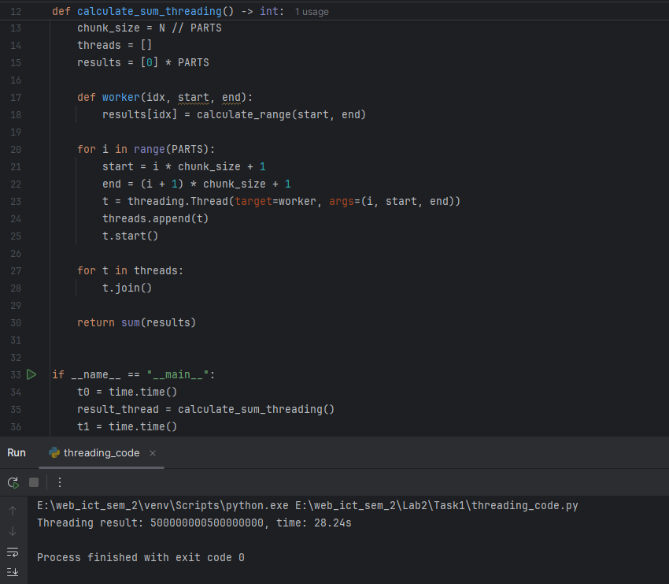
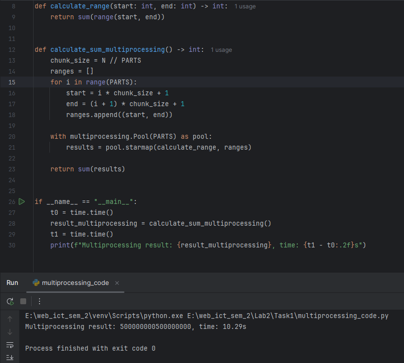
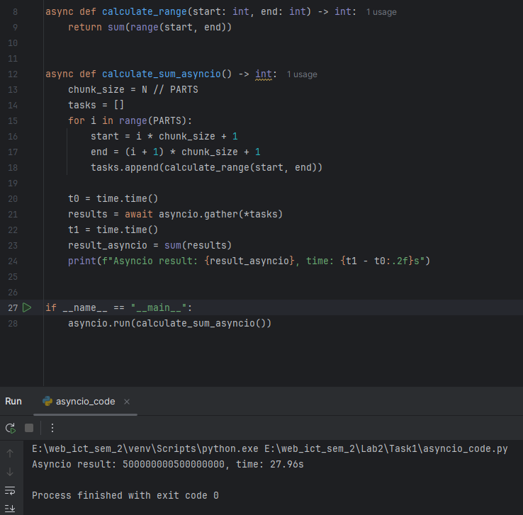
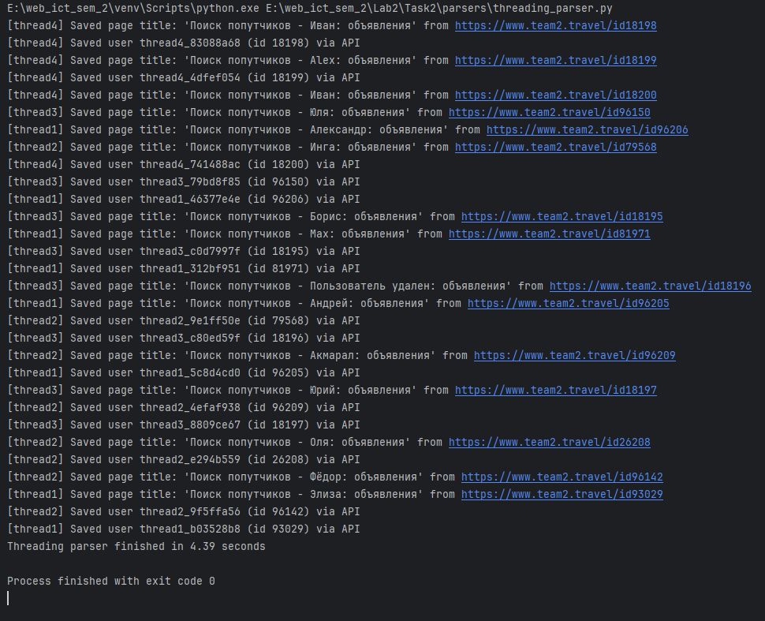
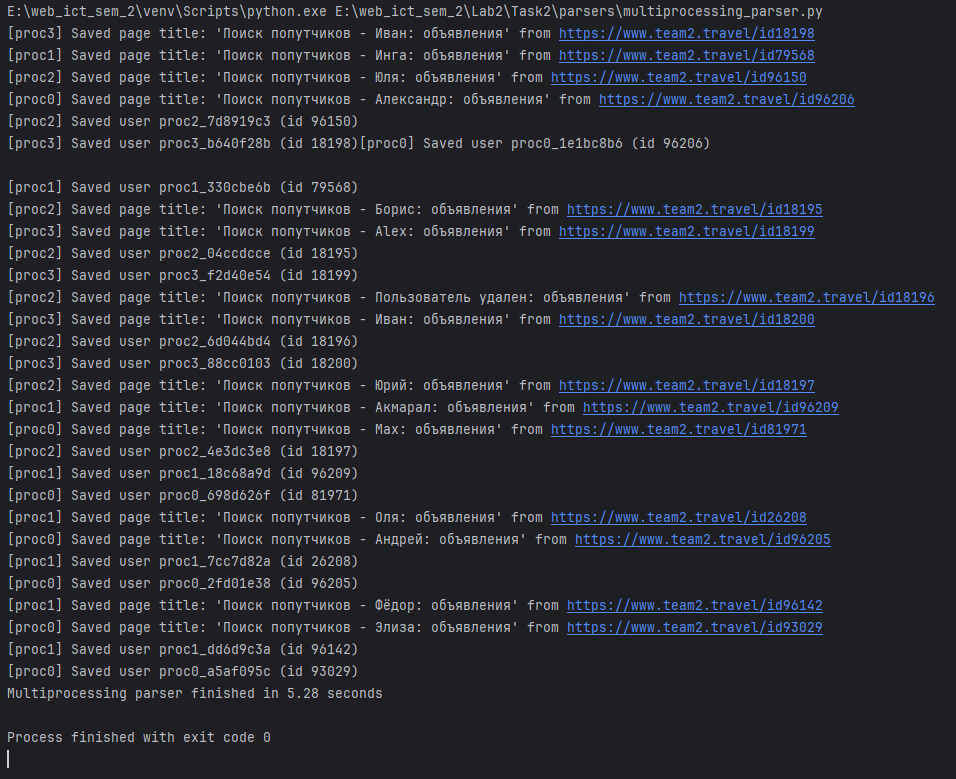
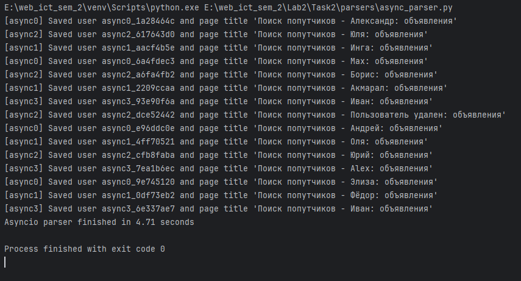

# Лабораторная работа 2. Потоки. Процессы. Асинхронность.

## Ход работы

### Задание 1

#### threading
Файл `threading_code.py`:
```python
import threading
import time

N = 10**9
PARTS = 5


def calculate_range(start: int, end: int) -> int:
    return sum(range(start, end))


def calculate_sum_threading() -> int:
    chunk_size = N // PARTS
    threads = []
    results = [0] * PARTS

    def worker(idx, start, end):
        results[idx] = calculate_range(start, end)

    for i in range(PARTS):
        start = i * chunk_size + 1
        end = (i + 1) * chunk_size + 1
        t = threading.Thread(target=worker, args=(i, start, end))
        threads.append(t)
        t.start()

    for t in threads:
        t.join()

    return sum(results)


if __name__ == "__main__":
    t0 = time.time()
    result_thread = calculate_sum_threading()
    t1 = time.time()
    print(f"Threading result: {result_thread}, time: {t1 - t0:.2f}s")
```

Результат выполнения:
  

#### multiprocessing
Файл `multiprocessing_code.py`:
```python
import multiprocessing
import time

N = 10**9
PARTS = 5


def calculate_range(start: int, end: int) -> int:
    return sum(range(start, end))


def calculate_sum_multiprocessing() -> int:
    chunk_size = N // PARTS
    ranges = []
    for i in range(PARTS):
        start = i * chunk_size + 1
        end = (i + 1) * chunk_size + 1
        ranges.append((start, end))

    with multiprocessing.Pool(PARTS) as pool:
        results = pool.starmap(calculate_range, ranges)

    return sum(results)


if __name__ == "__main__":
    t0 = time.time()
    result_multiprocessing = calculate_sum_multiprocessing()
    t1 = time.time()
    print(f"Multiprocessing result: {result_multiprocessing}, time: {t1 - t0:.2f}s")
```

Результат выполнения:


#### asyncio
Файл `asyncio_code.py`:
```python
import asyncio
import time

N = 10**9
PARTS = 5


async def calculate_range(start: int, end: int) -> int:
    return sum(range(start, end))


async def calculate_sum_asyncio() -> int:
    chunk_size = N // PARTS
    tasks = []
    for i in range(PARTS):
        start = i * chunk_size + 1
        end = (i + 1) * chunk_size + 1
        tasks.append(calculate_range(start, end))

    t0 = time.time()
    results = await asyncio.gather(*tasks)
    t1 = time.time()
    result_asyncio = sum(results)
    print(f"Asyncio result: {result_asyncio}, time: {t1 - t0:.2f}s")


if __name__ == "__main__":
    asyncio.run(calculate_sum_asyncio())
```

Результат выполнения:


#### Итоговые результаты
| Подход              | Количество потоков/процессов/задач | Время выполнения |
|:--------------------|:--|:-----------------|
| **Threading**       | 5 потоков | 28.24 секунд     |
| **Multiprocessing** | 5 процессов | 10.29 секунд     |
| **Asyncio**         | 5 задач | 27.96 секунд     |

#### Выводы
* При задачах с высокой нагрузкой на CPU наибольший выигрыш даёт запуск нескольких процессов через модуль multiprocessing. Каждый процесс работает на своём ядре, что ускоряет вычисления.
* Механизмы потоков и корутин при чисто вычислительной нагрузке не улучшают производительность. Первый "тормозится" GIL, а второй основан на кооперативной многозадачности, а не на настоящем параллелизме.

---

### Задание 2
Одним из требований задания был парсинг страниц для заполнения базы данных из ЛР1. Вариантом прошлой работы было создание сервиса для поиска попутчиков в поездку. Был найден сервис `team2.travel`, на котором пользователи создают запросы на совместную поездку куда-либо. Было выбрано 10 страниц для парсинга контента. Из каждой страницы извлекался заголовок и сохранялся в базу данных. Также извлекались данные пользователей и складывались в базу данных.

Была переиспользована модель User и добавлена модель Page.
```python
import uuid
from datetime import datetime
from typing import Optional

from sqlmodel import SQLModel, Field


class User(SQLModel, table=True):
    id: uuid.UUID = Field(default_factory=uuid.uuid4, primary_key=True, index=True)
    username: str = Field(index=True, unique=True, nullable=False)
    email: str = Field(index=True, unique=True, nullable=False)
    is_admin: bool = Field(default=False)
    first_name: Optional[str] = Field(default=None)
    last_name: Optional[str] = Field(default=None)
    age: Optional[int] = Field(default=None)
    description: Optional[str] = Field(default=None)
    password_hash: str


class Page(SQLModel, table=True):
    id: uuid.UUID = Field(default_factory=uuid.uuid4, primary_key=True, index=True)
    url: str = Field(index=True, nullable=False)
    title: Optional[str] = Field(default=None)
    fetched_at: datetime = Field(default_factory=datetime.utcnow, nullable=False)
```

Для более надёжного сбора информации был выбран метод использовать api. Полученная информация собирается в модель и сохраняется в базе данных.

#### threading
Результат выполнения:


#### multiprocessing
Результат выполнения:


#### asyncio + aiohttp
Результат выполнения:


#### Итоговые результаты
| Подход              | Количество потоков/процессов/задач | Время выполнения |
|:--------------------|:-----------------------------------|:-----------------|
| **Threading**       | 4 потока                           | 4.39 секунд      |
| **Multiprocessing** | 4 процесса                         | 5.28 секунд      |
| **Asyncio**         | 4 задачи                           | 4.71 секунд      |


#### Выводы
* При ограниченном числе сетевых обращений вполне достаточно использования потоков (threading).
* Если же требуется выполнить множество запросов, лучше применять asyncio — он обеспечивает высокую «лёгкость» и низкие накладные затраты.
* Модуль multiprocessing для лёгких сетевых операций избыточен: расходы на запуск процессов и межпроцессное взаимодействие перевешивают выигрыш.