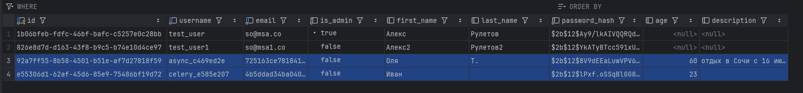
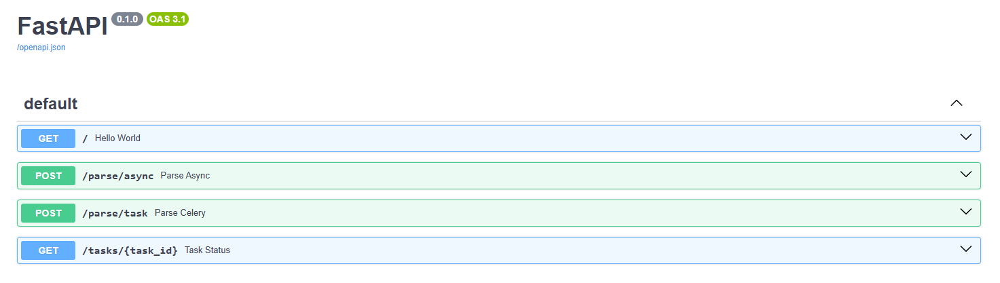

# Лабораторная работа 3. Упаковка FastAPI приложения в Docker, Работа с источниками данных и Очереди.

## Ход работы

### Docker
Сервис из лабораторной работы 1 собирается с помощью следующего Dockerfile:
```dockerfile
FROM python:3.10-slim

WORKDIR /find_companion

COPY requirements.txt .

RUN pip install --no-cache-dir -r requirements.txt

COPY ./alembic.ini .
COPY ./alembic ./alembic
COPY ./app ./app
```

Парсер (апи и воркер) собирается с помощью похожего Dockerfile:
```dockerfile
FROM python:3.10-slim

WORKDIR /parser

COPY requirements.txt .

RUN pip install --no-cache-dir -r requirements.txt

COPY . .
```

Все сервисы запускаются с помощью docker compose файла. Все команды запуска также описаны в `docker-compose.yml`:  
```dockerfile
services:
  postgres:
    image: postgres:15
    container_name: postgres
    restart: always
    healthcheck:
      test: [ "CMD-SHELL", "pg_isready -U ${DB_USER} -d ${DB_NAME}" ]
      interval: 5s
      timeout: 5s
      retries: 5
    environment:
      POSTGRES_USER: ${DB_USER}
      POSTGRES_PASSWORD: ${DB_PASSWORD}
      POSTGRES_DB: ${DB_NAME}
      POSTGRES_HOST_AUTH_METHOD: md5
    ports:
      - "${DB_PORT:-5432}:5432"
    volumes:
      - ./postgres_data:/var/lib/postgresql/data

  companion_app:
    build:
      context: ./find_companion
      dockerfile: Dockerfile
    container_name: companion_app
    ports:
      - "8080:8000"
    depends_on:
      postgres:
        condition: service_healthy
    env_file: .env
    environment:
      DB_HOST: postgres
      DB_PORT: 5432
    command: bash -c "alembic upgrade head && python app/main.py"

  redis:
    image: redis:7
    container_name: redis
    restart: always
    ports:
      - "6379:6379"

  parser_worker:
    build:
      context: ./parser
      dockerfile: Dockerfile
    container_name: parser_worker
    env_file: .env
    environment:
      DB_HOST: postgres
      DB_PORT: 5432
    command: celery -A tasks worker --loglevel=info --max-tasks-per-child=10
    depends_on:
      postgres:
        condition: service_healthy
      redis:
        condition: service_started

  parser_api:
    build:
      context: ./parser
      dockerfile: Dockerfile
    container_name: parser_api
    env_file: .env
    environment:
      DB_HOST: postgres
      DB_PORT: 5432
    command: python main.py
    ports:
      - "8001:8000"
    depends_on:
      postgres:
        condition: service_healthy
      redis:
        condition: service_started
```

Celery task инициируется следующим образом:  
```python
import asyncio
from celery import Celery

from config import settings
from parser import save_page

celery_app = Celery(
    "worker",
    broker=settings.redis_url,
    backend=settings.redis_url,
)

@celery_app.task
def parse_url_task(url: str) -> dict:
    return asyncio.run(save_page(url, prefix="celery"))
```

В файле `main.py` описано два эндпоинта: для парсинга асинхронно и с помощью celery.  
```python
@app.post("/parse/async")
async def parse_async(body: ParseRequest):
    await save_page(body.url, prefix="async")
    return {"status": "ok"}


@app.post("/parse/task")
async def parse_celery(body: ParseRequest):
    task = parse_url_task.delay(body.url)
    return {"task_id": task.id}
```

Результатом работы обоих эндпоинтов будет два добавленных пользователя:  


Список эндпоинтов в swagger:  
