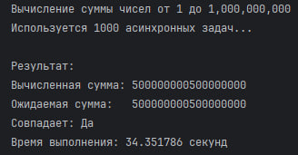
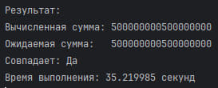
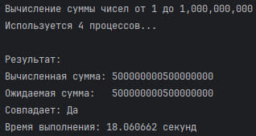

# Threading, multiprocessing и async в Python

**Задача**: Напишите три различных программы на Python, 
использующие каждый из подходов: threading, multiprocessing и async. 
Каждая программа должна решать считать сумму всех чисел от 1 до 
1000000000. Разделите вычисления на несколько параллельных задач 
для ускорения выполнения.


## async

```python
import asyncio
import time


async def calculate_partial_sum(start, end):
    return sum(range(start, end + 1))


async def main():
    n = 1_000_000_000
    num_tasks = 1000
    chunk_size = n // num_tasks

    print(f"Вычисление суммы чисел от 1 до {n:,}")
    print(f"Используется {num_tasks} асинхронных задач...")

    # корутины
    tasks = []
    for i in range(num_tasks):
        start = i * chunk_size + 1
        end = (i + 1) * chunk_size if i != num_tasks - 1 else n
        tasks.append(calculate_partial_sum(start, end))

    start_time = time.time()

    # запуск всех задач параллельно
    partial_sums = await asyncio.gather(*tasks)
    total_sum = sum(partial_sums)

    end_time = time.time()

    expected_sum = n * (n + 1) // 2
    is_correct = total_sum == expected_sum

    print("\nРезультат:")
    print(f"Вычисленная сумма: {total_sum}")
    print(f"Ожидаемая сумма:   {expected_sum}")
    print(f"Совпадает: {'Да' if is_correct else 'Нет'}")
    print(f"Время выполнения: {end_time - start_time:.6f} секунд")


if __name__ == "__main__":
    asyncio.run(main())
```



Используемый подход:

* Асинхронность
* Параллельное выполнение 1000 подзадач
* Числовой диапазон делится на 1000 равных частей (чанков)
* Каждая асинхронная задача вычисляет сумму своего чанка

`asyncio.gather()` планирует выполнение всех переданных корутин в event loop,
а `await` запускает механизм кооперативной многозадачности.

При встрече блокирующей операции `sum(range(...)` корутина не освобождает поток, так как это CPU-операция
=> все корутины из `gather()` выполняются конкурентно (не строго параллельно), переключаясь в одной нити, и мы получаем **нулевой выигрыш в скорости**.

## threading

```python
import threading
import time

def calculate_partial_sum(start, end, result, index):
    partial_sum = sum(range(start, end + 1))
    result[index] = partial_sum

def main():
    n = 1000000000
    num_threads = 4
    chunk_size = n // num_threads
    result = [0] * num_threads
    threads = []

    start_time = time.time()

    for i in range(num_threads):
        start = i * chunk_size + 1
        end = (i + 1) * chunk_size if i != num_threads - 1 else n
        thread = threading.Thread(
            target=calculate_partial_sum,
            args=(start, end, result, i)
        )
        threads.append(thread)
        thread.start()

    for thread in threads:
        thread.join()

    total_sum = sum(result)
    end_time = time.time()

    expected_sum = n * (n + 1) // 2
    is_correct = (total_sum == expected_sum)

    print("\nРезультат:")
    print(f"Вычисленная сумма: {total_sum}")
    print(f"Ожидаемая сумма:   {expected_sum}")
    print(f"Совпадает: {'Да' if is_correct else 'Нет'}")
    print(f"Время выполнения: {end_time - start_time:.6f} секунд")

if __name__ == "__main__":
    main()
```


Используемый подход:

* Многопоточность
* Разделение задачи на 4 параллельных потока
* Каждый поток работает со своим чанком
* Результаты сохраняются в общий список по индексу (нет конфликтов при доступе к данным)

`thread.start()` запускает поток, `thread.join()` ожидает его завершения.

**GIL** позволяет выполняться только одному потоку за раз для Python-кода => для CPU-bound задач (`sum()`) выигрыш в скорости минимален.


## multiprocessing

```python
import multiprocessing
import time


def calculate_partial_sum(start, end):
    return sum(range(start, end + 1))


def main():
    n = 1000000000
    num_processes = multiprocessing.cpu_count()  # все доступные ядра
    chunk_size = n // num_processes

    print(f"Вычисление суммы чисел от 1 до {n:,}")
    print(f"Используется {num_processes} процессов...")

    ranges = []
    for i in range(num_processes):
        start = i * chunk_size + 1
        end = (i + 1) * chunk_size if i != num_processes - 1 else n
        ranges.append((start, end))

    start_time = time.time()

    # пул процессов
    with multiprocessing.Pool(processes=num_processes) as pool:
        partial_sums = pool.starmap(calculate_partial_sum, ranges)
        total_sum = sum(partial_sums)

    end_time = time.time()

    expected_sum = n * (n + 1) // 2
    is_correct = total_sum == expected_sum

    print("\nРезультат:")
    print(f"Вычисленная сумма: {total_sum}")
    print(f"Ожидаемая сумма:   {expected_sum}")
    print(f"Совпадает: {'Да' if is_correct else 'Нет'}")
    print(f"Время выполнения: {end_time - start_time:.6f} секунд")


if __name__ == "__main__":
    main()
```


Используемый подход:

* Параллелизацию через механизм многопроцессности
* Каждый процесс работает в отдельном интерпретаторе Python с собственным GIL.
* Автоматически задействует `multiprocessing.cpu_count()` ядер - все ядра CPU

Каждый процесс вычисляет свою часть суммы независимо, 
управление ресурсами осуществлено через `multiprocessing.Pool`.
Метод `starmap` обеспечивает параллельный запуск функции с разными аргументами.