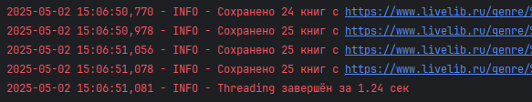
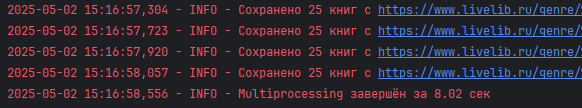
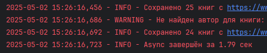

# Параллельный парсинг веб-страниц с сохранением в базу данных

**Задача**: Напишите программу на Python для параллельного парсинга нескольких веб-страниц с сохранением данных в базу данных с использованием подходов threading, multiprocessing и async. Каждая программа должна парсить информацию с нескольких веб-сайтов, сохранять их в базу данных.

### Парсер

```python
from typing import Optional

import requests
from bs4 import BeautifulSoup
from sqlmodel import SQLModel, Field, Session

GENRE_URLS = [
    "https://www.livelib.ru/genre/%D0%A1%D0%BE%D0%B2%D1%80%D0%B5%D0%BC%D0%B5%D0%BD%D0%BD%D0%B0%D1%8F-%D0%A0%D1%83%D1%81%D1%81%D0%BA%D0%B0%D1%8F-%D0%BB%D0%B8%D1%82%D0%B5%D1%80%D0%B0%D1%82%D1%83%D1%80%D0%B0",
    "https://www.livelib.ru/genre/%D0%A0%D1%83%D1%81%D1%81%D0%BA%D0%B0%D1%8F-%D0%BA%D0%BB%D0%B0%D1%81%D1%81%D0%B8%D0%BA%D0%B0",
    "https://www.livelib.ru/genre/%D0%97%D0%B0%D1%80%D1%83%D0%B1%D0%B5%D0%B6%D0%BD%D0%B0%D1%8F-%D0%BA%D0%BB%D0%B0%D1%81%D1%81%D0%B8%D0%BA%D0%B0",
    "https://www.livelib.ru/genre/%D0%97%D0%B0%D1%80%D1%83%D0%B1%D0%B5%D0%B6%D0%BD%D1%8B%D0%B5-%D0%B4%D0%B5%D1%82%D0%B5%D0%BA%D1%82%D0%B8%D0%B2%D1%8B",
    "https://www.livelib.ru/genre/%D0%A0%D1%83%D1%81%D1%81%D0%BA%D0%B0%D1%8F-%D0%BB%D0%B8%D1%82%D0%B5%D1%80%D0%B0%D1%82%D1%83%D1%80%D0%B0-%D0%B4%D0%BB%D1%8F-%D0%B4%D0%B5%D1%82%D0%B5%D0%B9",
    "https://www.livelib.ru/genre/%D0%A2%D1%80%D0%B8%D0%BB%D0%BB%D0%B5%D1%80%D1%8B"
]

class BookParsed(SQLModel, table=True):
    id: Optional[int] = Field(default=None, primary_key=True)
    name: str = Field(index=True)
    author: str = Field(index=True)
    year: int
    publisher: str

def parse_genre_page(url: str, engine = None):
    try:
        if engine is None:
            engine = init_db()

        logger.info(f"Парсинг страницы: {url}")

        headers = {
            'User-Agent': 'Mozilla/5.0 (Windows NT 10.0; Win64; x64) AppleWebKit/537.36'
        }

        response = requests.get(url, headers=headers, timeout=10)
        response.raise_for_status()

        soup = BeautifulSoup(response.text, 'html.parser')
        books = []

        for book_item in soup.find_all('div', class_='book-item__inner'):
            book = parse_book(book_item)
            if book:
                books.append(book)

        with Session(engine) as session:
            session.add_all(books)
            session.commit()
            logger.info(f"Сохранено {len(books)} книг с {url}")

    except Exception as e:
        logger.error(f"Ошибка при парсинге {url}: {str(e)}")

def parse_book(book_item) -> Optional[BookParsed]:
    try:
        title_elem = book_item.find('a', class_='book-item__title')
        if not title_elem:
            logger.warning("Не найдено название книги")
            return None
        title = title_elem.text.strip()

        author_elem = book_item.find('a', class_='book-item__author')
        if not author_elem:
            logger.warning(f"Не найден автор для книги: {title}")
            return None
        author = author_elem.text.strip()

        edition_table = book_item.find('table', class_='book-item-edition')
        year = None
        publisher = None

        if edition_table:
            year_row = edition_table.find('td', string='Год издания:')
            if year_row:
                year_td = year_row.find_next_sibling('td')
                if year_td:
                    year_str = year_td.text.strip()
                    if year_str.isdigit():
                        year = int(year_str)
                    else:
                        logger.warning(f"Некорректный год издания: '{year_str}' для книги: {title}")

            publisher_row = edition_table.find('td', string='Издательство:')
            if publisher_row:
                publisher_td = publisher_row.find_next_sibling('td')
                if publisher_td:
                    publisher_link = publisher_td.find('a', class_='lists-edition__link')
                    if publisher_link:
                        publisher = publisher_link.text.strip()
                    else:
                        publisher = publisher_td.text.strip().split(',')[0].strip()

        if not all([title, author, year, publisher]):
            logger.warning(f"Неполные данные для книги '{title}'")
            return None

        return BookParsed(name=title, author=author, year=year, publisher=publisher)

    except Exception as e:
        logger.error(f"Ошибка при парсинге книги: {str(e)}", exc_info=True)
        return None
```

Реализован парсинг сайта https://www.livelib.ru/. Собран список страниц каталога, содержащих
книги различных жанров. С помощью `requests` и `BeautifulSoup` со страницы жанра парсятся отдельные
книги, среди информации о которых выделяется название, автор, издательство и год издания.
Посредством `session.add_all(books)` и `session.commit()` список собранных книг сохраняется в БД.

## threading

```python
import threading
import time

def threading_approach():
    start_time = time.time()
    engine = init_db()

    threads = []

    for url in GENRE_URLS:
        thread = threading.Thread(target=parse_genre_page, args=(url, engine, ))
        threads.append(thread)
        thread.start()

    for thread in threads:
        thread.join()

    logger.info(f"Threading завершён за {time.time() - start_time:.2f} сек")


if __name__ == "__main__":
    threading_approach()
```



Используемый подход:

*  Главный поток создает и запускает рабочие потоки
*  Каждый поток обрабатывает отдельный URL
*  Пока один поток ожидает ответа от сервера, другие могут работать (I/O-операции (сеть/БД))

## multiprocessing

```python
import multiprocessing
import time

def multiprocessing_approach():
    start_time = time.time()

    init_db()

    multiprocessing.set_start_method('spawn', force=True)

    processes = []
    for url in GENRE_URLS:
        process = multiprocessing.Process(
            target=parse_genre_page,
            args=(url,)
        )
        processes.append(process)
        process.start()

    for process in processes:
        process.join()

    logger.info(f"Multiprocessing завершён за {time.time() - start_time:.2f} сек")


if __name__ == "__main__":
    multiprocessing_approach()
```


Используемый подход:

* Каждый процесс работает в отдельном интерпретаторе Python
* Полноценное использование всех ядер процессора
* Явное указание метода запуска (`spawn`)

`multiprocessing` создает отдельные процессы с 
собственным интерпретатором Python и памятью. 
Это требует больше ресурсов: затраты на создание и уничтожение процессов,
передача данных между процессами через pickle.
Именно такие накладные расходы и заставляют программу работать намного дольше других подходов.

## async

```python
import time

import asyncio
import aiohttp
import asyncpg
from bs4 import BeautifulSoup

async def async_approach():
    conn = await asyncpg.connect(DB_URL)
    await conn.execute('''
        CREATE TABLE IF NOT EXISTS bookparsed (
            id SERIAL PRIMARY KEY,
            name TEXT NOT NULL,
            author TEXT NOT NULL,
            year INTEGER NOT NULL,
            publisher TEXT NOT NULL
        )
    ''')
    await conn.close()

    async def parse_genre_page(url: str, session: aiohttp.ClientSession, pool: asyncpg.Pool):
        try:
            logger.info(f"Парсинг страницы: {url}")
            async with session.get(url) as response:
                html = await response.text()
                soup = BeautifulSoup(html, 'html.parser')

                books_data = []
                for book_item in soup.find_all('div', class_='book-item__inner'):
                    book = parse_book(book_item)
                    if book:
                        books_data.append((book.name, book.author, book.year, book.publisher))

                if books_data:
                    async with pool.acquire() as conn:
                        await conn.executemany('''
                            INSERT INTO bookparsed (name, author, year, publisher)
                            VALUES ($1, $2, $3, $4)
                        ''', books_data)
                        logger.info(f"Сохранено {len(books_data)} книг с {url}")

        except Exception as e:
            logger.error(f"Ошибка при парсинге {url}: {str(e)}")

    start_time = time.time()
    pool = await asyncpg.create_pool(DB_URL)

    async with aiohttp.ClientSession() as session:
        tasks = [parse_genre_page(url, session, pool) for url in GENRE_URLS]
        await asyncio.gather(*tasks)

    await pool.close()
    logger.info(f"Async завершён за {time.time() - start_time:.2f} сек")


if __name__ == "__main__":
    asyncio.run(async_approach())
```


Используемый подход:

* Асинхронные HTTP-запросы через `aiohttp.ClientSession`
* Асинхронное взаимодействие с БД через `asyncpg`
* Параллельная обработка через `asyncio.gather`

Когда корутина достигает `await` (например, `await session.get(url)`), она приостанавливается, 
и цикл переключается на другую корутину.
Не нужно создавать отдельные потоки (как в threading) или процессы (как в multiprocessing). 
Всё работает в одном потоке, переключаясь между задачами, соответственно, накладные расходы минимальны.


## Сравнение

| Характеристика               | Threading                                                                                 | Asyncio                                                                           | Multiprocessing                                                                                    |
|------------------------------|-------------------------------------------------------------------------------------------|-----------------------------------------------------------------------------------|----------------------------------------------------------------------------------------------------|
| **Сумма 1 млрд чисел**       | 35.2 сек                                                                                  | 34.4 сек                                                                          | 18.06 сек                                                                                          |
| **Парсинг**                  | 1.24 сек                                                                                  | 1.79 сек                                                                          | 8.02 сек                                                                                           |
| **Тип параллелизма**         | Псевдопараллелизм (GIL)                                                                   | Кооперативная многозадачность                                                     | Настоящий параллелизм                                                                              |
| **Использование CPU**        | 1 ядро                                                                                    | 1 ядро                                                                            | Все доступные ядра                                                                                 |
| **Потребление памяти**       | Низкое                                                                                    | Очень низкое                                                                      | Высокое (копии интерпретатора)                                                                     |
| **Накладные расходы**        | Средние                                                                                   | Минимальные                                                                       | Высокие                                                                                            |
| **Ограничения**              | GIL блокирует CPU-операции                                                                | Только I/O-bound задачи                                                           | Высокое потребление памяти                                                                         |


Как показало первое задание, **Multiprocessing** - лучший выбор для **CPU-bound вычислительных задач**.
Сюда входят матричные умножения, обработка изображений, обучение ML-моделей, хеширование, шифрование.
Multiprocessing использует несколько ядер CPU и обходит GIL, однако имеет высокое потребление памяти и накладные расходы на создание процессов.

**Threading и Asyncio** показывают лучшую скорость для **I/O-bound задач**.
Среди них: парсинг веб-страниц, загрузка файлов из интернета, работа с базами данных, отправка HTTP-запросов (API),
чтение/запись больших файлов на диск.
**Asyncio** лучше масштабируется при большом количестве запросов, имеет минимальные накладные расходы,
поддерживает тысячи одновременных соединений и автоматически переключает задачи.
