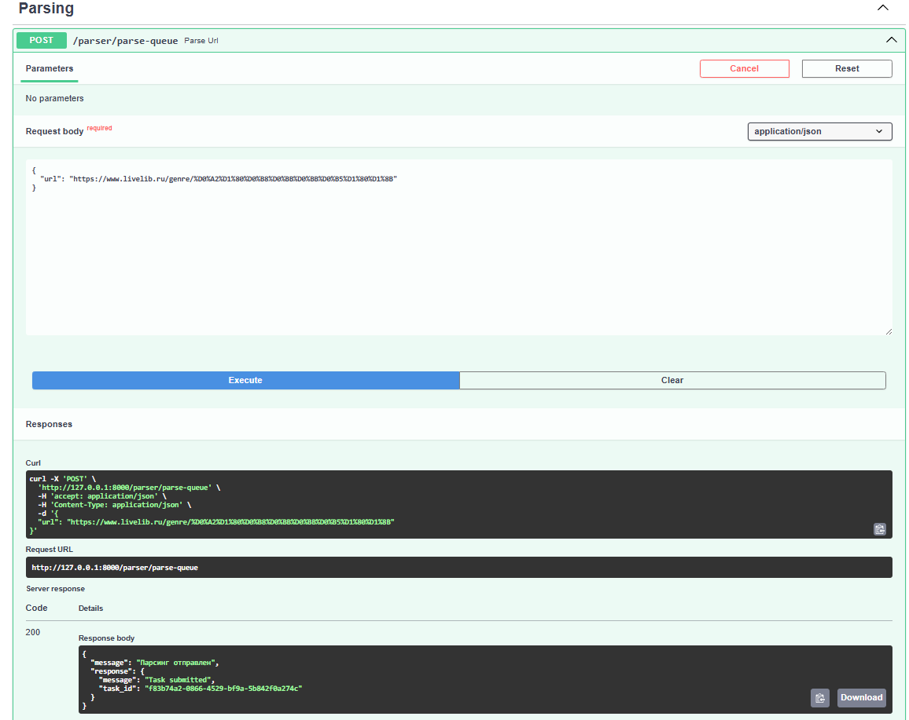
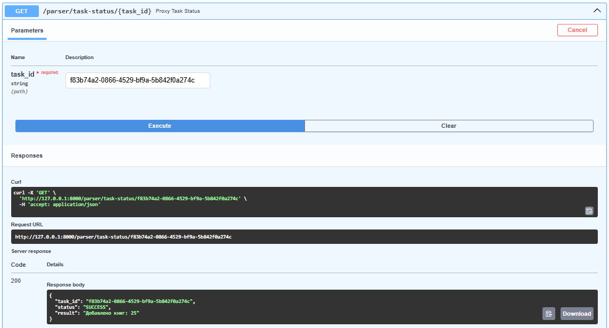
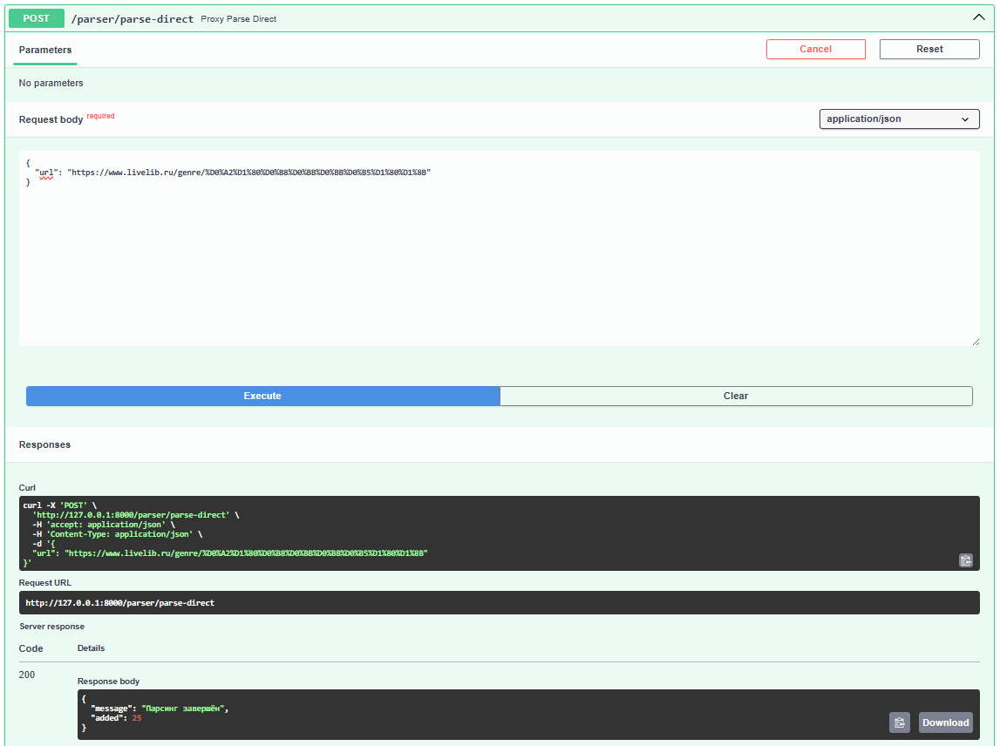

# Упаковка FastAPI приложения в Docker, Работа с источниками данных и Очереди

## Конфигурация

`Dockerfile` основного приложения (books)
``` dockerfile
FROM python:3.11

WORKDIR /app

RUN apt-get update && apt-get install -y netcat-openbsd

COPY requirements.txt .
RUN pip install --no-cache-dir -r requirements.txt

COPY . .

COPY wait-for-postgres.sh /wait-for-postgres.sh
RUN chmod +x /wait-for-postgres.sh

CMD ["/wait-for-postgres.sh", "uvicorn", "app.main:app", "--host", "0.0.0.0", "--port", "8000"]
```

В приложение `books` было добавлено 4 эндпоинта для общения с приложением
parser:

* отправка урла для парсинга напрямую
* отправка урла для парсинга через очередь 
* получение статуса задачи по её id 
* вспомогательная ручка для получения всех сохраненных через парсер книг

```python
import httpx
from fastapi import APIRouter, Depends, HTTPException
from pydantic import BaseModel
from sqlmodel import Session, select

from app.db.session import get_session
from app.models.models import BookParsed

router = APIRouter()

class ParseRequest(BaseModel):
    url: str

@router.post("/parse-queue")
async def parse_url(data: ParseRequest):
    try:
        async with httpx.AsyncClient() as client:
            response = await client.post("http://parser:9000/parse", json={"url": data.url})
        response.raise_for_status()
        return {"message": "Парсинг отправлен", "response": response.json()}
    except httpx.RequestError as e:
        raise HTTPException(status_code=502, detail=f"Ошибка подключения к парсеру: {e}")
    except httpx.HTTPStatusError as e:
        raise HTTPException(status_code=e.response.status_code, detail=f"Ошибка парсера: {e.response.text}")

@router.get("/task-status/{task_id}")
async def proxy_task_status(task_id: str):
    try:
        async with httpx.AsyncClient() as client:
            response = await client.get(f"http://parser:9000/task-status/{task_id}")
        return response.json()
    except Exception as e:
        raise HTTPException(status_code=502, detail=f"Ошибка при обращении к парсеру: {e}")

@router.get("/parsed-books")
def get_parsed_books(session: Session = Depends(get_session)):
    books = session.exec(select(BookParsed)).all()
    return books

@router.post("/parse-direct")
async def proxy_parse_direct(data: ParseRequest):
    try:
        async with httpx.AsyncClient() as client:
            response = await client.post("http://parser:9000/parse-direct", json={"url": data.url})
        response.raise_for_status()
        return response.json()
    except httpx.RequestError as e:
        raise HTTPException(status_code=502, detail=f"Ошибка подключения к парсеру: {e}")
    except httpx.HTTPStatusError as e:
        raise HTTPException(status_code=e.response.status_code, detail=e.response.text)
```

`Dockerfile` приложения parser
```dockerfile
FROM python:3.11

WORKDIR /app

COPY requirements.txt .
RUN pip install --no-cache-dir -r requirements.txt

COPY ./app ./app

CMD ["uvicorn", "app.main:app", "--host", "0.0.0.0", "--port", "9000"]
```

`celery_worker.py` - использует redis в качестве брокера задач и бэкенда, запускает
асинхронный парсинг урла

```python
from celery import Celery
import asyncio

from .parser import async_parse

celery_app = Celery(
    "parser",
    broker="redis://redis:6379/0",
    backend="redis://redis:6379/0"
)

@celery_app.task
def parse_url_task(url: str):
    count = asyncio.run(async_parse(url))
    return f"Добавлено книг: {count}"
```

В приложении `parser` есть 3 эндпоинта: добавление задачи в очередь, получение
статуса задачи по её id и прямой парсинг урла:

```python
from celery.result import AsyncResult
from fastapi import FastAPI, HTTPException
from pydantic import BaseModel

from .celery_worker import parse_url_task, celery_app
from .parser import async_parse

app = FastAPI()

class URLInput(BaseModel):
    url: str

@app.post("/parse")
def trigger_parse_task(data: URLInput):
    if not data.url.startswith("http"):
        raise HTTPException(status_code=400, detail="Invalid URL")
    task = parse_url_task.delay(data.url)
    return {"message": "Task submitted", "task_id": task.id}

@app.get("/task-status/{task_id}")
def get_task_status(task_id: str):
    task = AsyncResult(task_id, app=celery_app)
    return {
        "task_id": task.id,
        "status": task.status,
        "result": task.result if task.successful() else None
    }

@app.post("/parse-direct")
async def parse_direct(data: URLInput):
    try:
        count = await async_parse(data.url)
        return {"message": "Парсинг завершён", "added": count}
    except Exception as e:
        raise HTTPException(status_code=500, detail=f"Ошибка парсинга: {e}")
```

`docker-compose.yml` конфигурирует все необходимые контейнеры и их зависимости:

* **books** - основное приложение, зависит от db
* **parser** - микросервис, зависит от db и redis
* **worker** - обработчик задач из очереди, получает задачи из Redis, зависит от parser, redis, db
* **redis** - брокер очередей и хранилище результатов Celery
* **db** - PostgreSQL база данных, используется обоими приложениями, сохраняет данные между перезапусками через pgdata

```dockerfile
version: '3.8'

services:
  books:
    build:
      context: ./books
    container_name: books
    ports:
      - "8000:8000"
    depends_on:
      - db
    env_file:
      - ./books/.env

  parser:
    build:
      context: ./parser
    container_name: parser
    ports:
      - "9000:9000"
    depends_on:
      - db
      - redis
    env_file:
      - .env

  worker:
    build:
      context: ./parser
    container_name: parser-worker
    command: celery -A app.celery_worker.celery_app worker --loglevel=info
    depends_on:
      - parser
      - redis
      - db
    env_file:
      - .env

  redis:
    image: redis:7
    container_name: redis
    ports:
      - "6379:6379"

  db:
    image: postgres:15
    container_name: postgres
    restart: always
    env_file:
      - .env
    ports:
      - "5432:5432"
    volumes:
      - pgdata:/var/lib/postgresql/data

volumes:
  pgdata:
```

## Эндпоинты

Отправка урла на парсинг через очередь



Просмотр статуса задачи по id



Отправка урла на парсинг напрямую

