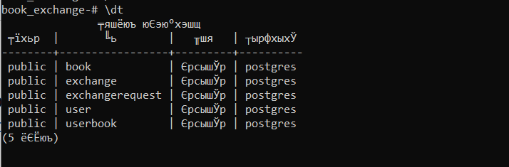

# Лабораторная работа №1 Реализация серверного приложения FastAPI

Цели

Научится реализовывать полноценное серверное приложение с помощью фреймворка FastAPI с применением дополнительных средств и библиотек.

**Тема: Разработка веб-приложения для буккросинга.**

Ваша задача - создать веб-приложение, которое позволит пользователям обмениваться книгами между собой. Это приложение должно облегчать процесс обмена книгами, позволяя пользователям находить книги, которые им интересны, и находить новых пользователей для обмена книгами. 

**Функционал веб-приложения должен включать следующее:**

**Создание профилей**: Возможность пользователям создавать профили, указывать информацию о себе, своих навыках, опыте работы и предпочтениях по проектам.

**Добавление книг в библиотеку**: Пользователи могут добавлять книги, которыми они готовы поделиться, в свою виртуальную библиотеку на платформе.

**Поиск и запросы на обмен**: Функционал поиска книг в библиотеке других пользователей. Возможность отправлять запросы на обмен книгами другим пользователям.

**Управление запросами и обменами**: Возможность просмотра и управления запросами на обмен. Возможность подтверждения или отклонения запросов на обмен.


**Критерии модели данных:**

1. 5 или больше таблиц
2. Связи many-to-many и one-to-many
3. Ассоциативная сущность должна иметь поле, характеризующее связь, помимо ссылок на связанные таблицы

.png)

## Создание базы данных

### Создание бд в postgres 
1. через win+r services.msc запускаю postgres.
2. в cmd psql -U postgres
3. CREATE DATABASE book_exchange;

### Создание моделей

**код из файла models.py:**
```python
from typing import Optional, List
from datetime import datetime
from sqlmodel import SQLModel, Field, Relationship


# ---------- USER ----------
class User(SQLModel, table=True):
    user_id: Optional[int] = Field(default=None, primary_key=True)
    username: str = Field(index=True, unique=True)
    email: str = Field(unique=True, index=True)
    password_hash: str
    profile_info: Optional[str] = None
    skills: Optional[str] = None
    preferences: Optional[str] = None
    created_at: datetime = Field(default_factory=datetime.utcnow)

    books: List["UserBook"] = Relationship(back_populates="user")
    sent_requests: List["ExchangeRequest"] = Relationship(back_populates="sender", sa_relationship_kwargs={"foreign_keys": "[ExchangeRequest.sender_id]"})
    received_requests: List["ExchangeRequest"] = Relationship(back_populates="receiver", sa_relationship_kwargs={"foreign_keys": "[ExchangeRequest.receiver_id]"})


# ---------- BOOK ----------
class Book(SQLModel, table=True):
    book_id: Optional[int] = Field(default=None, primary_key=True)
    title: str
    author: str
    isbn: Optional[str] = None
    genre: str
    publication_year: int
    condition: str
    description: Optional[str] = None

    owners: List["UserBook"] = Relationship(back_populates="book")


# ---------- USERBOOK ----------
class UserBook(SQLModel, table=True):
    user_book_id: Optional[int] = Field(default=None, primary_key=True)
    user_id: int = Field(foreign_key="user.user_id")
    book_id: int = Field(foreign_key="book.book_id")
    added_at: datetime = Field(default_factory=datetime.utcnow)
    status: str  # доступна / недоступна
    location: Optional[str] = None

    user: "User" = Relationship(back_populates="books")
    book: "Book" = Relationship(back_populates="owners")

    sender_requests: List["ExchangeRequest"] = Relationship(back_populates="sender_book", sa_relationship_kwargs={"foreign_keys": "[ExchangeRequest.sender_book_id]"})
    receiver_requests: List["ExchangeRequest"] = Relationship(back_populates="desired_book", sa_relationship_kwargs={"foreign_keys": "[ExchangeRequest.desired_book_id]"})


# ---------- EXCHANGEREQUEST ----------
class ExchangeRequest(SQLModel, table=True):
    request_id: Optional[int] = Field(default=None, primary_key=True)
    sender_id: int = Field(foreign_key="user.user_id")
    receiver_id: int = Field(foreign_key="user.user_id")
    sender_book_id: int = Field(foreign_key="userbook.user_book_id")
    desired_book_id: int = Field(foreign_key="userbook.user_book_id")
    status: str  # pending / accepted / rejected
    created_at: datetime = Field(default_factory=datetime.utcnow)
    updated_at: datetime = Field(default_factory=datetime.utcnow)
    message: Optional[str] = None

    sender: "User" = Relationship(back_populates="sent_requests", sa_relationship_kwargs={"foreign_keys": "[ExchangeRequest.sender_id]"})
    receiver: "User" = Relationship(back_populates="received_requests", sa_relationship_kwargs={"foreign_keys": "[ExchangeRequest.receiver_id]"})
    sender_book: "UserBook" = Relationship(back_populates="sender_requests", sa_relationship_kwargs={"foreign_keys": "[ExchangeRequest.sender_book_id]"})
    desired_book: "UserBook" = Relationship(back_populates="receiver_requests", sa_relationship_kwargs={"foreign_keys": "[ExchangeRequest.desired_book_id]"})
    exchange: Optional["Exchange"] = Relationship(back_populates="request")


# ---------- EXCHANGE ----------
class Exchange(SQLModel, table=True):
    exchange_id: Optional[int] = Field(default=None, primary_key=True)
    request_id: int = Field(foreign_key="exchangerequest.request_id", unique=True)
    exchange_date: datetime = Field(default_factory=datetime.utcnow)
    completion_status: str  # в процессе / завершен
    user1_rating: Optional[int] = None
    user2_rating: Optional[int] = None
    feedback: Optional[str] = None

    request: "ExchangeRequest" = Relationship(back_populates="exchange")
```
### Создание файла для бд

**код из файла db.py:**
```python
from sqlmodel import Session, SQLModel, create_engine
import os
from dotenv import load_dotenv

load_dotenv()

DATABASE_URL = os.getenv("DATABASE_URL")
engine = create_engine(DATABASE_URL, echo=True)

def get_session():
    with Session(engine) as session:
        yield session

```
Всю важную информацию храню в файле .env
### Создание базы данных с моделями

**код из файла create_db.py:**
```python
from models import SQLModel
from db import engine

def create_db_and_tables():
    SQLModel.metadata.create_all(engine)

if __name__ == "__main__":
    create_db_and_tables()

```

Запускаю python create_db.py в терминале

Проверяю в постгрес
