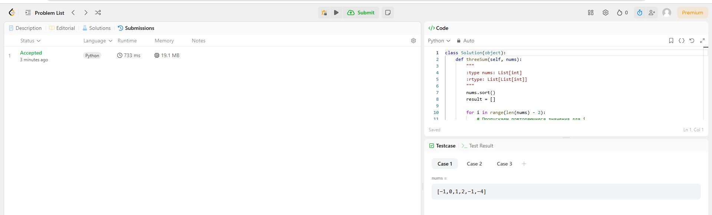
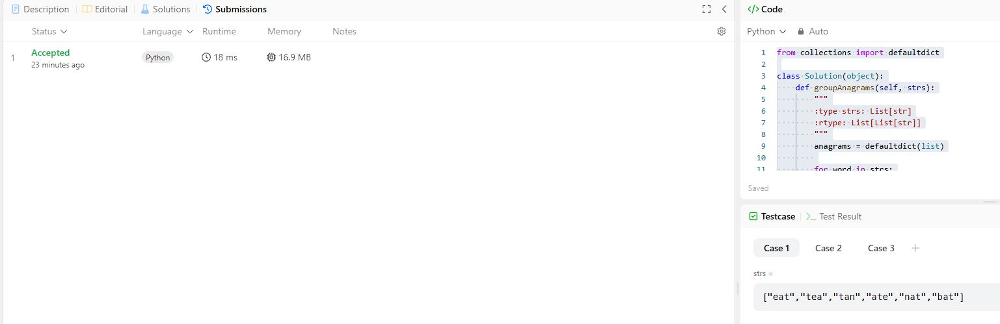
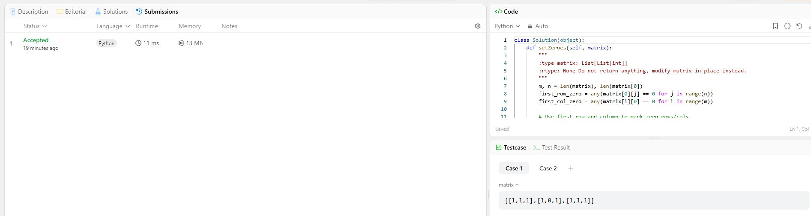
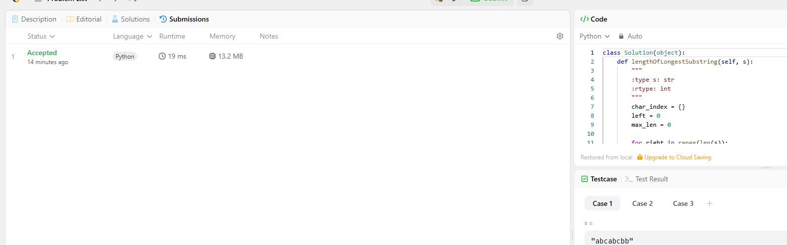
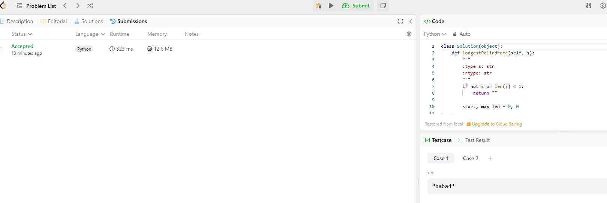
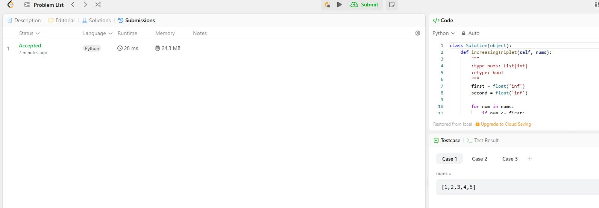
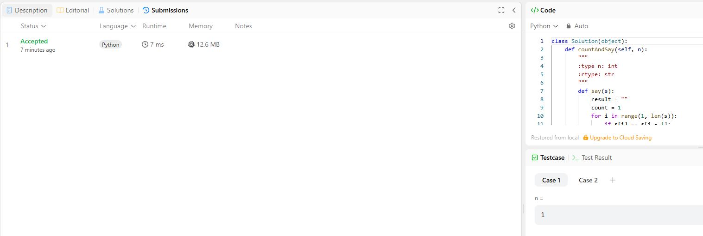
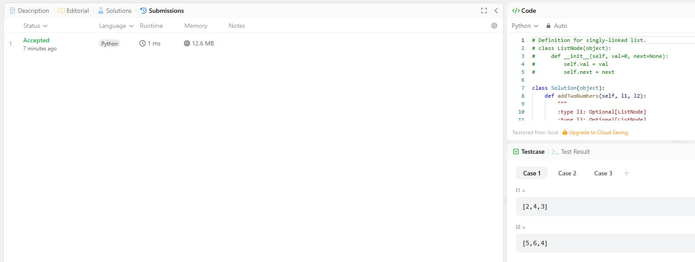

# Задача 15. 3Sum

## Условие:
```
Given an integer array nums, return all the triplets [nums[i], nums[j], nums[k]] such that i != j, i != k, and j != k, and nums[i] + nums[j] + nums[k] == 0.

Notice that the solution set must not contain duplicate triplets.

 

Example 1:

Input: nums = [-1,0,1,2,-1,-4]
Output: [[-1,-1,2],[-1,0,1]]
Explanation: 
nums[0] + nums[1] + nums[2] = (-1) + 0 + 1 = 0.
nums[1] + nums[2] + nums[4] = 0 + 1 + (-1) = 0.
nums[0] + nums[3] + nums[4] = (-1) + 2 + (-1) = 0.
The distinct triplets are [-1,0,1] and [-1,-1,2].
Notice that the order of the output and the order of the triplets does not matter.
Example 2:

Input: nums = [0,1,1]
Output: []
Explanation: The only possible triplet does not sum up to 0.
Example 3:

Input: nums = [0,0,0]
Output: [[0,0,0]]
Explanation: The only possible triplet sums up to 0.
 

Constraints:

3 <= nums.length <= 3000
-10^5 <= nums[i] <= 10^5
```

## Код:

```python
class Solution(object):
    def threeSum(self, nums):
        """
        :type nums: List[int]
        :rtype: List[List[int]]
        """
        nums.sort()
        result = []

        for i in range(len(nums) - 2):
            # Пропускаем повторяющиеся значения для i
            if i > 0 and nums[i] == nums[i - 1]:
                continue

            left, right = i + 1, len(nums) - 1

            while left < right:
                s = nums[i] + nums[left] + nums[right]

                if s == 0:
                    result.append([nums[i], nums[left], nums[right]])

                    # Пропускаем дубликаты слева и справа
                    while left < right and nums[left] == nums[left + 1]:
                        left += 1
                    while left < right and nums[right] == nums[right - 1]:
                        right -= 1

                    left += 1
                    right -= 1
                elif s < 0:
                    left += 1  # Нужна большая сумма
                else:
                    right -= 1  # Нужна меньшая сумма

        return result
```

---

# Задача 49. Group Anagrams

## Условие:
```
Given an array of strings strs, group the anagrams together. You can return the answer in any order.

 

Example 1:

Input: strs = ["eat","tea","tan","ate","nat","bat"]

Output: [["bat"],["nat","tan"],["ate","eat","tea"]]

Explanation:

There is no string in strs that can be rearranged to form "bat".
The strings "nat" and "tan" are anagrams as they can be rearranged to form each other.
The strings "ate", "eat", and "tea" are anagrams as they can be rearranged to form each other.
Example 2:

Input: strs = [""]

Output: [[""]]

Example 3:

Input: strs = ["a"]

Output: [["a"]]

 

Constraints:

1 <= strs.length <= 10^4
0 <= strs[i].length <= 100
strs[i] consists of lowercase English letters.
```

## Код:

```python
from collections import defaultdict

class Solution(object):
    def groupAnagrams(self, strs):
        """
        :type strs: List[str]
        :rtype: List[List[str]]
        """
        anagrams = defaultdict(list)
        
        for word in strs:
            # Sort the word and use it as the key
            sorted_word = tuple(sorted(word))
            anagrams[sorted_word].append(word)
        
        return list(anagrams.values())
```

---

# Задача 73. Set Matrix Zeroes

## Условие:
```
Given an m x n integer matrix matrix, if an element is 0, set its entire row and column to 0's.

You must do it in place.

 

Example 1:


Input: matrix = [[1,1,1],[1,0,1],[1,1,1]]
Output: [[1,0,1],[0,0,0],[1,0,1]]
Example 2:


Input: matrix = [[0,1,2,0],[3,4,5,2],[1,3,1,5]]
Output: [[0,0,0,0],[0,4,5,0],[0,3,1,0]]
 

Constraints:

m == matrix.length
n == matrix[0].length
1 <= m, n <= 200
-231 <= matrix[i][j] <= 231 - 1
 

Follow up:

A straightforward solution using O(mn) space is probably a bad idea.
A simple improvement uses O(m + n) space, but still not the best solution.
Could you devise a constant space solution?
```

## Код:

```python
class Solution(object):
    def setZeroes(self, matrix):
        """
        :type matrix: List[List[int]]
        :rtype: None Do not return anything, modify matrix in-place instead.
        """
        m, n = len(matrix), len(matrix[0])
        first_row_zero = any(matrix[0][j] == 0 for j in range(n))
        first_col_zero = any(matrix[i][0] == 0 for i in range(m))

        for i in range(1, m):
            for j in range(1, n):
                if matrix[i][j] == 0:
                    matrix[i][0] = 0
                    matrix[0][j] = 0

        for i in range(1, m):
            for j in range(1, n):
                if matrix[i][0] == 0 or matrix[0][j] == 0:
                    matrix[i][j] = 0

        if first_row_zero:
            for j in range(n):
                matrix[0][j] = 0

        if first_col_zero:
            for i in range(m):
                matrix[i][0] = 0
```

---

# Задача 3. Longest Substring Without Repeating Characters

## Условие:
```
Given a string s, find the length of the longest substring without duplicate characters.

 

Example 1:

Input: s = "abcabcbb"
Output: 3
Explanation: The answer is "abc", with the length of 3.
Example 2:

Input: s = "bbbbb"
Output: 1
Explanation: The answer is "b", with the length of 1.
Example 3:

Input: s = "pwwkew"
Output: 3
Explanation: The answer is "wke", with the length of 3.
Notice that the answer must be a substring, "pwke" is a subsequence and not a substring.
 

Constraints:

0 <= s.length <= 5 * 104
s consists of English letters, digits, symbols and spaces.
```

## Код:

```python
class Solution(object):
    def lengthOfLongestSubstring(self, s):
        """
        :type s: str
        :rtype: int
        """
        char_index = {}
        left = 0
        max_len = 0

        for right in range(len(s)):
            if s[right] in char_index and char_index[s[right]] >= left:
                left = char_index[s[right]] + 1

            char_index[s[right]] = right
            max_len = max(max_len, right - left + 1)

        return max_len
```

---

# Задача 5. Longest Palindromic Substring

## Условие:
```
Given a string s, return the longest palindromic substring in s.

 

Example 1:

Input: s = "babad"
Output: "bab"
Explanation: "aba" is also a valid answer.
Example 2:

Input: s = "cbbd"
Output: "bb"
 

Constraints:

1 <= s.length <= 1000
s consist of only digits and English letters.
```

## Код:

```python
class Solution(object):
    def longestPalindrome(self, s):
        """
        :type s: str
        :rtype: str
        """
        if not s or len(s) < 1:
            return ""
        
        start, max_len = 0, 0
        
        for i in range(len(s)):
            len1 = self.expandAroundCenter(s, i, i)      # Odd length
            len2 = self.expandAroundCenter(s, i, i + 1)  # Even length
            curr_len = max(len1, len2)
            
            if curr_len > max_len:
                max_len = curr_len
                start = i - (curr_len - 1) // 2
                
        return s[start:start + max_len]

    def expandAroundCenter(self, s, left, right):
        while left >= 0 and right < len(s) and s[left] == s[right]:
            left -= 1
            right += 1
        return right - left - 1
```

---

# Задача 334. Increasing Triplet Subsequence

## Условие:
```
Given an integer array nums, return true if there exists a triple of indices (i, j, k) such that i < j < k and nums[i] < nums[j] < nums[k]. If no such indices exists, return false.

 

Example 1:

Input: nums = [1,2,3,4,5]
Output: true
Explanation: Any triplet where i < j < k is valid.
Example 2:

Input: nums = [5,4,3,2,1]
Output: false
Explanation: No triplet exists.
Example 3:

Input: nums = [2,1,5,0,4,6]
Output: true
Explanation: The triplet (3, 4, 5) is valid because nums[3] == 0 < nums[4] == 4 < nums[5] == 6.
 

Constraints:

1 <= nums.length <= 5 * 105
-231 <= nums[i] <= 231 - 1
 

Follow up: Could you implement a solution that runs in O(n) time complexity and O(1) space complexity?
```

## Код:

```python
class Solution(object):
    def increasingTriplet(self, nums):
        """
        :type nums: List[int]
        :rtype: bool
        """
        first = float('inf')
        second = float('inf')
        
        for num in nums:
            if num <= first:
                first = num
            elif num <= second:
                second = num
            else:
                # Found num > second > first
                return True
        
        return False
```

---

# Задача 38. Count and Say

## Условие:
```
The count-and-say sequence is a sequence of digit strings defined by the recursive formula:

countAndSay(1) = "1"
countAndSay(n) is the run-length encoding of countAndSay(n - 1).
Run-length encoding (RLE) is a string compression method that works by replacing consecutive identical characters (repeated 2 or more times) with the concatenation of the character and the number marking the count of the characters (length of the run). For example, to compress the string "3322251" we replace "33" with "23", replace "222" with "32", replace "5" with "15" and replace "1" with "11". Thus the compressed string becomes "23321511".

Given a positive integer n, return the nth element of the count-and-say sequence.

 

Example 1:

Input: n = 4

Output: "1211"

Explanation:

countAndSay(1) = "1"
countAndSay(2) = RLE of "1" = "11"
countAndSay(3) = RLE of "11" = "21"
countAndSay(4) = RLE of "21" = "1211"
Example 2:

Input: n = 1

Output: "1"

Explanation:

This is the base case.

 

Constraints:

1 <= n <= 30
```

## Код:

```python
class Solution(object):
    def countAndSay(self, n):
        """
        :type n: int
        :rtype: str
        """
        def say(s):
            result = ""
            count = 1
            for i in range(1, len(s)):
                if s[i] == s[i - 1]:
                    count += 1
                else:
                    result += str(count) + s[i - 1]
                    count = 1
            result += str(count) + s[-1]
            return result

        result = "1"
        for _ in range(n - 1):
            result = say(result)
        return result
```

---

# Задача 2. Add Two Numbers

## Условие:
```
You are given two non-empty linked lists representing two non-negative integers. The digits are stored in reverse order, and each of their nodes contains a single digit. Add the two numbers and return the sum as a linked list.

You may assume the two numbers do not contain any leading zero, except the number 0 itself.

 

Example 1:


Input: l1 = [2,4,3], l2 = [5,6,4]
Output: [7,0,8]
Explanation: 342 + 465 = 807.
Example 2:

Input: l1 = [0], l2 = [0]
Output: [0]
Example 3:

Input: l1 = [9,9,9,9,9,9,9], l2 = [9,9,9,9]
Output: [8,9,9,9,0,0,0,1]
 

Constraints:

The number of nodes in each linked list is in the range [1, 100].
0 <= Node.val <= 9
It is guaranteed that the list represents a number that does not have leading zeros.
```

## Код:

```python
# Definition for singly-linked list.
# class ListNode(object):
#     def __init__(self, val=0, next=None):
#         self.val = val
#         self.next = next

class Solution(object):
    def addTwoNumbers(self, l1, l2):
        """
        :type l1: Optional[ListNode]
        :type l2: Optional[ListNode]
        :rtype: Optional[ListNode]
        """
        dummy = ListNode(0)
        current = dummy
        carry = 0

        while l1 or l2 or carry:
            val1 = l1.val if l1 else 0
            val2 = l2.val if l2 else 0
            
            total = val1 + val2 + carry
            carry = total // 10
            digit = total % 10
            
            current.next = ListNode(digit)
            current = current.next
            
            if l1: l1 = l1.next
            if l2: l2 = l2.next
        
        return dummy.next
```

---