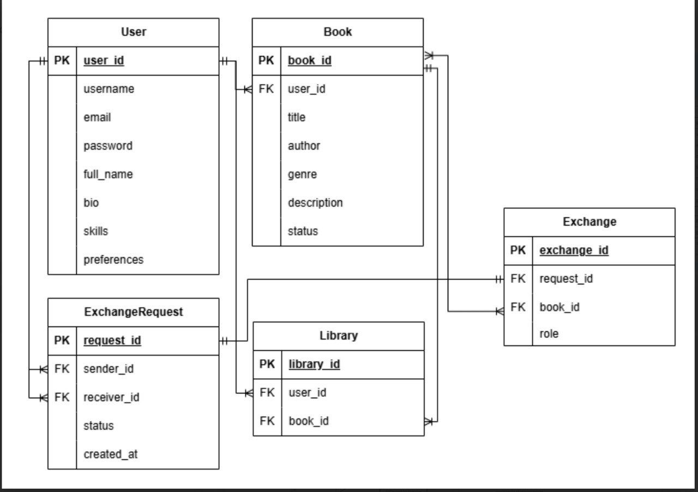
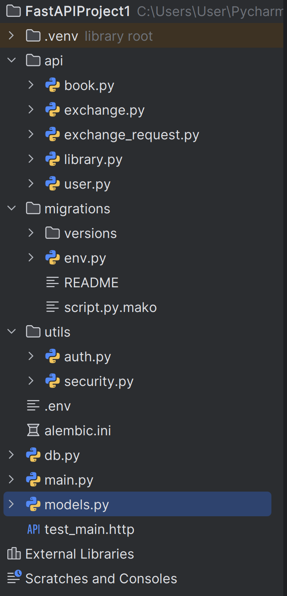

# Реализация серверного приложения FastAPI

### Таблицы, реализованные с помощью ORM SQLAlchemy или SQLModel с использованием БД PostgreSQL.

### API, содержащее CRUD-ы. Там где это необходимо, реализовать GET-запросы возвращающие модели с вложенными объектами (связи many-to-many и one-to-many).

### Настроенную систему миграций с помощью библиотеки Alembic.
[Перейти к практике №3](../Practice/3.md#миграции-env-gitignore-и-структура-проекта)

### Аннотацию типов в передаваемых и возвращаемых значениях в API-методах.
[Перейти к практике №2](../Practice/2.md#сделать-модели-и-api-для-many-to-many-связей-с-вложенным-отображением)
### Оформленную файловую структуру проекта с разделением кода, отвечающего за разную бизнес-логику и предметную область, на отдельные файлы и папки.
