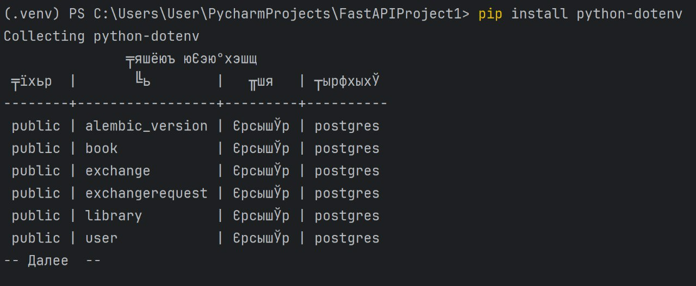
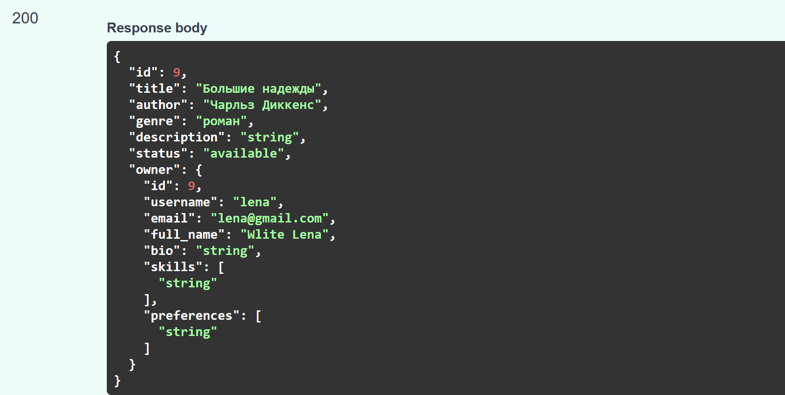

# Настройка БД, SQLModel и миграции через Alembic

### Пошагово реализовать подключение к БД, АПИ и модели, на основании своего варианта основываясь на действиях в практике
Файл с подключением к БД.

    load_dotenv()
    db_url = os.getenv('DB_ADMIN')
    
    engine = create_engine(db_url, echo=True)
    
    def init_db():
        try:
            SQLModel.metadata.create_all(engine)
            print("Database tables created successfully")
        except Exception as e:
            print(f"Error creating database tables: {e}")
            raise
    
    def get_session():
        with Session(engine) as session:
            yield session

Реализованная БД, где в качестве наследника класс SQLModel.

    class User(SQLModel, table=True):
        id: Optional[int] = Field(default=None, primary_key=True)
        username: str
        email: str
        password: str
        full_name: str
        bio: Optional[str] = None
        skills: Optional[List[str]] = Field(default=[], sa_column=Column(JSON))
        preferences: Optional[List[str]] = Field(default=[], sa_column=Column(JSON))
        books: List["Book"] = Relationship(back_populates="owner", sa_relationship_kwargs={"cascade": "all, delete"})
        library: List["Library"] = Relationship(back_populates="user", sa_relationship_kwargs={"cascade": "all, delete"})

    class Book(SQLModel, table=True):
        id: Optional[int] = Field(default=None, primary_key=True)
        title: str
        author: str
        genre: str
        description: str
        status: BookStatus
        owner: Optional["User"] = Relationship(back_populates="books", sa_relationship_kwargs={"cascade": "all, delete"})
        libraries: List["Library"] = Relationship(back_populates="book", sa_relationship_kwargs={"cascade": "all, delete"})
    
    class Exchange(SQLModel, table=True):
        id: Optional[int] = Field(default=None, primary_key=True)
        request_id: int = Field(foreign_key="exchangerequest.id")
        book_id: int = Field(foreign_key="book.id")
        role: ExchangeRole
    
    class ExchangeRequest(SQLModel, table=True):
        id: Optional[int] = Field(default=None, primary_key=True)
        sender_id: int = Field(foreign_key="user.id")
        receiver_id: int = Field(foreign_key="user.id")
        status: str
        created_at: datetime = Field(default_factory=datetime.utcnow)
    
    class Library(SQLModel, table=True):
        library_id: Optional[int] = Field(default=None, primary_key=True)
        user_id: int = Field(foreign_key="user.id")
        book_id: int = Field(foreign_key="book.id")
        user: Optional["User"] = Relationship(back_populates="library", sa_relationship_kwargs={"cascade": "all, delete"})
        book: Optional["Book"] = Relationship(back_populates="libraries", sa_relationship_kwargs={"cascade": "all, delete"})
    
    class BookStatus(str, Enum):
            available = "available"
            exchanged = "exchanged"

    class ExchangeRole(str, Enum):
        sender = "sender"
        receiver = "receiver"
Проверила наличие всех созданных таблиц.

Использование PATCH вместо PUT

    @router.patch("/update/{book_id}", response_model=BookInfo)
        def update_book(
            book_id: int,
            book_update: BookUpdate,
            request: Request,
            session: Session = Depends(get_session)
        ):
            db_book = session.get(Book, book_id)
            get_current_user(request)
            if not db_book:
                raise HTTPException(status_code=404, detail="Book not found")
        
            update_data = book_update.dict(exclude_unset=True)
            for field, value in update_data.items():
                if value is not None and value != "":
                    setattr(db_book, field, value)
        
            session.commit()
            session.refresh(db_book)
            return db_book

### Сделать модели и API для many-to-many связей с вложенным отображением

Реализация API-эндроинтов для модели User

    router = APIRouter()
    security = HTTPBearer()
    
    
    @router.post("/register")
    async def register(user: UserDefault, session: Session = Depends(get_session)):
        existing_user = session.exec(select(User).where(User.email == user.email)).first()
        if existing_user:
            raise HTTPException(status_code=400, detail="Email already registered")
    
        new_user = User(
            email=user.email,
            password=hash_password(user.password),
            username=user.username,
            full_name=user.full_name,
            bio=user.bio,
            skills=user.skills,
            preferences=user.preferences
        )
        session.add(new_user)
        session.commit()
        return {"message": "User created"}
    
    
    @router.post("/login")
    async def login(data: LoginRequest, session: Session = Depends(get_session)):
        user = session.exec(select(User).where(User.email == data.email)).first()
        if not user or not verify_password(data.password, user.password):
            raise HTTPException(status_code=401, detail="Invalid credentials")
    
        access_token = create_access_token({"sub": str(user.id)})
        return {"access_token": access_token, "token_type": "bearer"}
    
    
    @router.get("/me")
    async def get_me(request: Request, session: Session = Depends(get_session)):
        payload = get_current_user(request)
        user = session.get(User, int(payload["sub"]))
        if not user:
            raise HTTPException(status_code=404, detail="User not found")
        return user
    
    
    @router.post("/change-password")
    async def change_password(
            data: PasswordChangeRequest,
            request: Request,
            session: Session = Depends(get_session)
    ):
        payload = get_current_user(request)
        user = session.get(User, int(payload["sub"]))
    
        if not verify_password(data.old_password, user.password):
            raise HTTPException(status_code=400, detail="Old password is incorrect")
    
        user.password = hash_password(data.new_password)
        session.commit()
        return {"message": "Password updated"}
    
    
    @router.get("/")
    async def list_users(request: Request, session: Session = Depends(get_session)):
        get_current_user(request)
        return session.exec(select(User)).all()
    
    
    @router.get("/{user_id}")
    def user_by_id(user_id: int, session: Session = Depends(get_session)) -> User:
        user = session.exec(select(User).where(User.id == user_id)).first()
        if not user:
            raise HTTPException(status_code=404, detail="User not found")
        return user
    
    
    @router.patch("/update/{user_id}")
    def user_update(user_id: int, user: UserUpdate, session: Session = Depends(get_session)) -> User:
        db_user = session.get(User, user_id)
        if not db_user:
            raise HTTPException(status_code=404, detail="User not found")
    
        user_data = user.model_dump(exclude_unset=True)
    
        for key, value in user_data.items():
            setattr(db_user, key, value)
    
        session.add(db_user)
        session.commit()
        session.refresh(db_user)
        return db_user
    
    
    @router.delete("/delete/{user_id}")
    def delete_user(user_id: int, session: Session = Depends(get_session)):
        user = session.get(User, user_id)
        if not user:
            raise HTTPException(status_code=404, detail="User not found")
        session.delete(user)
        session.commit()
        return {"message": "User deleted"}
Пример вложенного запроса в Book

    @router.post("/create", response_model=BookInfo)
    def create_book(book: BookCreate, request: Request, session: Session = Depends(get_session)):
        user_data = get_current_user(request)
        user_id = int(user_data.get("sub"))
        current_user = session.get(User, user_id)
        db_book = Book.model_validate(book)
        db_book.owner_id = current_user.id
     
        session.add(db_book)
        session.commit()
        session.refresh(db_book)
    
        full_book = session.exec(
            select(Book).where(Book.id == db_book.id).options(selectinload(Book.owner))
        ).first()
    
        return full_book
Вот так выглядит модель ответа на создание новой книги:

    class BookInfo(SQLModel):
        id: int
        title: str
        author: str
        genre: str
        description: str
        status: BookStatus
        owner: Optional[UserPublic]

    class Book(SQLModel, table=True):
            id: Optional[int] = Field(default=None, primary_key=True)
            title: str
            author: str
            genre: str
            description: str
            status: BookStatus
            owner: Optional["User"] = Relationship(back_populates="books", sa_relationship_kwargs={"cascade": "all, delete"})
            libraries: List["Library"] = Relationship(back_populates="book", sa_relationship_kwargs={"cascade": "all, delete"})
        
Аналогичным образом были расписаны модели для Exchange, ExchangeRequest, Library.
Пример вложенного запроса.
