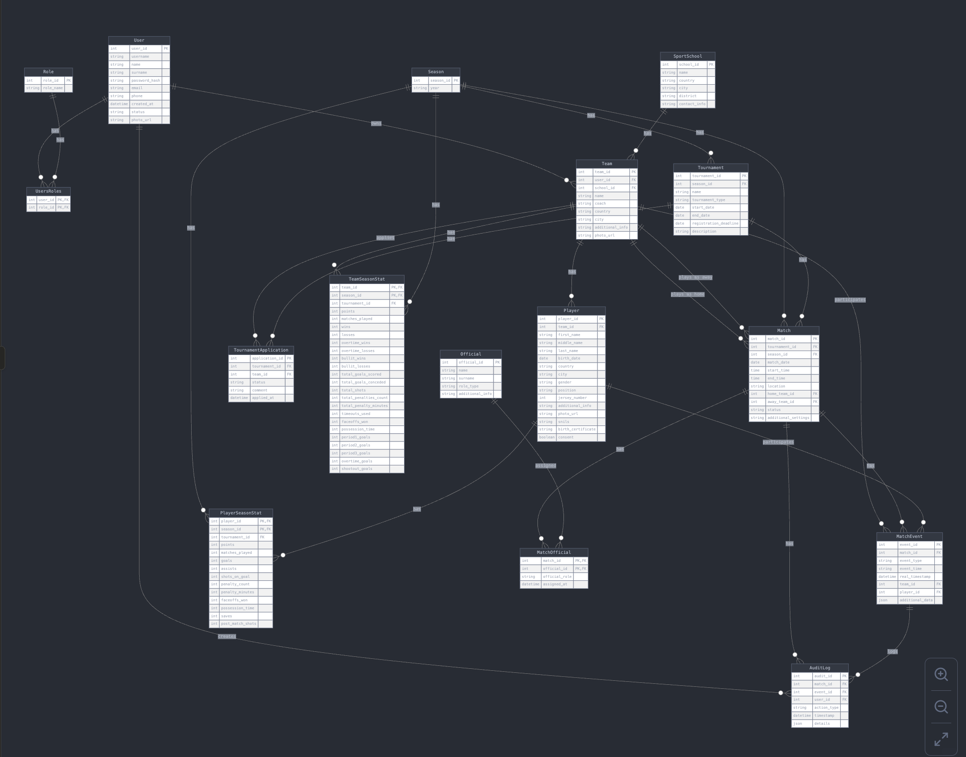
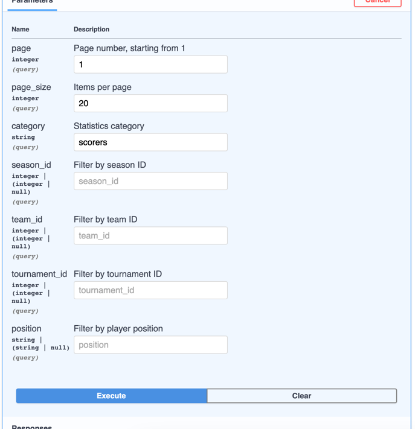
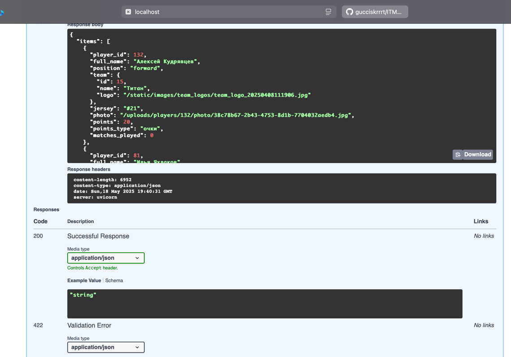

# Документация к Hockey API

## Обзор проекта

Серверное приложение на FastAPI представляет собой платформу для управления хоккейными командами, игроками, турнирами и статистикой. Система построена с использованием асинхронной архитектуры, ORM SQLAlchemy и базы данных PostgreSQL.

## Структура базы данных



База данных включает следующие основные сущности:
- Пользователи и роли (User, Role)
- Команды и спортивные школы (Team, SportSchool)
- Игроки и их статистика (Player, PlayerSeasonStat)
- Турниры и сезоны (Tournament, Season)
- Матчи и события матчей (Match, MatchEvent)
- Официальные лица (Official)
- Система аудита (AuditLog)

### Типы связей

1. **One-to-Many (OTM):**
   - User -> Team
   - SportSchool -> Team
   - Team -> Player
   - Season -> Tournament
   - Tournament -> Match

2. **Many-to-Many (MTM):**
   - User <-> Role через UsersRoles
   - Match <-> Official через MatchOfficial

## Настройка проекта


### Файл .env

```
# Database configuration
DB_HOST=localhost
DB_NAME=hockey_db
DB_USER=postgres
DB_PASSWORD=your_password

# Security configuration
SECRET_KEY=your_secret_key
ALGORITHM=HS256
ACCESS_TOKEN_EXPIRE_MINUTES=30
REFRESH_TOKEN_EXPIRE_MINUTES=1440

# Database URLs
DATABASE_URL=postgresql+asyncpg://${DB_USER}:${DB_PASSWORD}@${DB_HOST}/${DB_NAME}
ALEMBIC_DB_URL=postgresql://${DB_USER}:${DB_PASSWORD}@${DB_HOST}/${DB_NAME}
```

### Запуск проекта

```bash
# Создать первого админа
python create_admin.py admin admin@example.com password

# Запустить сервер
python main.py
```

## API Endpoints

### Аутентификация и пользователи

#### Авторизация

```
POST /auth/token
```

**Запрос:**
```json
{
  "username": "user123",
  "password": "secure_password"
}
```

**Ответ:**
```json
{
  "access_token": "eyJhbGciOiJIUzI1NiIsInR5cCI6IkpXVCJ9...",
  "refresh_token": "eyJhbGciOiJIUzI1NiIsInR5cCI6IkpXVCJ9...",
  "token_type": "bearer"
}
```

#### Обновление токена

```
POST /auth/refresh-token
```

**Запрос:**
```json
{
  "refresh_token": "eyJhbGciOiJIUzI1NiIsInR5cCI6IkpXVCJ9..."
}
```

#### Получение текущих токенов

```
GET /auth/current-tokens
```

#### Создание пользователя (только админ)

```
POST /users/
```

**Запрос:**
```json
{
  "username": "newuser",
  "password": "secure_password",
  "email": "user@example.com",
  "name": "John",
  "surname": "Doe",
  "phone": "+1234567890"
}
```

#### Обновление пароля

```
PATCH /users/password
```

**Запрос:**
```json
{
  "password": "new_password",
  "password_confirm": "new_password"
}
```

### Роли

#### Список ролей (только админ)

```
GET /roles/
```

#### Создание роли (только админ)

```
POST /roles/
```

**Запрос:**
```json
{
  "role_name": "manager"
}
```

#### Назначение роли пользователю (только админ)

```
POST /roles/assign
```

**Запрос:**
```json
{
  "user_id": 1,
  "role_id": 2
}
```

### Турниры и сезоны

```
GET /tournaments/
POST /tournaments/
GET /tournaments/{tournament_id}
PUT /tournaments/{tournament_id}
DELETE /tournaments/{tournament_id}

GET /seasons/
POST /seasons/
```

### Команды и игроки

```
GET /teams/
POST /teams/
GET /teams/{team_id}
PUT /teams/{team_id}
DELETE /teams/{team_id}

GET /teams/{team_id}/players
POST /teams/{team_id}/players
```

### Спортивные школы

```
GET /schools/
POST /schools/
GET /schools/{school_id}
PUT /schools/{school_id}
DELETE /schools/{school_id}
```

## Реализация требований к заданию

### 1. ORM SQLAlchemy с PostgreSQL

```python
# models.py
from sqlalchemy import Column, Integer, String
from sqlalchemy.ext.declarative import declarative_base

Base = declarative_base()


class User(Base):
   __tablename__ = 'users'
   user_id = Column(Integer, primary_key=True)
   username = Column(String, unique=True, nullable=False)
   # ...
```

### 2. API с CRUD и вложенными объектами

```python
# Пример эндпоинта с вложенными объектами
@router.get("/{team_id}", response_model=TeamFullResponse)
async def get_team(
    team_id: int,
    session: AsyncSession = Depends(get_session),
    current_user: User = Depends(get_current_active_user),
):
    result = await session.execute(select(Team).where(Team.team_id == team_id))
    team = result.scalar_one_or_none()
    if not team:
        raise HTTPException(status_code=404, detail="Команда не найдена")
    return team  # TeamFullResponse включает вложенные объекты
```

### 3. Система миграций Alembic

```bash
# Инициализация Alembic
alembic init migrations

# Создание миграции
alembic revision --autogenerate -m "Initial migration"

# Применение миграций
alembic upgrade head
```

### 4. Аннотация типов

```python
# schemas/user_security_schemas.py
from pydantic import BaseModel
from typing import Optional, List

class UserCreate(BaseModel):
    username: str
    password: str
    email: str
    name: Optional[str] = None
    surname: Optional[str] = None
    phone: Optional[str] = None

class UserResponse(BaseModel):
    user_id: int
    username: str
    email: str
    name: Optional[str] = None
    surname: Optional[str] = None
    status: str
    # ...
```


## Особенности проекта

### Асинхронный подход

Проект использует полностью асинхронный стек:
- FastAPI для асинхронных API
- SQLAlchemy 2.0 с async_engine
- asyncpg для асинхронной работы с PostgreSQL

### Безопасность

1. **JWT авторизация и аутентификация**:
```python
def create_access_token(data: dict, expires_delta: Optional[timedelta] = None) -> str:
    to_encode = data.copy()
    expire = datetime.utcnow() + (expires_delta or timedelta(minutes=15))
    to_encode.update({"exp": expire})
    return jwt.encode(to_encode, SECRET_KEY, algorithm=ALGORITHM)
```

2. **Хеширование паролей с bcrypt**:
```python
pwd_context = CryptContext(schemes=["bcrypt"], deprecated="auto")

def get_password_hash(password) -> str:
    return pwd_context.hash(password)
```

3. **Система ролей и разрешений**:
```python
async def get_current_admin_user(current_user: User = Depends(get_current_active_user),
                                session: AsyncSession = Depends(get_session)) -> User:
    result = await session.execute(
        select(Role)
        .join(UsersRoles, UsersRoles.role_id == Role.role_id)
        .where(UsersRoles.user_id == current_user.user_id, Role.role_name == "admin")
    )
    if result.scalar_one_or_none() is None:
        raise HTTPException(status_code=403, detail="Not enough permissions")
    return current_user
```

### Дополнение к работе - надо было добавить вложенный энд: 

**Возьмем для статистику игрока по категории Снайперы:**

```Энд выглядит вот так /main-page/statistics?page=1&page_size=20&category=scorers```

```json
{
   "items": [
      {
         "player_id": 132,
         "full_name": "Алексей Кудрявцев",
         "position": "forward",
         "team": {
            "id": 15,
            "name": "Титан",
            "logo": "/static/images/team_logos/team_logo_20250408111906.jpg"
         },
         "jersey": "#21",
         "photo": "/uploads/players/132/photo/38c78b67-2b43-4753-8d1b-7704032aedb4.jpg",
         "points": 20,
         "points_type": "очки",
         "matches_played": 0
      }
   ]
}
```


