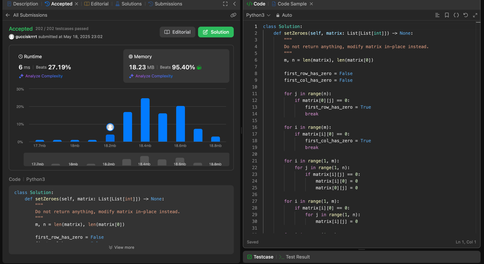

# В качестве наказания за просрочку сдачи пошел делать литкодики:

Наткнулся на задачу с матрицами, суть которой заключалась вся его строка и столбец заполнялись нулями, выполняя
операцию "in place" без использования дополнительной памяти


## Такое простое решение получилось: 

```python
def setZeroes(matrix):
   m, n = len(matrix), len(matrix[0])
   first_row_has_zero = False
   first_col_has_zero = False
   
   # Проверяем наличие нулей в первой строке
   for j in range(n):
       if matrix[0][j] == 0:
           first_row_has_zero = True
           break
   
   # Проверяем наличие нулей в первом столбце
   for i in range(m):
       if matrix[i][0] == 0:
           first_col_has_zero = True
           break
   
   # Помечаем строки и столбцы с нулями
   for i in range(1, m):
       for j in range(1, n):
           if matrix[i][j] == 0:
               matrix[i][0] = 0  # Метка в первом столбце
               matrix[0][j] = 0  # Метка в первой строке
   
   # обнуляем строки по меткам
   for i in range(1, m):
       if matrix[i][0] == 0:
           for j in range(1, n):
               matrix[i][j] = 0
   
   # обнуляем столбцы по меткам
   for j in range(1, n):
       if matrix[0][j] == 0:
           for i in range(1, m):
               matrix[i][j] = 0
   
   # обнуляем первую строку если нужно
   if first_row_has_zero:
       for j in range(n):
           matrix[0][j] = 0
   
   # обнуляем первый столбец если нужно
   if first_col_has_zero:
       for i in range(m):
           matrix[i][0] = 0
   
   return matrix
```
Ну и результат:
