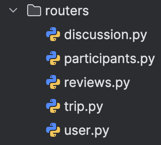
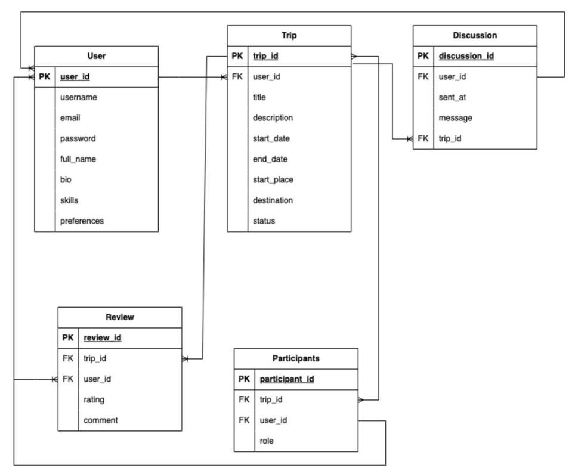
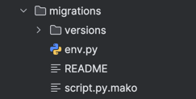
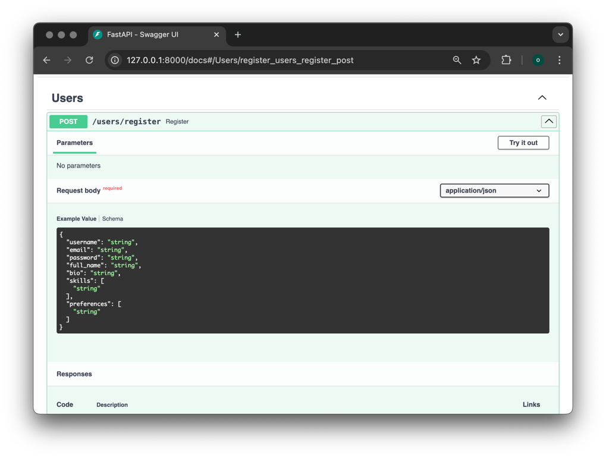
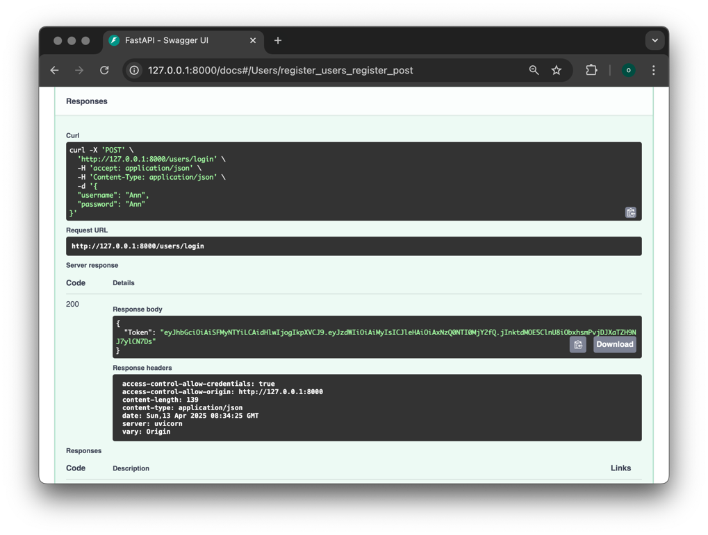
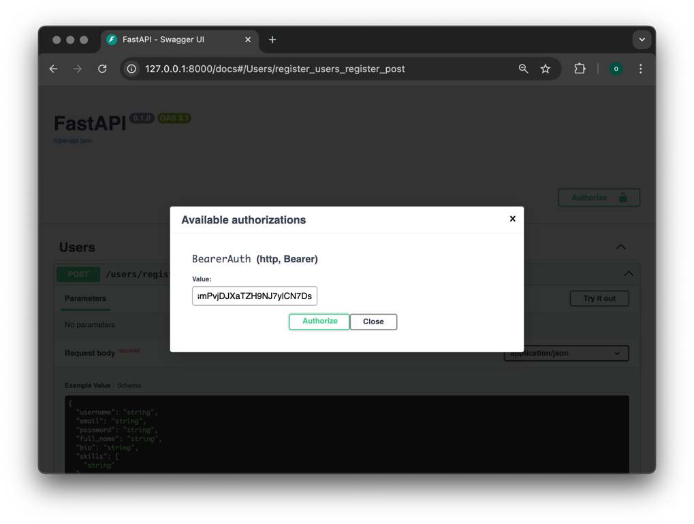
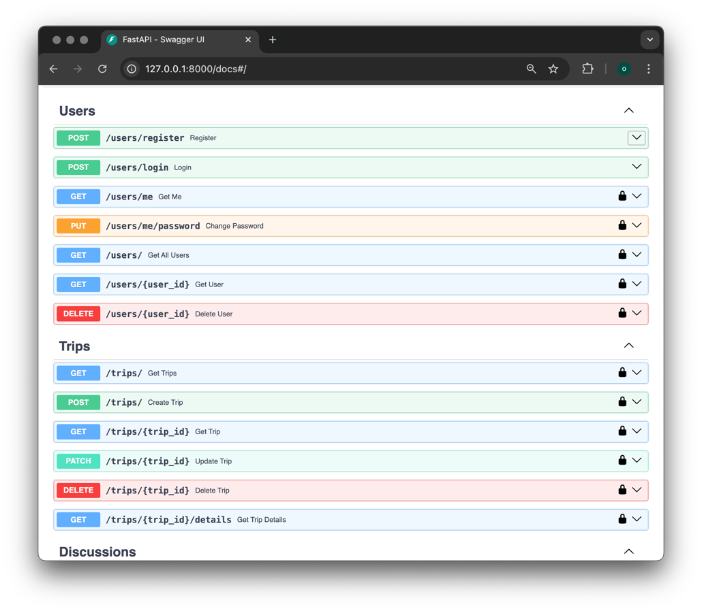

# Создание базового приложения на FastAPI
## Практика 1.1
Реализованный main.py:

```
from fastapi import FastAPI, Depends
from fastapi.middleware.cors import CORSMiddleware
from auth.auth import authenticate_request
from db import init_db
from routers import user, trip, discussion, participants, reviews
from auth.openapi import custom_openapi

app = FastAPI()

@app.on_event("startup")
async def on_startup():
    init_db()

app.add_middleware(
    CORSMiddleware,
    allow_origins=["*"],
    allow_credentials=True,
    allow_methods=["*"],
    allow_headers=["*"],
)

app.openapi = lambda: custom_openapi(app)

app.include_router(user.router)

protected_routers = [
    trip.router,
    discussion.router,
    participants.router,
    reviews.router,
]
for router in protected_routers:
    app.include_router(router, dependencies=[Depends(authenticate_request)])
```

Реализованное приложение запускается командой 
```
uvicorn main:app --reload
```

Создание АПИ-эндпоинтов. Для этого я создала папку routes и для каждого апи эндоинта свой python файл:  
  
Пример эндоинтов для trip.py:
```
from fastapi import APIRouter, Depends, HTTPException
from sqlalchemy.orm import selectinload
from sqlmodel import Session, select, delete
from typing import List

from auth.auth import authenticate_request
from models.models import Trip, TripCreate, TripUpdate, Participant, Review, Discussion, TripOut
from db import get_session

router = APIRouter(prefix="/trips", tags=["Trips"], dependencies=[Depends(authenticate_request)])

@router.get("/", response_model=List[Trip])
def get_trips(session: Session = Depends(get_session)):
    return session.exec(select(Trip)).all()

@router.get("/{trip_id}", response_model=Trip)
def get_trip(trip_id: int, session: Session = Depends(get_session)):
    trip = session.get(Trip, trip_id)
    if not trip:
        raise HTTPException(status_code=404, detail="Такой поездки нет")
    return trip

@router.get("/{trip_id}/details", response_model=TripOut)
def get_trip_details(trip_id: int, session: Session = Depends(get_session)):
    trip = session.exec(
        select(Trip)
        .where(Trip.trip_id == trip_id)
        .options(
            selectinload(Trip.participants).selectinload(Participant.user),
            selectinload(Trip.reviews).selectinload(Review.user),
            selectinload(Trip.discussions).selectinload(Discussion.user),
        )
    ).first()

    if not trip:
        raise HTTPException(status_code=404, detail="Такой поездки нет")
    return trip

@router.post("/", response_model=Trip)
def create_trip(trip: TripCreate, session: Session = Depends(get_session)):
    db_trip = Trip(
        user_id=trip.user_id,
        title=trip.title,
        description=trip.description,
        start_date=trip.start_date.replace(tzinfo=None) if trip.start_date.tzinfo else trip.start_date,
        end_date=trip.end_date.replace(tzinfo=None) if trip.end_date.tzinfo else trip.end_date,
        start_place=trip.start_place,
        destination=trip.destination,
        status=trip.status
    )

    session.add(db_trip)
    session.commit()
    session.refresh(db_trip)
    return db_trip

@router.patch("/{trip_id}", response_model=Trip)
def update_trip(
    trip_id: int,
    trip_update: TripUpdate,
    session: Session = Depends(get_session)
):
    db_trip = session.get(Trip, trip_id)
    if not db_trip:
        raise HTTPException(status_code=404, detail="Такой поездки не существует")

    update_data = trip_update.dict(exclude_unset=True)
    for key, value in update_data.items():
        if value not in [None, ""]:
            setattr(db_trip, key, value)

    session.commit()
    session.refresh(db_trip)
    return db_trip

@router.delete("/{trip_id}")
def delete_trip(trip_id: int, session: Session = Depends(get_session)):
    trip = session.get(Trip, trip_id)
    if not trip:
        raise HTTPException(status_code=404, detail="Такой поездки нет")

    session.exec(delete(Participant).where(Participant.trip_id == trip_id))
    session.exec(delete(Review).where(Review.trip_id == trip_id))
    session.exec(delete(Discussion).where(Discussion.trip_id == trip_id))
    session.delete(trip)
    session.commit()

    return {"message": "Всё успешно удалено"}

```
База данных:


Затем созадала модели для своей базы данных, которые хранятся в файле models.py. 
Ниже представлены примеры моделей:
```
from datetime import datetime
from enum import Enum
from typing import Optional, List

from pydantic import validator
from sqlalchemy import DateTime
from sqlmodel import SQLModel, Field, Relationship, Column, JSON

class Role(str, Enum):
    organizer = "Организатор"
    participant = "Участник"

class Participant(SQLModel, table=True):
    participant_id: int = Field(default=None, primary_key=True)
    trip_id: int = Field(default=None, foreign_key="trip.trip_id")
    user_id: int = Field(default=None, foreign_key="user.user_id")
    role: Role

    trip: "Trip" = Relationship(back_populates="participants")
    user: "User" = Relationship(back_populates="trips")

class Review(SQLModel, table=True):
    review_id: int = Field(default=None, primary_key=True)
    trip_id: int = Field(default=None, foreign_key="trip.trip_id")
    user_id: int = Field(default=None, foreign_key="user.user_id")
    rating: int
    comment: str

    trip: "Trip" = Relationship(back_populates="reviews")
    user: User = Relationship(back_populates="reviews")

class ReviewCreate(SQLModel):
    trip_id: int
    user_id: int
    rating: int = Field(..., ge=1, le=5, description="Рейтинг должен быть от 1 до 5")
    comment: str

class Discussion(SQLModel, table=True):
    discussion_id: int = Field(default=None, primary_key=True)
    trip_id: int = Field(default=None, foreign_key="trip.trip_id")
    user_id: int = Field(default=None, foreign_key="user.user_id")
    sent_at: datetime = Field(
        sa_column=Column(DateTime(timezone=False)),
        default_factory=datetime.utcnow
    )
    message: str

    trip: "Trip" = Relationship(back_populates="discussions")
    user: User = Relationship(back_populates="discussions")

class Trip(SQLModel, table=True):
    trip_id: int = Field(default=None, primary_key=True)
    user_id: int = Field(default=None, foreign_key="user.user_id")
    title: str
    description: str
    start_date: datetime = Field(sa_column=Column(DateTime()))
    end_date: datetime = Field(sa_column=Column(DateTime()))
    start_place: str
    destination: str
    status: str

    participants: List[Participant] = Relationship(
        back_populates="trip",
        sa_relationship_kwargs={
            "cascade": "all, delete-orphan",
            "passive_deletes": True
        }
    )
    reviews: List[Review] = Relationship(
        back_populates="trip",
        sa_relationship_kwargs={
            "cascade": "all, delete-orphan",
            "passive_deletes": True
        }
    )
    discussions: List[Discussion] = Relationship(
        back_populates="trip",
        sa_relationship_kwargs={
            "cascade": "all, delete-orphan",
            "passive_deletes": True
        }
    )
```

## Практика 1.2

Сначала я установила необходимые зависимости:
```
pip install sqlmodel
pip install psycopg2-binary
```
После установки всех зависимостей я реализовала файл с подключением к БД - db.py  
```
from sqlmodel import SQLModel, Session, create_engine
import os
from dotenv import load_dotenv

load_dotenv()
db_url = os.getenv('DATABASE_URL')

engine = create_engine(db_url, echo=True)


def init_db():
    SQLModel.metadata.create_all(engine)


def get_session():
    with Session(engine) as session:
        yield session
```

Чтобы описанные таблицы были созданы  добавила в main.py метод on_startup с декоратором on_event вызывающий внутри их инициализацию.
```
@app.on_event("startup")
async def on_startup():
    init_db()
```

Использование patch:
```
@router.patch("/{trip_id}", response_model=Trip)
def update_trip(
    trip_id: int,
    trip_update: TripUpdate,
    session: Session = Depends(get_session)
):
    db_trip = session.get(Trip, trip_id)
    if not db_trip:
        raise HTTPException(status_code=404, detail="Такой поездки не существует")

    update_data = trip_update.dict(exclude_unset=True)
    for key, value in update_data.items():
        if value not in [None, ""]:
            setattr(db_trip, key, value)

    session.commit()
    session.refresh(db_trip)
    return db_trip
```

Модели и апи для many-to-many связей с вложенным отображением:
```
@router.get("/{trip_id}/details", response_model=TripOut)
def get_trip_details(trip_id: int, session: Session = Depends(get_session)):
    trip = session.exec(
        select(Trip)
        .where(Trip.trip_id == trip_id)
        .options(
            selectinload(Trip.participants).selectinload(Participant.user),
            selectinload(Trip.reviews).selectinload(Review.user),
            selectinload(Trip.discussions).selectinload(Discussion.user),
        )
    ).first()

    if not trip:
        raise HTTPException(status_code=404, detail="Такой поездки нет")
    return trip
    
class UserBase(SQLModel):
    username: str

    class Config:
        from_attributes = True


class ParticipantOut(SQLModel):
    role: Role
    user: UserBase

    class Config:
        from_attributes = True


class ReviewOut(SQLModel):
    rating: int
    comment: str
    user: UserBase

    class Config:
        from_attributes = True


class DiscussionOut(SQLModel):
    message: str
    sent_at: datetime
    user: UserBase

    class Config:
        from_attributes = True

class TripOut(SQLModel):
    trip_id: int
    user_id: int
    title: str
    description: str
    start_date: datetime
    end_date: datetime
    start_place: str
    destination: str
    status: str
    participants: List[ParticipantOut] = []
    reviews: List[ReviewOut] = []
    discussions: List[DiscussionOut] = []
```

## Практика 1.3

Для интеграции Alembic в  проект установила его через пакетный менеджер:
```
pip install alembic 
```
Папка с миграциями:  
  

В файле alembic.ini переменной sqlalchemy.url  указала адрес БД, по аналогии с тем, что находится в файле db.py
В файле env.py импортировала все из models.py и в переменной target_metadata указала значение target_metadata=SQLModel.metadata
Создала миграции и применила.
Также создала файл .env в корне проекта и вписала туда переменные с чувствительными данными.

## Продолжение лабораторной работы

Авторизация и регисьрация пользователя. Генерация JWT-токенов. Хэширование паролей.
Дополнительные АПИ-методы для получения информации о пользователе, списка пользователей и смене пароля.  
auth.py:
```
import os
import json
import hmac
import base64
import hashlib
from datetime import datetime, timedelta
from typing import Optional, Dict, Any
from fastapi import HTTPException, status, Request, Depends
from passlib.context import CryptContext
from sqlmodel import Session
from db import get_session
from models.models import User


SECRET_KEY = os.getenv("SECRET_KEY")
ALGORITHM = os.getenv("ALGORITHM", "HS256")
ACCESS_TOKEN_EXPIRE_MINUTES = int(os.getenv("ACCESS_TOKEN_EXPIRE_MINUTES", 30))

pwd_context = CryptContext(schemes=["bcrypt"], deprecated="auto")

def hash_password(password: str) -> str:
    return pwd_context.hash(password)

def verify_password(plain: str, hashed: str) -> bool:
    return pwd_context.verify(plain, hashed)

def base64url_encode(data: bytes) -> str:
    return base64.urlsafe_b64encode(data).rstrip(b'=').decode()

def base64url_decode(data: str) -> bytes:
    return base64.urlsafe_b64decode(data + '=' * (-len(data) % 4))

def create_jwt_token(data: Dict[str, Any], expires_delta: Optional[timedelta] = None) -> str:
    expire = datetime.utcnow() + (expires_delta or timedelta(minutes=ACCESS_TOKEN_EXPIRE_MINUTES))
    payload = {**data, "exp": int(expire.timestamp())}
    header = {"alg": ALGORITHM, "typ": "JWT"}

    header_enc = base64url_encode(json.dumps(header).encode())
    payload_enc = base64url_encode(json.dumps(payload).encode())

    signing_input = f"{header_enc}.{payload_enc}".encode()
    signature = base64url_encode(hmac.new(SECRET_KEY.encode(), signing_input, hashlib.sha256).digest())

    return f"{header_enc}.{payload_enc}.{signature}"

def verify_jwt_token(token: str) -> Optional[Dict[str, Any]]:
    try:
        header_enc, payload_enc, signature = token.split('.')
        signing_input = f"{header_enc}.{payload_enc}".encode()
        expected_signature = base64url_encode(hmac.new(SECRET_KEY.encode(), signing_input, hashlib.sha256).digest())

        if not hmac.compare_digest(signature, expected_signature):
            return None

        payload = json.loads(base64url_decode(payload_enc))
        if datetime.utcnow().timestamp() > payload.get("exp", 0):
            return None
        return payload
    except Exception:
        return None

async def authenticate_request(request: Request, session: Session = Depends(get_session)) -> User:
    token = request.headers.get("Authorization", "").removeprefix("Bearer ").strip()
    payload = verify_jwt_token(token)
    if not payload or not (user_id := payload.get("sub")):
        raise HTTPException(status_code=status.HTTP_401_UNAUTHORIZED, detail="Аторизуйтесь для просмотра данных")

    user = session.get(User, int(user_id))
    if not user:
        raise HTTPException(status_code=status.HTTP_401_UNAUTHORIZED, detail="Пользователь не найден")
    return user


def get_current_user(request: Request, session: Session = Depends(get_session)) -> User:
    token = request.headers.get("Authorization", "").removeprefix("Bearer ").strip()
    payload = verify_jwt_token(token)
    if not payload:
        raise HTTPException(status_code=401, detail="Токен не валиден")

    user_id = payload.get("sub")
    if not user_id:
        raise HTTPException(status_code=401, detail="Не удалось извлечь ID пользователя из токена")

    user = session.get(User, user_id)
    if not user:
        raise HTTPException(status_code=401, detail="Пользователь не найден")

    return user
```
user.py:
```
from fastapi import APIRouter, HTTPException, Depends, status
from sqlmodel import Session, select
from typing import List
from datetime import timedelta

from auth.auth import (
    hash_password,
    verify_password,
    create_jwt_token,
    authenticate_request,
    ACCESS_TOKEN_EXPIRE_MINUTES
)
from models.models import User, UserCreate, UserLogin, UserUpdatePassword
from db import get_session

router = APIRouter(prefix="/users", tags=["Users"])

@router.post("/register", response_model=User)
def register(user: UserCreate, session: Session = Depends(get_session)):
    existing_user = session.exec(
        select(User).where(
            (User.email == user.email) | (User.username == user.username)
        )
    ).first()

    if existing_user:
        raise HTTPException(
            status_code=status.HTTP_400_BAD_REQUEST,
            detail="Пользователь с таким Username или email уже существует"
        )

    hashed_password = hash_password(user.password)
    db_user = User(
        username=user.username,
        email=user.email,
        password=hashed_password,
        full_name=user.full_name,
        bio=user.bio,
        skills=user.skills,
        preferences=user.preferences
    )

    session.add(db_user)
    session.commit()
    session.refresh(db_user)
    return db_user

@router.post("/login")
def login(form: UserLogin, session: Session = Depends(get_session)):
    user = session.exec(
        select(User).where(User.username == form.username)
    ).first()

    if not user or not verify_password(form.password, user.password):
        raise HTTPException(
            status_code=status.HTTP_401_UNAUTHORIZED,
            detail="Неверный пароль или имя пользователя",
            headers={"WWW-Authenticate": "Bearer"},
        )

    access_token = create_jwt_token(
        {"sub": str(user.user_id)},
        expires_delta=timedelta(minutes=ACCESS_TOKEN_EXPIRE_MINUTES)
    )

    return {"Token": access_token,}

@router.get("/me", response_model=User)
def get_me(current_user: User = Depends(authenticate_request)):
    return current_user

@router.put("/me/password")
def change_password(
    password_data: UserUpdatePassword,
    session: Session = Depends(get_session),
    current_user: User = Depends(authenticate_request)
):
    if not verify_password(password_data.current_password, current_user.password):
        raise HTTPException(
            status_code=status.HTTP_400_BAD_REQUEST,
            detail="Некорректный пароль"
        )

    current_user.password = hash_password(password_data.new_password)
    session.add(current_user)
    session.commit()
    return {"message": "Пароль успешно обновлен"}

@router.get("/", response_model=List[User])
def get_all_users(
    session: Session = Depends(get_session),
    current_user: User = Depends(authenticate_request)
):
    return session.exec(select(User)).all()

@router.get("/{user_id}", response_model=User)
def get_user(
    user_id: int,
    session: Session = Depends(get_session)
):
    user = session.get(User, user_id)
    if not user:
        raise HTTPException(status_code=404, detail="Нет такого пользователя")
    return user

@router.delete("/{user_id}")
def delete_user(
    user_id: int,
    session: Session = Depends(get_session),
    current_user: User = Depends(authenticate_request)
):
    if current_user.user_id != user_id:
        raise HTTPException(
            status_code=status.HTTP_403_FORBIDDEN,
            detail="Вы можете удалить только свой аккаунт"
        )

    user = session.get(User, user_id)
    if not user:
        raise HTTPException(status_code=404, detail="Нет такого пользователя")

    session.delete(user)
    session.commit()
    return {"message": "Удалено"}
```

п.3 реализован вручную без использования сторонних библиотек.



