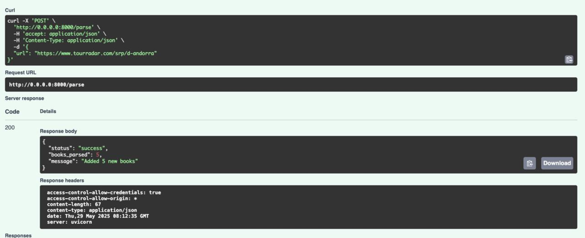
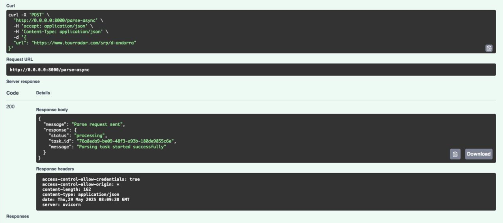
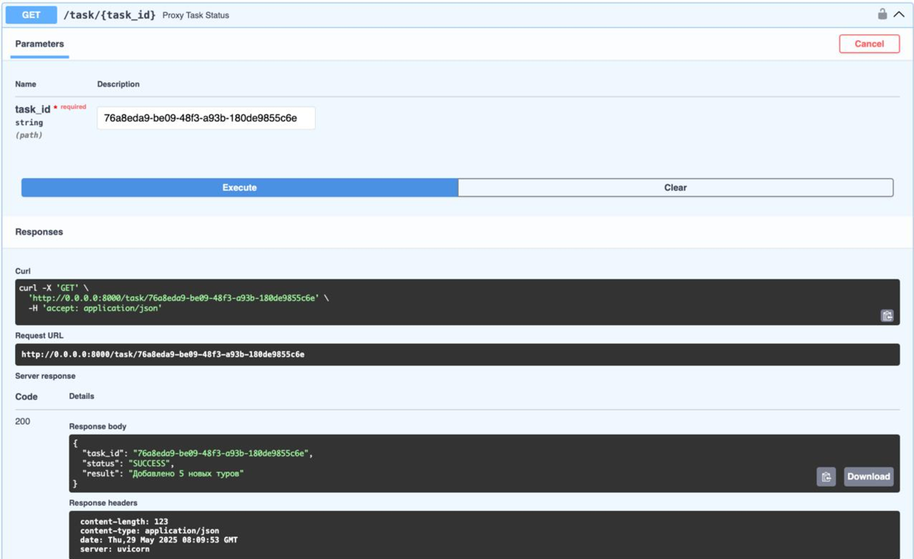
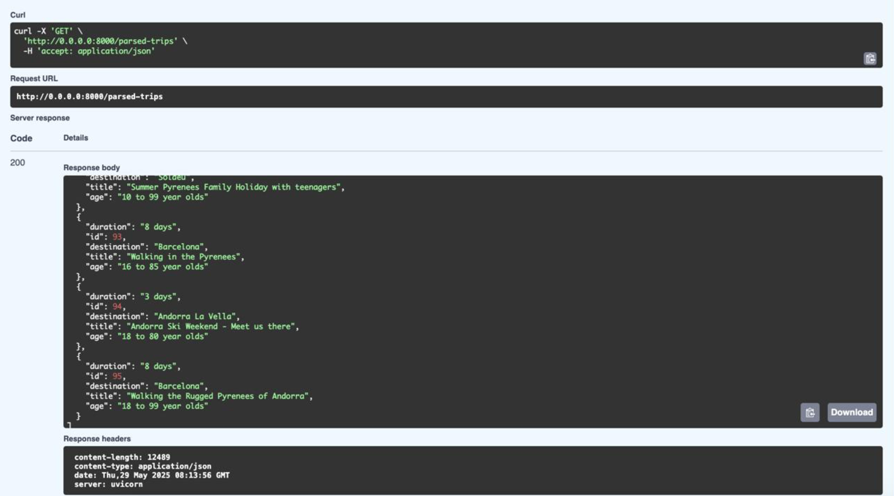

# Лабораторная работа 3: Упаковка FastAPI приложения в Docker, Работа с источниками данных и Очереди
## Подзадача 1: Упаковка FastAPI приложения, базы данных и парсера данных в Docker

Вызов парсера по http:

```
@app.post("/parse")
async def parse(data: InputUrl):
    try:
        count = await parse_and_save_tours(data.url)
        return {
            "status": "success",
            "books_parsed": count,
            "message": f"Added {count} new tours"
        }
    except Exception as e:
        import traceback
        traceback.print_exc()
        logger.error(f"Exception in /parse: {str(e)}")
        raise HTTPException(status_code=500, detail=str(e))
```

Dockerfile для упаковки FastAPI приложения и приложения с паресером:
main_app/Dockerfile
```
FROM python:3.13-slim

WORKDIR /app
ENV PYTHONPATH=/app

COPY requirements.txt .
RUN pip install --no-cache-dir -r requirements.txt --index-url=https://pypi.tuna.tsinghua.edu.cn/simple

COPY . .

CMD ["uvicorn", "main_app.main:app", "--host", "0.0.0.0", "--port", "8000"]
```
parser/Dockerfile
```
FROM python:3.13-slim

WORKDIR /app

COPY requirements.txt .
RUN pip install --no-cache-dir -r requirements.txt --index-url=https://pypi.tuna.tsinghua.edu.cn/simple

COPY ./app ./app

CMD ["uvicorn", "app.main:app", "--host", "0.0.0.0", "--port", "9000"]
```

Создание Docker Compose файла:
```
services:
  db:
    image: postgres:17
    container_name: db
    environment:
      POSTGRES_USER: ${DB_ADMIN}
      POSTGRES_DB: ${DB_NAME}
      POSTGRES_HOST_AUTH_METHOD: trust
    env_file:
      - .env
    ports:
      - "5432:5432"
    volumes:
      - postgres_data:/var/lib/postgresql/data
    healthcheck:
      test: ["CMD-SHELL", "pg_isready -U postgres"]
      interval: 5s
      timeout: 5s
      retries: 5
    networks:
      - trip_network

  celery:
    build:
      context: ./parser
    container_name: celery-worker
    command: celery -A app.celery_worker.celery_app worker --loglevel=info
    depends_on:
      - redis
      - db
    env_file:
      - .env
    volumes:
      - ./parser/app:/app/app
    environment:
      - PYTHONPATH=/app
    networks:
      - trip_network

  redis:
    image: redis:7
    container_name: redis
    ports:
      - "6379:6379"
    networks:
      - trip_network

  app:
    build:
      context: ./main_app
      dockerfile: Dockerfile
    container_name: app
    ports:
      - "8000:8000"
    depends_on:
      db:
        condition: service_healthy
    env_file:
      - .env
    environment:
      - DB_ADMIN=${DB_ADMIN}
      - DB_HOST=db
      - DB_PORT=${DB_PORT}
      - DB_NAME=${DB_NAME}
    volumes:
      - ./main_app:/app/main_app
    networks:
      - trip_network

  parser:
    build:
      context: ./parser
      dockerfile: Dockerfile
    container_name: parser
    depends_on:
      db:
        condition: service_healthy
      app:
        condition: service_started
    env_file:
      - .env
    volumes:
      - ./parser:/app/parser
    networks:
      - trip_network

volumes:
  postgres_data:
    external: true
    name: postgres_data

networks:
  trip_network:
    driver: bridge
```
Создание файла docker-compose.yml для управления оркестром сервисов, включающих FastAPI приложение, базу данных и парсер данных.  
celery – воркер Celery для асинхронных задач. Зависит от redis и db. redis – сервер Redis для кеширования или брокера сообщений Celery.  

## Подзадача 2: Вызов парсера из FastAPI
Эндпоинт в FastAPI для вызова парсера, который будет принимать запросы с URL для парсинга от клиента, отправлять запрос парсеру (запущенному в отдельном контейнере) и возвращать ответ с результатом клиенту.

```
@router.post("/parse")
async def parse_url(request: RequestURL):
    try:
        async with httpx.AsyncClient() as client:
            response = await client.post(
                f"http://parser:9000/parse",
                json={"url": request.url},
                timeout=30.0
            )
            response.raise_for_status()
            return response.json()
```



## Подзадача 3: Вызов парсера из FastAPI через очередь

```
@router.post("/parse-async")
async def parse_url_async(request: RequestURL):
    try:
        async with httpx.AsyncClient() as client:
            response = await client.post(
                f"http://parser:9000/parse-async",
                json={"url": request.url},
                timeout=30.0
            )
            response.raise_for_status()
            return {"message": "Parse request sent", "response": response.json()}

    except httpx.HTTPStatusError as e:
        raise HTTPException(
            status_code=e.response.status_code,
            detail=f"Parser service error: {e.response.text}"
        )
    except Exception as e:
        raise HTTPException(
            status_code=500,
            detail=f"Internal server error: {str(e)}"
        )
```


Создается объект AsyncResult, который связывается с задачей Celery по её task_id. celery_app – это экземпляр Celery, который управляет задачами.
Celery выносит парсинг в фоновый процесс, а Redis помогает управлять очередями задач и результатами.

```
@router.get("/task/{task_id}")
async def proxy_task_status(task_id: str):
    try:
        async with httpx.AsyncClient() as client:
            response = await client.get(f"http://parser:9000/task/{task_id}")
        return response.json()
    except Exception as e:
        raise HTTPException(status_code=502, detail=f"Ошибка при обращении к парсеру: {e}")
```


И соответственно смотрим спрашенные туры:


