# <span style="color:teal">Отчет по Лабораторной работе №2. Параллельный парсинг веб-страниц и сохранение в базу данных</span>.

## Цель

Создать три программы на Python для параллельного парсинга множества веб-страниц с использованием подходов `threading`, `multiprocessing` и `async`. Все собранные данные должны быть сохранены в базу данных.

## Задание №1 и №2

## Описание программ

### 1. Threading

Программа использует многопоточность для параллельной загрузки и сохранения данных.

рассчет суммы:

```python
async def partial_sum(start, end):
    return sum(range(start, end))

async def calculate_sum():
    num_tasks = 4
    maximum = 10**9
    step = maximum // num_tasks
    tasks = []

    for i in range(num_tasks):
        start = i * step + 1
        if i != num_tasks - 1:
            end = (i + 1) * step + 1
        else:
            end = maximum + 1
        task = asyncio.create_task(partial_sum(start, end))
        tasks.append(task)

    results = await asyncio.gather(*tasks)
    return sum(results)
```
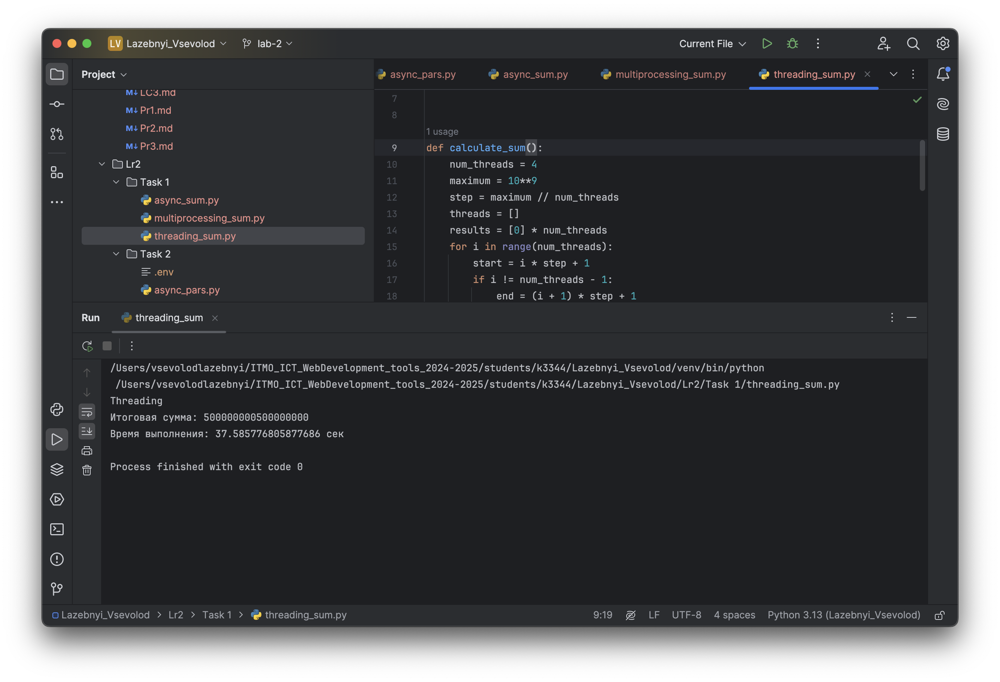
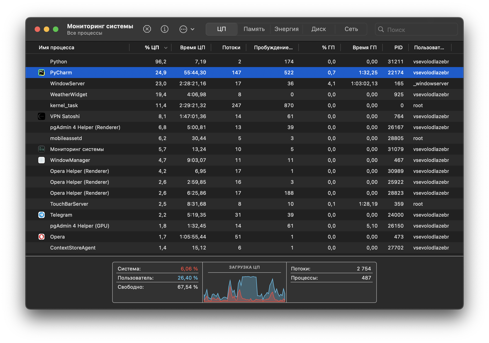

models.py для бд хранилища
```python
from sqlmodel import SQLModel, Field
from datetime import date

class StockData(SQLModel, table=True):
    id: int = Field(default=None, primary_key=True)
    asset_name: str
    ticker: str
    investing_id: int
    date: date
    open_price: float
    high_price: float
    low_price: float
    close_price: float
    volume: int
```
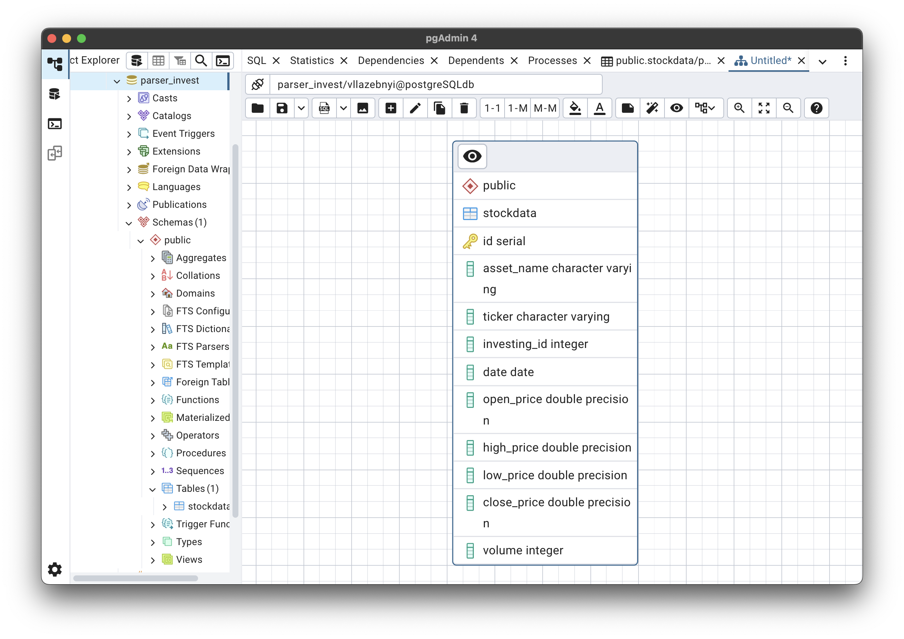

парсинг акций с разных URL использованием библиотек yfinance.
```python

def fetch_historical_data(asset):
    ticker = asset['ticker']
    stock = yf.Ticker(ticker)
    df = stock.history(start="2023-01-01", end="2024-12-31")
    if df.empty:
        return asset, None
    data = df.reset_index().to_dict('records')
    return asset, data

def save_data_to_db(asset, data):
    if not data:
        print(f"No data to save for {asset['name']} ({asset['ticker']})")
        return
    records = []
    for entry in data:
        date_obj = entry['Date'].date() if isinstance(entry['Date'], pd.Timestamp) else entry['Date']
        record = StockData(
            asset_name=asset['name'],
            ticker=asset['ticker'],
            investing_id=0,
            date=date_obj,
            open_price=float(entry['Open']),
            high_price=float(entry['High']),
            low_price=float(entry['Low']),
            close_price=float(entry['Close']),
            volume=int(entry['Volume']) if 'Volume' in entry else 0
        )
        records.append(record)
    with get_session() as db_session:
        for record in records:
            db_session.add(record)
        db_session.commit()
    print(f"Saved {len(records)} for {asset['name']} ({asset['ticker']})")

def process_asset(asset):
    asset, data = fetch_historical_data(asset)
    save_data_to_db(asset, data)

def main():
    assets_to_search = [
        {"name": "Apple Inc.", "ticker": "AAPL"},
        {"name": "Tesla, Inc.", "ticker": "TSLA"},
        {"name": "Sberbank of Russia", "ticker": "SBER.ME"},
        {"name": "Brent Crude Oil", "ticker": "BZ=F"},
        {"name": "WTI Crude Oil", "ticker": "CL=F"}
    ]
    threads = []
    for asset in assets_to_search:
        thread = threading.Thread(target=process_asset, args=(asset,))
        threads.append(thread)
        thread.start()
    for thread in threads:
        thread.join()
```

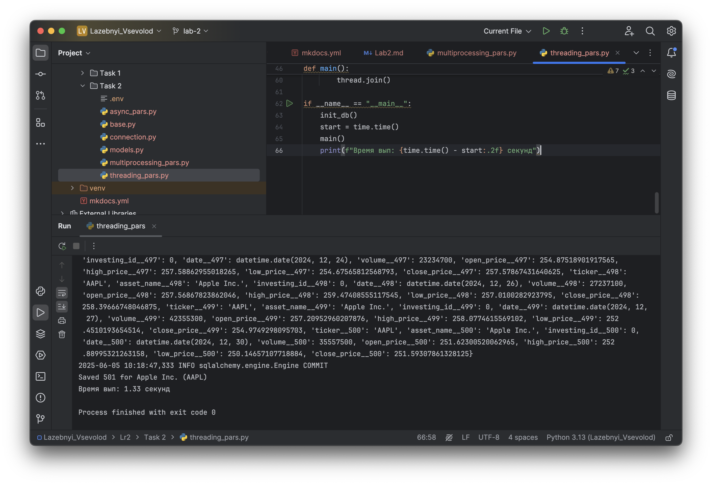


### 2. Multiprocessing

Программа использует многопроцессорность для параллельной загрузки и сохранения данных.

```python
def partial_sum(start, end, result, index):
    result[index] = sum(range(start, end))

def calculate_sum():
    num_processes = multiprocessing.cpu_count()
    maximum = 10**9
    step = maximum // num_processes
    manager = multiprocessing.Manager()
    processes = []
    results = manager.list([0] * num_processes)

    for i in range(num_processes):
        start = i * step + 1
        if i != num_processes - 1:
            end = (i + 1) * step + 1
        else:
            end = maximum + 1
        process = multiprocessing.Process(target=partial_sum, args=(start, end, results, i))
        processes.append(process)
        process.start()
    for process in processes:
        process.join()
    return sum(results)
```
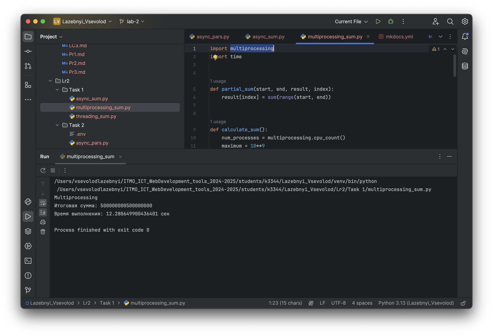
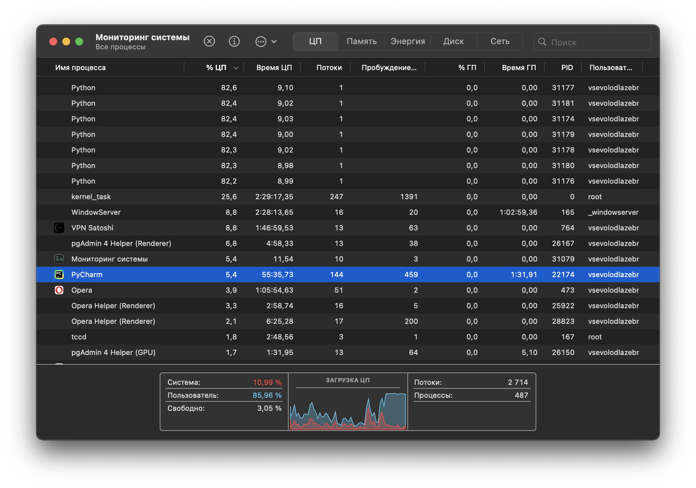

```python
def fetch_historical_data(asset):
    ticker = asset['ticker']
    stock = yf.Ticker(ticker)
    df = stock.history(start="2023-01-01", end="2024-12-31")
    if df.empty:
        return asset, None
    data = df.reset_index().to_dict('records')
    return asset, data

def save_data_to_db(asset, data):
    if not data:
        print(f"No data to save for {asset['name']} ({asset['ticker']})")
        return
    records = []
    for entry in data:
        date_obj = entry['Date'].date() if isinstance(entry['Date'], pd.Timestamp) else entry['Date']
        record = StockData(
            asset_name=asset['name'],
            ticker=asset['ticker'],
            investing_id=0,
            date=date_obj,
            open_price=float(entry['Open']),
            high_price=float(entry['High']),
            low_price=float(entry['Low']),
            close_price=float(entry['Close']),
            volume=int(entry['Volume']) if 'Volume' in entry else 0
        )
        records.append(record)
    with get_session() as db_session:
        for record in records:
            db_session.add(record)
        db_session.commit()
    print(f"Saved {len(records)} records for {asset['name']} ({asset['ticker']})")

def process_asset(asset):
    asset, data = fetch_historical_data(asset)
    save_data_to_db(asset, data)

def main():
    assets_to_search = [
        {"name": "Apple Inc.", "ticker": "AAPL"},
        {"name": "Tesla, Inc.", "ticker": "TSLA"},
        {"name": "Sberbank of Russia", "ticker": "SBER.ME"},
        {"name": "Brent Crude Oil", "ticker": "BZ=F"},
        {"name": "WTI Crude Oil", "ticker": "CL=F"}
    ]
    with Pool(processes=3) as pool:
        pool.map(process_asset, assets_to_search)
```

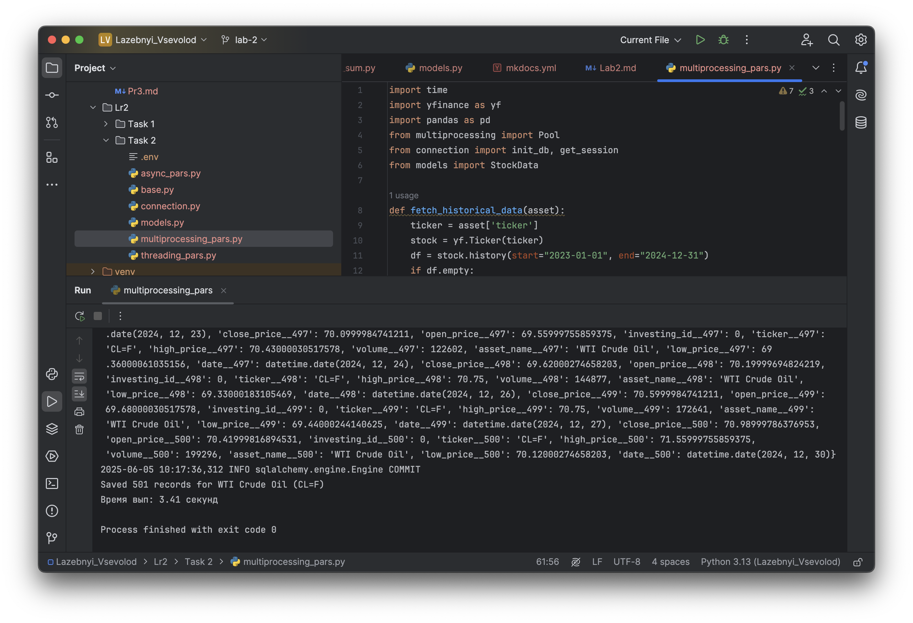
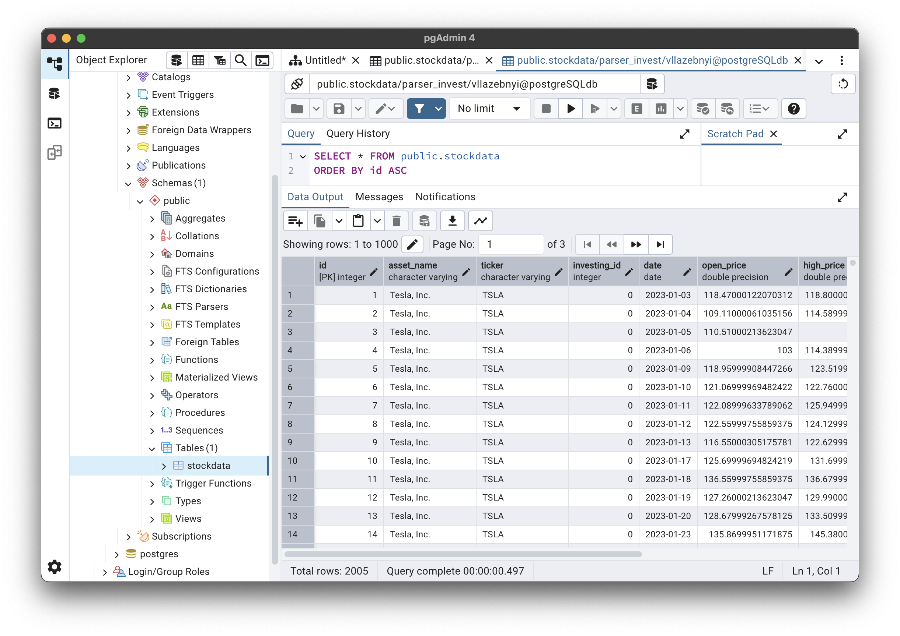

### 3. Asyncio

Программа использует асинхронность для параллельной загрузки и сохранения данных.

```python
async def partial_sum(start, end):
    return sum(range(start, end))

async def calculate_sum():
    num_tasks = 4
    maximum = 10**9
    step = maximum // num_tasks
    tasks = []

    for i in range(num_tasks):
        start = i * step + 1
        if i != num_tasks - 1:
            end = (i + 1) * step + 1
        else:
            end = maximum + 1
        task = asyncio.create_task(partial_sum(start, end))
        tasks.append(task)

    results = await asyncio.gather(*tasks)
    return sum(results)
```
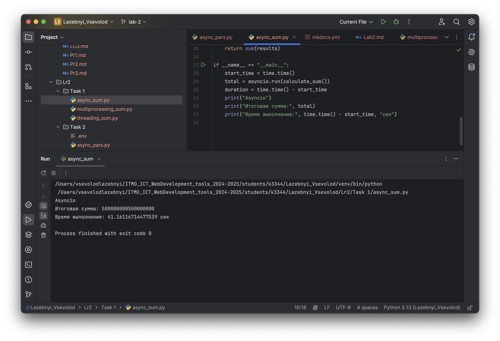
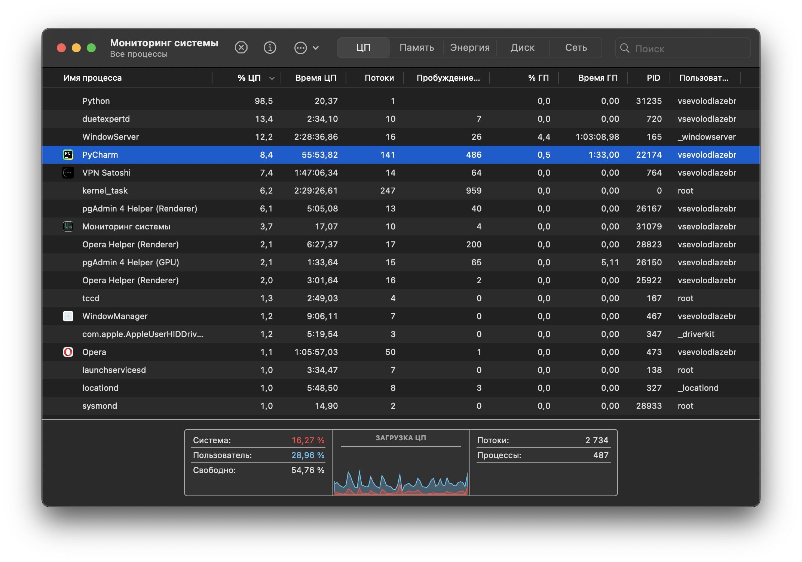

```python
async def fetch_historical_data(asset):
    try:
        ticker = asset['ticker']
        stock = yf.Ticker(ticker)
        df = stock.history(start="2023-01-01", end="2024-12-31")
        if df.empty:
            return asset, None
        data = df.reset_index().to_dict('records')
        return asset, data
    except Exception:
        return asset, None

async def save_data_to_db(asset, data):
    if not data:
        print(f"No data to save for {asset['name']} ({asset['ticker']})")
        return
    records = []
    for entry in data:
        try:
            date_obj = entry['Date'].date() if isinstance(entry['Date'], pd.Timestamp) else entry['Date']
            record = StockData(
                asset_name=asset['name'],
                ticker=asset['ticker'],
                investing_id=0,
                date=date_obj,
                open_price=float(entry['Open']),
                high_price=float(entry['High']),
                low_price=float(entry['Low']),
                close_price=float(entry['Close']),
                volume=int(entry['Volume']) if 'Volume' in entry else 0
            )
            records.append(record)
        except (ValueError, KeyError, TypeError):
            continue
    try:
        with get_session() as db_session:
            for record in records:
                db_session.add(record)
            db_session.commit()
    except Exception as e:
        print(f"Failed to save data {asset['name']} ({asset['ticker']}) {e}")

async def process_asset(asset):
    _, data = await fetch_historical_data(asset)
    await save_data_to_db(asset, data)
```

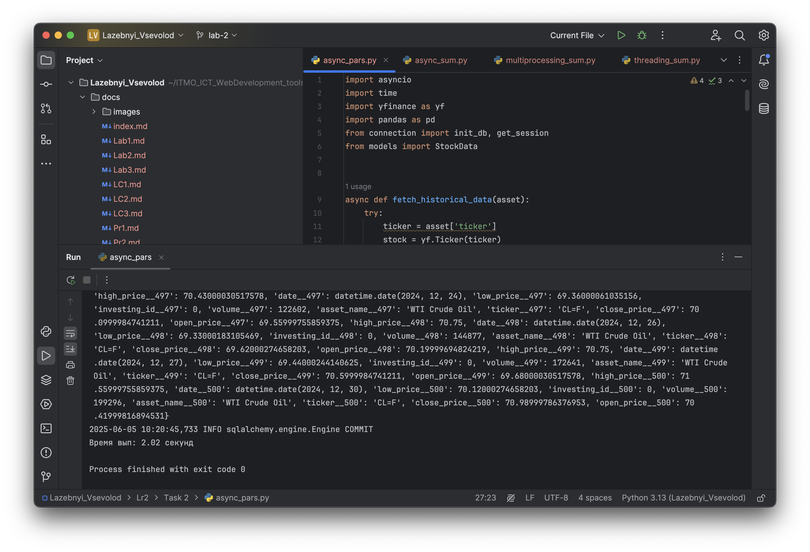
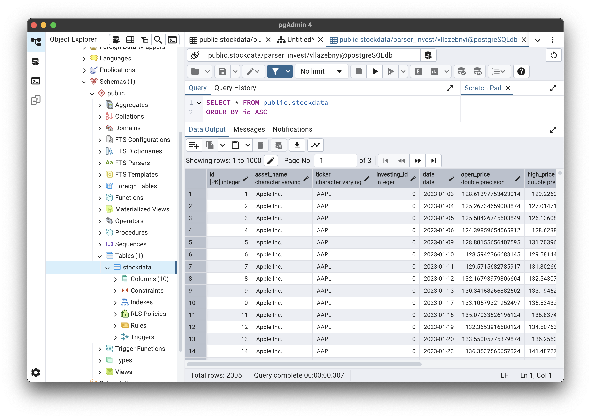

## Результаты

| Подход       | Время выполнения задания 1 | Время выполнения задания 2                       |
|--------------|----------------------------|--------------------------------------------------|
| Threading    | 37.5 сек                   | 1.33                                             |
| Multiprocessing | 12.3 сек                   | 3.41 только из-за ошибки с парсингом акций сбера |
| Asyncio      | 41.2 сек                   | 2.02                                             |   

.png)
.png)

## Вывод

В ходе выполнения лабораторной работы были реализованы три подхода к параллельному парсингу веб-страниц:

1. **Threading** - подходит для задач, требующих большого количества операций ввода-вывода, но GIL ограничивает эффективность.
2. **Multiprocessing** - обеспечивает наилучшие результаты для CPU-bound задач, так как каждый процесс работает отдельно.
3. **Asyncio** - хорошо подходит для асинхронных операций ввода-вывода, таких как HTTP-запросы, но зависит от количества ожидающих операций.

Эти наблюдения помогут выбрать методы обработки для различных задач, основываясь на их потребностях.


