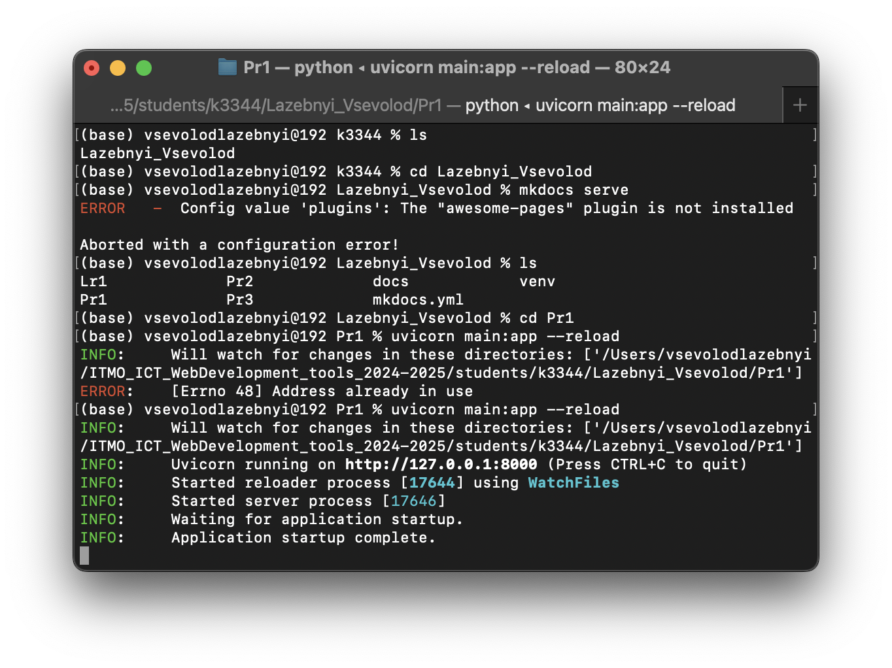
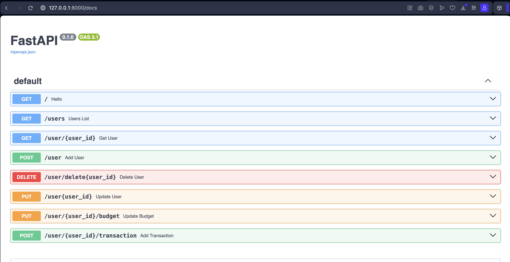
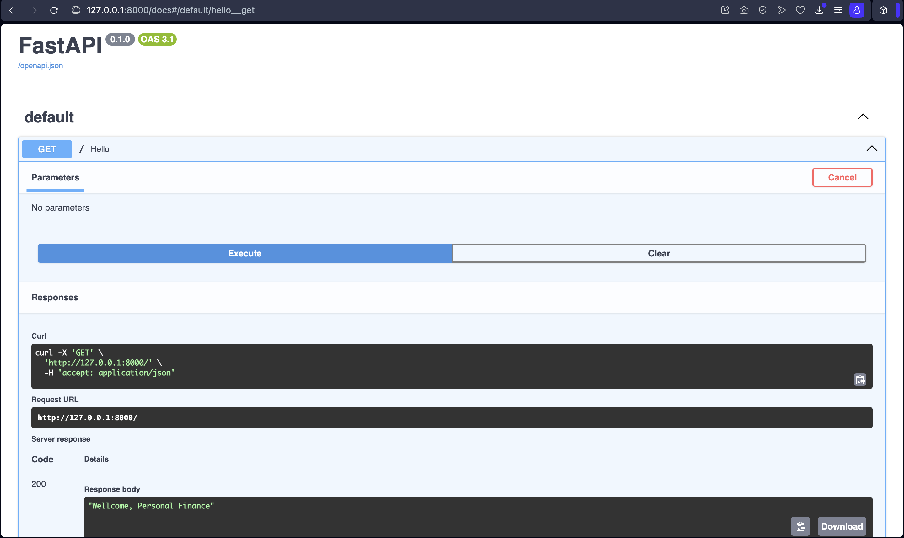
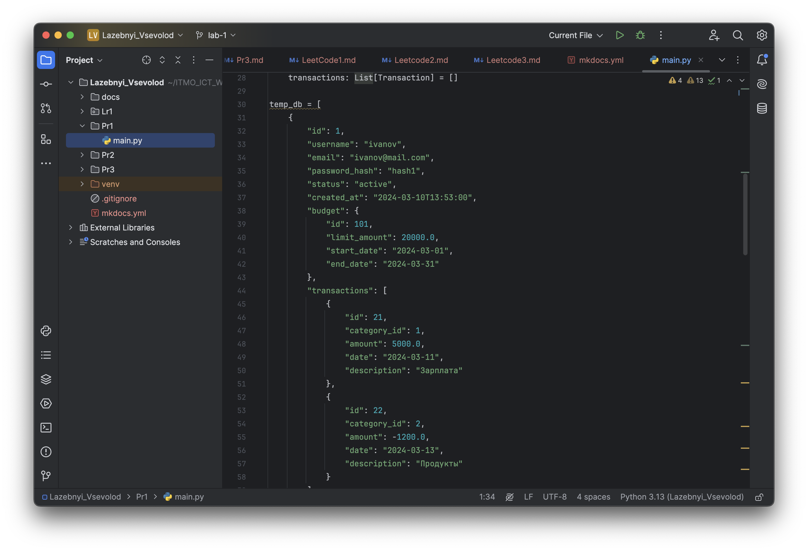

# Практика 1.1: Создание базового приложения на FastAPI
# Шаги выполнения:
## Создаем виртуальное окружение и активируем его:
```bash
python -m venv .venv
source .venv/bin/activate 
```
## Установливаем необходимые зависимости
```bash
pip install fastapi[all]
```
## Создаем файл main.py и добавляем временную бд:
```python
from typing import Optional, List
from fastapi import FastAPI
from pydantic import BaseModel, EmailStr

app = FastAPI()

class Budget(BaseModel):
    id: int
    limit_amount: float
    start_date: str
    end_date: str

class Transaction(BaseModel):
    id: int
    category_id: int
    amount: float
    date: str
    description: Optional[str] = ""

class User(BaseModel):
    id: int
    username: str
    email: EmailStr
    password_hash: str
    status: str = "active"
    created_at: str
    budget: Budget
    transactions: List[Transaction] = []

temp_db = [
    {
        "id": 1,
        "username": "ivanov",
        "email": "ivanov@mail.com",
        "password_hash": "hash1",
        "status": "active",
        "created_at": "2024-03-10T13:53:00",
        "budget": {
            "id": 101,
            "limit_amount": 20000.0,
            "start_date": "2024-03-01",
            "end_date": "2024-03-31"
        },
        "transactions": [
            {
                "id": 21,
                "category_id": 1,
                "amount": 5000.0,
                "date": "2024-03-11",
                "description": "Зарплата"
            },
            {
                "id": 22,
                "category_id": 2,
                "amount": -1200.0,
                "date": "2024-03-13",
                "description": "Продукты"
            }
        ]
    },
    {
        "id": 2,
        "username": "petrova",
        "email": "petrova@mail.com",
        "password_hash": "hash2",
        "status": "active",
        "created_at": "2024-03-15T10:01:00",
        "budget": {
            "id": 102,
            "limit_amount": 18000.0,
            "start_date": "2024-03-01",
            "end_date": "2024-03-31"
        },
        "transactions": [
            {
                "id": 23,
                "category_id": 1,
                "amount": 8000.0,
                "date": "2024-03-16",
                "description": "Премия"
            }
        ]
    }
]

@app.get("/")
def hello():
    return "Wellcome, Personal Finance"

@app.get("/users", response_model=List[User])
def users_list():
    return temp_db

@app.get("/user/{user_id}", response_model=User)
def get_user(user_id: int):
    for user in temp_db:
        if user.get("id") == user_id:
            return user

@app.post("/user", response_model=User)
def add_user(user: User):
    temp_db.append(user.dict())
    return user

@app.delete("/user/delete{user_id}")
def delete_user(user_id: int):
    for i, user in enumerate(temp_db):
        if user.get("id") == user_id:
            temp_db.pop(i)
            return {"status": 201, "message": "deleted"}

@app.put("/user{user_id}", response_model=User)
def update_user(user_id: int, user: User):
    for i, usr in enumerate(temp_db):
        if usr.get("id") == user_id:
            temp_db[i] = user.dict()
            return user

@app.put("/user/{user_id}/budget", response_model=User)
def update_budget(user_id: int, budget: Budget):
    for user in temp_db:
        if user.get("id") == user_id:
            user["budget"] = budget.dict()
            return user

@app.post("/user/{user_id}/transaction", response_model=User)
def add_transaction(user_id: int, transaction: Transaction):
    for user in temp_db:
        if user.get("id") == user_id:
            user["transactions"].append(transaction.dict())
            return user
```

## Запускаем сервер командой:

```bash
uvicorn main:app --reload
```
  
 

## Проверяем вложенность:

  
 
 
