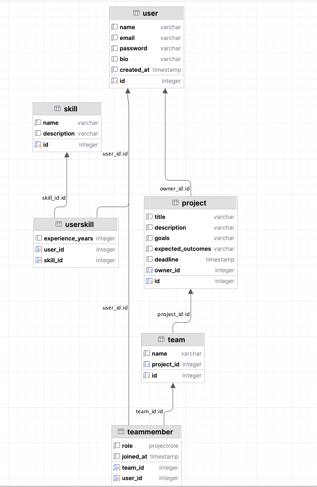
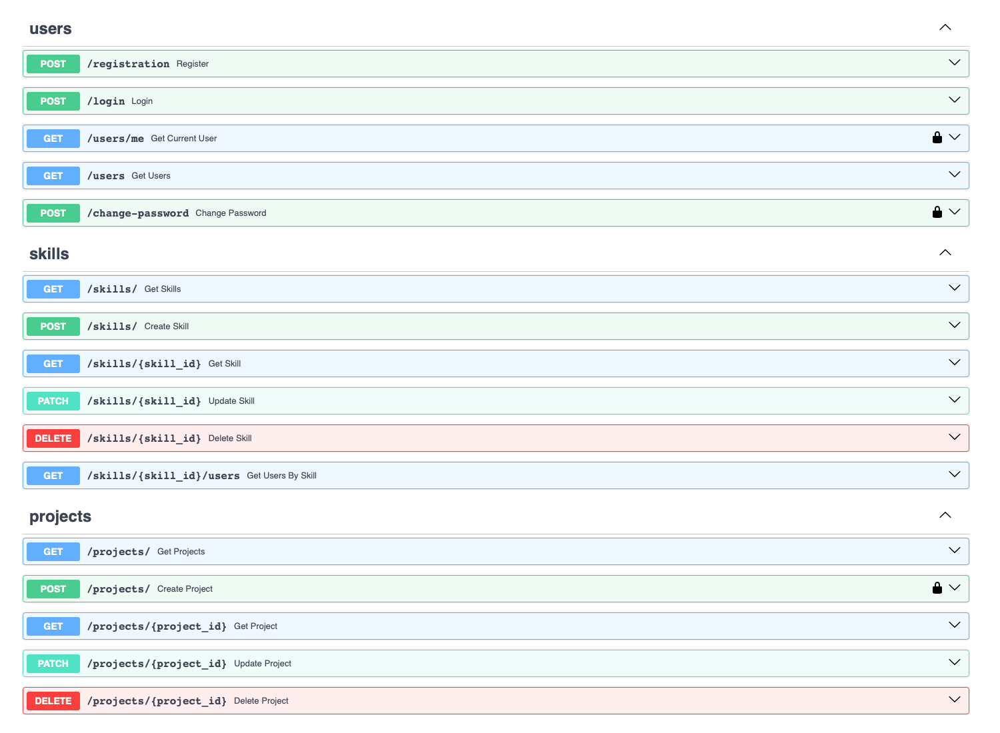
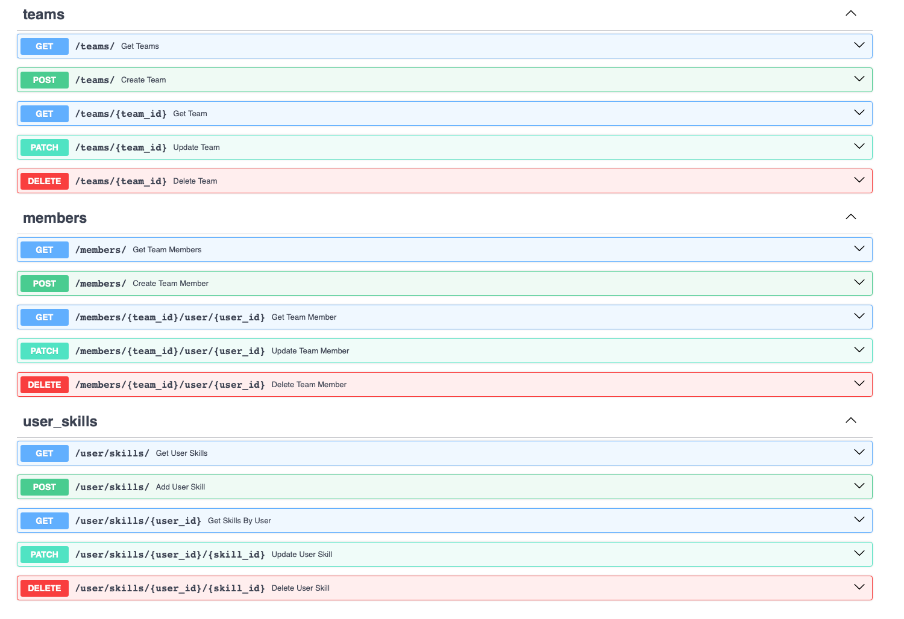

# Лабораторная работа 1. Реализация серверного приложения FastAPI

## Тема:
Создание системы для поиска людей в команду

# Ход работы:
Схема базы данных:


Файл `models.py`
```python
from datetime import datetime
from typing import Optional, List
from enum import Enum
from sqlmodel import SQLModel, Field, Relationship


class ProjectRole(str, Enum):
    developer = "developer"
    designer = "designer"
    analyst = "analyst"
    manager = "manager"


class User(SQLModel, table=True):
    id: int = Field(default=None, primary_key=True)
    name: str
    email: str
    password: str
    bio: Optional[str]
    created_at: datetime = datetime.now()

    skills: List["UserSkill"] = Relationship(back_populates="user")
    memberships: List["TeamMember"] = Relationship(back_populates="user")
    owned_projects: List["Project"] = Relationship(back_populates="owner")


class Skill(SQLModel, table=True):
    id: int = Field(default=None, primary_key=True)
    name: str
    description: Optional[str] = None

    user_skills: List["UserSkill"] = Relationship(back_populates="skill")


class UserSkill(SQLModel, table=True):
    user_id: int = Field(foreign_key="user.id", primary_key=True)
    skill_id: int = Field(foreign_key="skill.id", primary_key=True)
    experience_years: Optional[int] = 0

    user: Optional[User] = Relationship(back_populates="skills")
    skill: Optional[Skill] = Relationship(back_populates="user_skills")


class Project(SQLModel, table=True):
    id: int = Field(default=None, primary_key=True)
    title: str
    description: str
    goals: str
    expected_outcomes: str
    deadline: Optional[datetime] = None
    owner_id: int = Field(foreign_key="user.id")

    owner: Optional[User] = Relationship(back_populates="owned_projects")
    teams: List["Team"] = Relationship(back_populates="project")


class Team(SQLModel, table=True):
    id: int = Field(default=None, primary_key=True)
    name: str
    project_id: int = Field(foreign_key="project.id")

    project: Optional[Project] = Relationship(back_populates="teams")
    members: List["TeamMember"] = Relationship(back_populates="team")


class TeamMember(SQLModel, table=True):
    team_id: int = Field(foreign_key="team.id", primary_key=True)
    user_id: int = Field(foreign_key="user.id", primary_key=True)
    role: ProjectRole
    joined_at: datetime = datetime.now()

    team: Optional[Team] = Relationship(back_populates="members")
    user: Optional[User] = Relationship(back_populates="memberships")

```

Файл `connection.py`

```python
import os

from dotenv import load_dotenv
from sqlmodel import SQLModel, Session, create_engine

load_dotenv()
db_url = os.getenv('DB_URL')
engine = create_engine(db_url, echo=True)


def init_db():
    SQLModel.metadata.create_all(engine)


def get_session():
    with Session(engine) as session:
        yield session

```

Файл `project_endpoints.py`

```python
from fastapi import APIRouter, Depends, HTTPException
from sqlmodel import Session, select
from typing_extensions import List

from auth.auth import AuthHandler
from db.connection import get_session
from model.models.models import Project, User
from model.schemas.project import ProjectCreate, ProjectRead, ProjectUpdate

project_router = APIRouter()
auth_handler = AuthHandler()


@project_router.post("/", response_model=ProjectRead)
def create_project(project: ProjectCreate, session: Session = Depends(get_session), current_user: User = Depends(auth_handler.get_current_user)):
    db_project = Project(**project.model_dump(), owner_id=current_user.id)
    session.add(db_project)
    session.commit()
    session.refresh(db_project)
    return db_project


@project_router.get("/", response_model=List[ProjectRead])
def get_projects(session: Session = Depends(get_session)):
    return session.exec(select(Project)).all()


@project_router.get("/{project_id}", response_model=ProjectRead)
def get_project(project_id: int, session: Session = Depends(get_session)):
    project = session.get(Project, project_id)
    if not project:
        raise HTTPException(status_code=404, detail="Project not found")
    return project


@project_router.patch("/{project_id}", response_model=ProjectRead)
def update_project(project_id: int, update: ProjectUpdate, session: Session = Depends(get_session)):
    project = session.get(Project, project_id)
    if not project:
        raise HTTPException(status_code=404, detail="Project not found")
    update_data = update.model_dump(exclude_unset=True)
    for key, value in update_data.items():
        setattr(project, key, value)
    session.commit()
    session.refresh(project)
    return project


@project_router.delete("/{project_id}", response_model=dict)
def delete_project(project_id: int, session: Session = Depends(get_session)):
    project = session.get(Project, project_id)
    if not project:
        raise HTTPException(status_code=404, detail="Project not found")
    session.delete(project)
    session.commit()
    return {"ok": True}

```

Файл `schemas.skill.py`

```python
from pydantic import BaseModel, EmailStr
from typing import Optional


class SkillBase(BaseModel):
    name: str
    description: Optional[str] = None


class SkillCreate(SkillBase):
    pass


class SkillRead(SkillBase):
    id: int

    class Config:
        from_attributes = True

class SkillUpdate(SkillBase):
    name: Optional[str]
    description: Optional[str]

class UserShortInfo(BaseModel):
    name: str
    email: EmailStr
    bio: Optional[str] = None

class UsersSkillReadDetail(BaseModel):
    user: Optional["UserShortInfo"]
    experience_years: Optional[int]

```

Эндпоинты в Swagger

